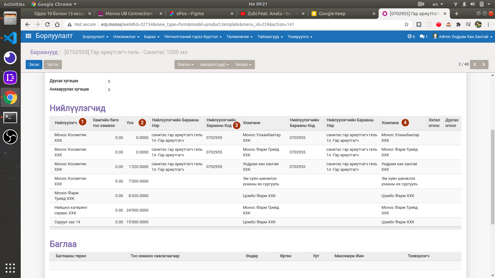

**********************************
Odoo 10 болон 13 хоорондын холболт
**********************************

Odoo 10 болон 13 хоорондоо мэдээлэл солилцох зорилготой нэмэлт хөгжүүлэлт

Барааны харгалзаа хийх, шалгах
===============================

Odoo 10 систем дээр :guilabel:`product_supplierinfo` дээр барааны харгалзааны тохиргоог хийж байгаа бөгөөд
зурагт харуулсан байгаа.

1) Нийлүүлэх компани (Odoo 13 уруу шилжсэн компаниуд).
2) Барааны үнэ (Odoo 13 системээс автоматаар засна).
3) Нийлүүлэгчийн барааны код (Odoo 13 дээрх барааны код).
4) Odoo 13 систем дээр холболт үүсгэх Odoo 10-н компани.

Худалдан авалт татаж борлуулалт үүсгэх
=======================================

1) Odoo 10 дээр "Нийлүүлгч батлахыг хүлээж буй" төлөвтэй худалдан авалтыг татна.
2) Худалдан авалтанд орсон барааны харгалзаа зөв байгаа үгүйг шалгана. Харгалзах боломжгүй байвал анхааруулах лог бичнэ.
3) Odoo 10 системийн :guilabel:`product_supplierinfo` үнийг засна.

Борлуулалт батлах
-----------------------------------

1) Odoo 10 дээрх худалдан авалтын барааны үнийг засна.
2) Батлагдсан тоо хэмжээгээр Odoo 10 дээрх захиалгын тоог засна.
3) Odoo 10 дээр лог бичнэ.

Борлуулалт цуцлах
-----------------------------------

1) Odoo 10 дээрх худалдан авалтын захиалгын шууд цуцлана.

Агуулахын баримт дуусгах
-----------------------------------

1) Odoo 13 системээс яг гарсан тоо хэмжээгээр Odoo 10 системд орлогын баримт үүсгэнэ.

Агуулахын баримт цуцлах
-----------------------------------

1) Odoo 10 дээрх худалдан авалтын захиалгын цуцлана.
2) Дахин сэргээгээд батлах үед "Алсын odoo холболтыг удирдах" эрх шаардах бөгөөд зөвхөн эрх бүхий хүн батлана.