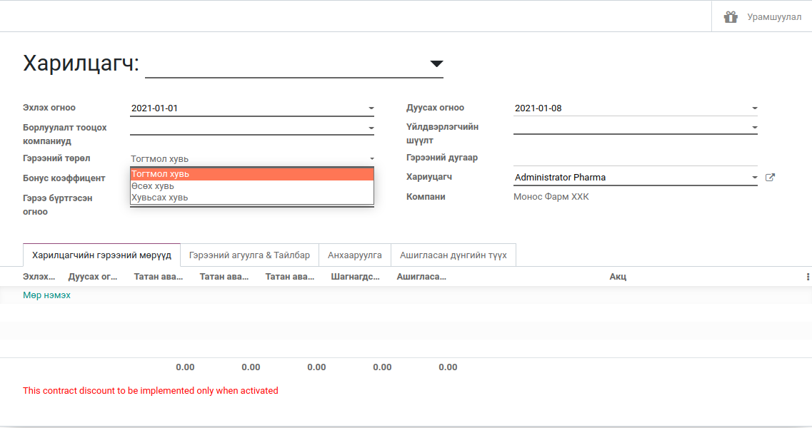

**********************************
Харилцагчийн урамшууллын гэрээ
**********************************

"Монос Фарм ХХК" шаардлагаар хөгжүүлсэн нэмэлт модуль. Тухайн харилцагчтай тохиролцон гэрээ байгуулж 
гэрээний болзолт дүн тогтоох бөгөөд тухайн болзлыг хангавал урамшуулал олгогдоно. Харилцагч урамшууллаа
акц бараа (Цахилгаан хэрэгсэл) эсвэл борлуулах бараагаар орлуулан авах боломжтой байдаг.

..  note::
    Борлуулалт тооцох талбарт тохируулсан компаниудын үйлдвэрлэгчийн шүүлт 
    талбарт тохируулсан үйлдвэрлэгчдийн барааны борлуулалтанд зөвхөн хамаарна

Гэрээ бодох аргачлал
====================

Харилцагчийн гэрээг сар бүрийн нэгний өдөр автоматаар тооцоолол хийж тухайн сарын худалдан авалт болон
буцаалтаар цэвэр борлуулалтын дүнг гаргаж гэрээний урамшуулал бодох төрлөөс хамаарч өөр өөр тооцоолол хийнэ

Гэрээ нь гурван төрөлтэй бөгөөд тус бүр :guilabel:`Өсөх`, :guilabel:`Хувьсах`, :guilabel:`Тогтмол` гэж ерөнхий нэрлэсэн.

Тогтмол тооцоолол
-----------------

Бонус коффициент талбарт тохируулсан хувиар тогтмол тооцоолол хийнэ.

..  note::
    |   Гэрээний болзолт дүн: 100,000₮
    |   Тухайн харилцагчийн худалдан авалт: 120,100₮
    |   Урамшууллын дүн: 120,100 * 10 / 100 = 120,10₮

Өсөх тооцоолол
--------------

Бонус коффициент талбарт тохируулсан хувиар тогтмол тооцоолол хийнэ. Хэрэв харилцагч болзолт дүнгээ хангавал
дараа сард Урамшуулалт хувь = (Бонус коффициент + Өсөх коффициент) бодогдож урамшууллаа авна. Харилцагч болзолт дүнгээ
хангаж чадахгүйд хүрвэл бонус коффициент анх тохируулсан хувь уруу унана

..  note::
    |   Гэрээний болзолт дүн: 100,000₮
    |   Тухайн харилцагчийн худалдан авалт: 100,000₮
    |   Урамшууллын дүн: 100,000 * 12 / 100 = 120,00₮

Хувьсах тооцоолол
-----------------

Харилцагчийн татан авалтаас хамаарч хувьсана. Татан авалт нь болзолт дүнгийн 160%-тай тэнцсэн гэж үзье.
Харилцагчийн гэрээний хөнгөлөлтийн дүрмээр 160% биелүүлсэн бол 60% урамшуулал бодогдоно гэж тохируулсан байвал.

..  note::
    |   Гэрээний болзолт дүн: 100,000₮
    |   Тухайн харилцагчийн худалдан авалт: 160,000₮
    |   Урамшууллын дүн: 100,000 * 60 / 100 = 60,000₮

Системтэй холбоотой мэдээлэл
============================

Харилцагчийн гэрээ нь зөвхөн Монос Фарм ХХК-д хамаарахгүй бөгөөд орон нутгийн Монос ХХК, Монос Фарм Трейд
компаниуд урамшууллыг олгодог. Энэ юу гэсэн үг вэ гэхээр "Монос Одоо 10" болон "Монос Фарм Трейд Одоо 13" тай холбогдож ажилладаг.

Харгалзаа
--------------------------------

2020 онд байгуулсан гэрээ "Монос Одоо 10" хувилбар дээр бүртгэгдсэн бөгөөд 2021 онд "Үндсэн 13" уруу зөөсөн.
Ингэхийн тулд бараа болон харилцагчийн мэдээлэл үнэн зөв харгалзах шаардлагатай болсон. "Монос Фарм Трейд Одоо 13"
нь "Монос Одоо 10"-тай аль хэдийн харгалзсан бөгөөд одоо манай "Үндсэн 13"-тай интеграци хийгдсэн.

..  note::
    |   Бараа болон харилцагчийн харгалзаа чухал бөгөөд "Алсын Odoo Холболтыг" ашигладаг.
    |   Монос Фарм ХХК-д Алсын Одоо Холболт Монос Фарм гэж холболт үүсгэсэн байгаа.

Ажиллагаа
--------------------------------

"Үндсэн 13" систем ерөнхий мэдээллийг хадгалж явах бөгөөд бусад системүүд харилцагчийн бонусын үлдэгдэл татаж
боломжит үлдэгдлээр борлуулалт бичин манай систем уруу илгээдэг.