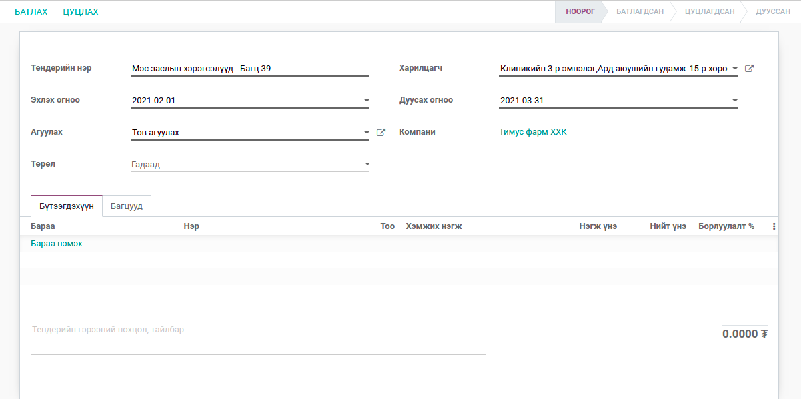
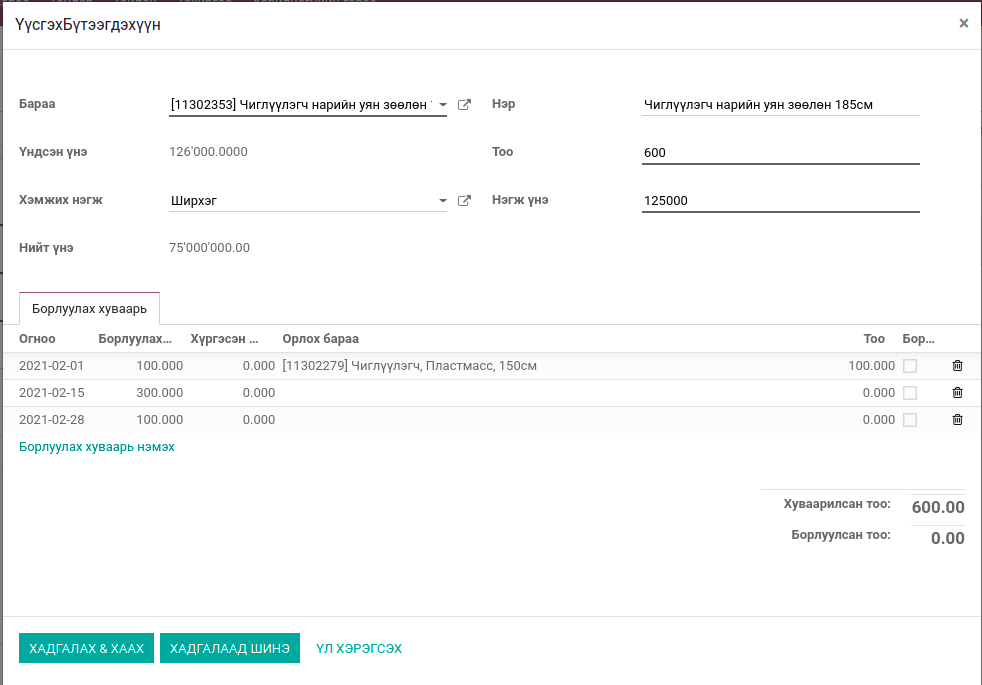
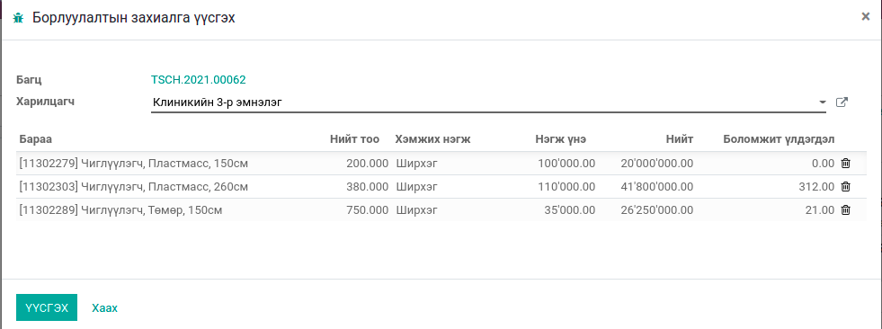
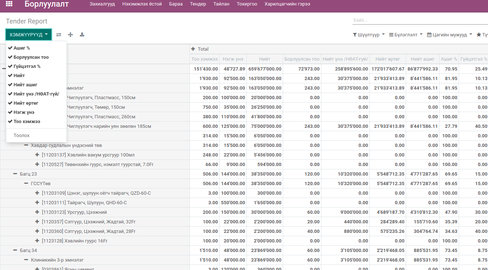

***************
Тендерийн гэрээ
***************

Бараа бүтээгдэхүүнийг тендерийн гэрээнд заагдсан тоо хэмжээ, үнийн дүнгээр эхлэх дуусах огнооны мужид борлуулалт хийх модуль. 
Одоогоор "Тимус Фарм ХХК" дээр ашиглагдаж байна.
    

Гэрээ бүргэх
============

Тендерийн гэрээ нь :guilabel:`Үндсэн мэдээлэл`, :guilabel:`Барааны мэдээлэл`, :guilabel:`Борлуулах хуваарь` , :guilabel:`Борлуулах багц` 
гэсэн үндсэн 4 хэсгээс бүрдэнэ

1. Үндсэн мэдээлэл
^^^^^^^^^^^^^^^^^^

    * Нэр: Тендерийн нэр болон багцын дугаар
    * Харилцагч: Системд бүртгэлтэй харилцагчдаас сонгох талбар. Тухайн тендерийн гэрээ байгуулсан харилцагчийг сонгоно.
    * Эхлэх огноо: Гэрээний эхлэх огноо
    * Дуусах огноо: Гэрээний дуусах огноо
    * Агуулах: Системд бүртгэлтэй агуулахын жагсаалтаас сонгох. Тухайн тендерийн гэрээний борлуулалт хийгдэх агуулах. 
    * Тендерийн төрөл: :guilabel:`Дотоод`, :guilabel:`Гадаад` компаний гэх 2 боломжтой

    
.. note::
    Сар бүр тендерийн багц үүсгэх үед зөвхөн Агуулах талбарт сонгосон агуулахаас борлуулах боломжит үлдэгдэл тооцно.

2. Барааны мэдээлэл
^^^^^^^^^^^^^^^^^^^

Тендерийн гэрээгээр борлуулах бараануудын мэдээллийг оруулна.

    * Бараа: Системд бүртгэлтэй барааны жагсаалтаас сонгоно
    * Нэр: Сонгогдсон барааны нэр автоматаар бөглөгдөх бөгөөд өөрчилж болно.
    * Үндсэн үнэ: Барааны систем дэх үнэ 
    * Тоо хэмжээ: Гэрээнд заагдсан борлуулах тоо хэмжээ
    * Хэмжих нэгж: Гэрээгээр борлуулах хэмжих нэгж. 
    * Нэгж үнэ: Гэрээнд заагдсан борлуулах үнэ
    * Нийт үнэ: Нэгж үнэ * Тоо хэмжээ

.. note::
    Тендерийн гэрээ баталсаны дараа барааны нэгж үнийг засах боломжгүй.

3. Борлуулалтын хуваарь оруулах
^^^^^^^^^^^^^^^^^^^^^^^^^^^^^^^
Тухайн барааг тендерийн хугацаанд нийлүүлэх хуваарийг өдөр өдрөөр оруулна.

    * Огноо: Борлуулалт хийх огноо
    * Борлуулах тоо: Тухайн огноонд борлуулалт хийх тоо.
    * Хүргэсэн тоо: Борлуулалтын захиалгын хүргэлт хийсэн тоо. /дууссан төлөвтэй хүргэлтийн тоо/
    * Орлох бараа: Барааны үлдэгдэл хүрэлцэхгүй үед орлуулах боломжтой ижил төстэй бараа
    * Тоо: Орлох барааны тоо хэмжээ. 
    * Борлуулсан эсэх: Борлуулалтын захиалга үүсгэсэн эсэх

.. note::
    Борлуулалт хийх огноо нь тендерийн эхлэх дуусах огнооны мужид байх ёстой.

.. note::
    Нийт борлуулах тоо нь  = Борлуулах тоо + Орлох барааны тоо байна.

4. Багц тооцоолох
^^^^^^^^^^^^^^^^^
:guilabel:`Багц тооцоолох` коммандыг ажиллуулсанаар Борлуулалтын хуваарийн дагуу үүссэн бараануудыг өдөр өдрөөр багцлан 
Нийлүүлэлт хийх багц үүснэ.

.. note::
    Багц тооцоолох комманд нь мөн бараануудын борлуулсан хувь, борлуулсан тоо хэмжээг тухай тендерийн гэрээнээс 
    үүссэн борлуулалтын захиалгуудын төлөв, хүргэлтийн тоог тооцоолж шинэчлэдэг.

Тендер батлах
=============
Тендерийн гэрээг баталсаны дараа Багц тооцоолох боломжтой болно. :guilabel:`Тендерийн менежер` эрхтэй хэрэглэгч зөвхөн батлах эрхтэй байна.

Борлуулалтын захиалга үүсгэх
============================
Багц тооцоолсоноор борлуулах багцууд үүсэх бөгөөд тухайн багцын мөр дээр байгаа :guilabel:`Борлуулалтын захиалга үүсгэх` коммандаар
ажиллуулна.

    * Багц: Багцын дугаар /автомат/
    * Харилцагч: Тендерийн гэрээ анх үүсгэхэд сонгосон харилцагчаас өөр харилцагч сонгож болно.
    * Барааны мэдээлэл: Борлуулах хуваарийн дагуу автоматаар мөрүүд үүсэх бөгөөд тоо хэмжээ өөрчлөх болон бараа хасч болно.

.. note::
    Тоо хэмжээ болон бараа хассан тохиолдолд :guilabel:`Багц тооцоолох` коммандыг дахин ажиллуулсанаар үлдсэн тоо хэмжээгээр дахин багц үүснэ.

.. warning::
    Борлуулах хуваарийн огноо болоогүй байхад Борлуулалтын захиалга урьдчилж үүсгэх боломжгүй байна. 

Тайлан
======
Тайлангийн формат – пибот

Үзүүлэлтүүд:
^^^^^^^^^^^^
    * Тоо ширхэг
    * Нэгж өртөг
    * Нийт үнэ /НӨАТ-тэй/
    * Нийт үнэ /НӨАТ-гүй/
    * Нийт өртөг
    * Нийт ашиг (=Нийт НӨАТ-гүй үнэ – Нийт өртөг)
    * Ашгийн хувь (=Нийт ашиг/Нийт өртөг)
    * Гүйцэтгэлийн хувь  (Тайлангийн хугацааны тендерийн гэрээний төлөвлөлттэй нийлүүлсэн тоо ширхэг харьцуулсан хувь)

Бүлэглэх:
^^^^^^^^^
    * Харилцагчаар
    * Багц
    * Бараа
    * Нийлүүлэгч

Хэрэглэгчийн эрхүүд
===================

* Тендерийн мэргэжилтэн – Тендерийн гэрээ бүртгэх, тайлан харах эрхтэй байна.
* Тендерийн менежер – Тендерийн гэрээ бүртгэх болон батлах, тайлан дээр өртөг харах эрхтэй байна.

.. |

Техникийн нэр
=============

``bumanit_tender``

.. |

Уялдаа холбоо
=============

| ``sale``     үндсэн борлуулалтын модуль
| ``stock``    үндсэн агуулахын модуль