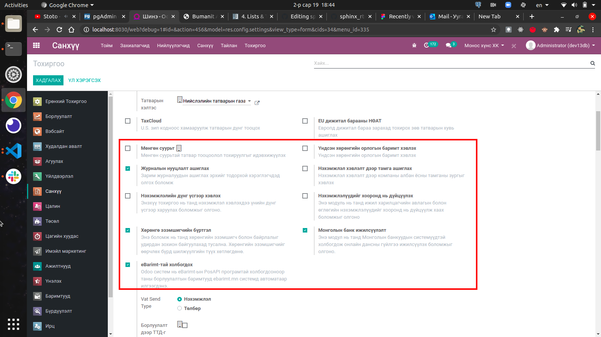
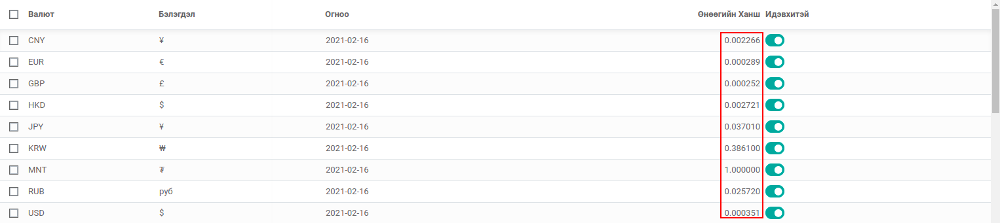
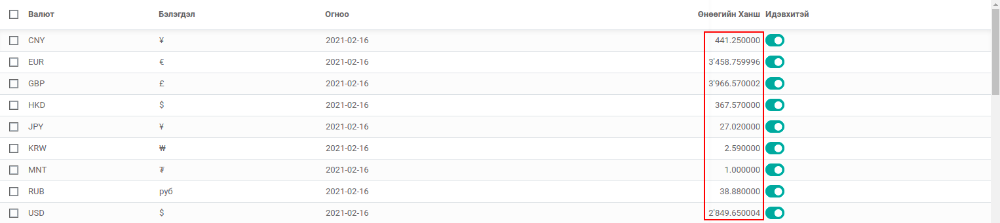
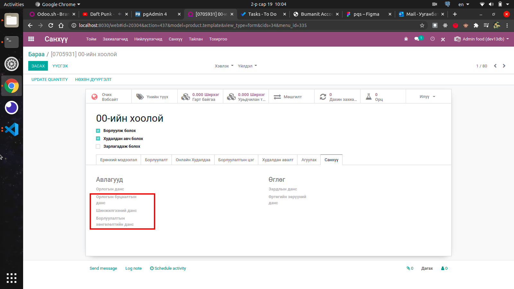
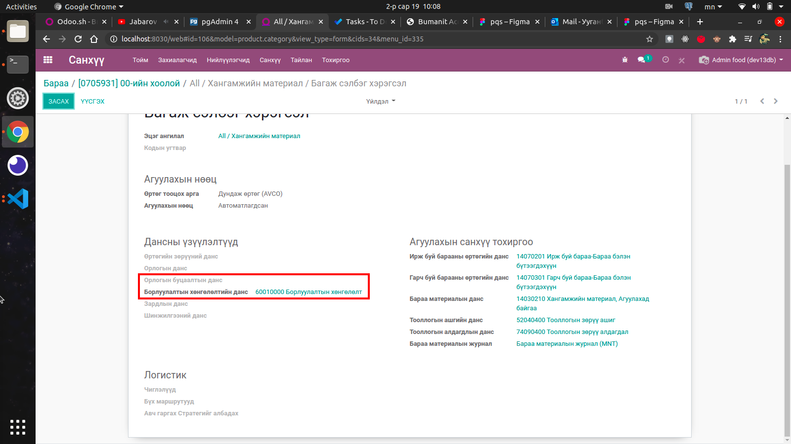

****************************
Bumanit Accounting Extension
****************************

Техникийн нэр
=============

:guilabel:`bumanit_account`

Уялдаа холбоо
=============

:guilabel:`account` :guilabel:`l10n_mn`

Тайлбар
=======

Odoo v13 санхүүгийн модулийн өргөтгөл бөгөөд Монгол улсын санхүүгийн шаардлагын хүрээнд 
дахин засварлаж нэмэлт боломжуудаар хангаж өгсөн

Системийн ерөнхий тохиргоо
============================

Системд шаардлагатай тохиргоонууд нэмэгдсэн бөгөөд дэд модультай холбогдсон, бусад гэж 2 ангилж ойлгож болно.
Дэд модультай холбогдсон гэдэг нь нэмэлтээр модуль суулгах тохиргоо юм. Харин бусад гэсэн нь ерөнхий үйл ажиллагаатай холбоотой
тохиргоонууд юм.

Шинэ дэд модуль суулгах тохиргоонууд
----------------------------------------

Санхүү => Тохиргоо => Тохиргоо

    Системийн тохиргооны дэд модуль суулгах тохиргоонууд

..  note::
    Дээрх тохиргоонуудыг идэвхижүүлснээр дэд модулиуд суух ба анхаарах зүйл нь идэвхигүй болгох үед дэд модулиуд
    системээс устгагдах болно. Иймээс тус тохиргоотой маш болгоомжтой харьцах хэрэгтэй

- eBarimt-тай холбогдох :guilabel:`bumanit_ebarimt`
- Хөрөнгө эзэмшигчийн бүртгэл :guilabel:`bumanit_asset_ownership`
- Монголын банк ижилсүүлэлт :guilabel:`bumanit_account_online_sync`
- Нэхэмжлэлүүдийг хооронд нь дүйцүүлэх :guilabel:`bumanit_move_adjustment`
- Нэхэмжлэл хэвлэлт дээр тамга ашиглах :guilabel:`bumanit_invoice_stamp`
- Журналын нууцлалт ашиглах :guilabel:`bumanit_account_journal_security`
- Үндсэн хөрөнгийн орлогын баримт хэвлэх :guilabel:`bumanit_asset_move`

Бусад тохиргоо
----------------------------------------

Санхүү => Тохиргоо => Тохиргоо

- Татварын хэлтэс: Ажил гүйлгээний НӨАТ-ын татварын мөр тус харилцагч уруу бичигдэнэ
- Ханшийн зөрүүний шинжилгээний данс: Ханшийн тэгшитгэл
- Ханшийн зөрүүний шинжилгээний пайз: Ханшийн тэгшитгэл

Санхүүгийн дансд болон татварын загвар дээрх хөгжүүлэлт
=========================================================

- **l10n_mn** модуль нь Монгол улсад ашиглахдах санхүүгийн дансд болон татварын загвар үүсгэдэг. 
- Энэ модуль нь буцаалтын дансыг тус загварт нэмж өгсөн
- Худалдан авалтын НӨАТ-ын татвар дээр пайзууд нэмж өгсөн
    
    - НӨАТ-гүй худалдан авалт
    - НӨАТ импортоор авсан бараа, үйлчилгээ
    - НӨАТ төлөгчөөр бүртгүүлэх үед худалдан авсан
    - НӨАТ мал аж ахуй эрхлэгчээс худалдан авсан

Валютын ханш дээрх хөгжүүлэлтүүд
========================================

#) Валютын дүнг үсгээр илэрхийлэх хөгжүүлэлт
#) Бусад валютыг төгрөгөөр илэрхийсэн

    Үндсэн ханшийн харагдац.

    Кодын хөгжүүлэлт хийгдсэний дараах ханшийн харагдац.

Бараа
========================================

Бараа болон барааны ангилал дээр **Орлогын буцаалтын данс**, **Борлуулалтын хөнгөлөлтийн данс** талбарууд нэмсэн. 
:guilabel:`bumanit_account` модуль дээр тус талбарыг ашигласан хөгжүүлэлт байхгүй

    Барааны форм харагдац.

    Барааны ангиллын форм харагдац.

Бусад хөгжүүлэлт
======================

- Ханшийн тэгшитгэл
- Ажил гүйлгээг валютаар бүртгэх үед журнал үүссэн санхүүгийн огнооноос нэг өдрийн өмнөх ханшаар авах
- Харилцагчийн авлага, өглөгийн данс дээр ``бусад`` төрөлтэй данс сонгох боломжтой болгосон

.. centered:: Гарын авлага боловсруулсан: Ууганбат. Б