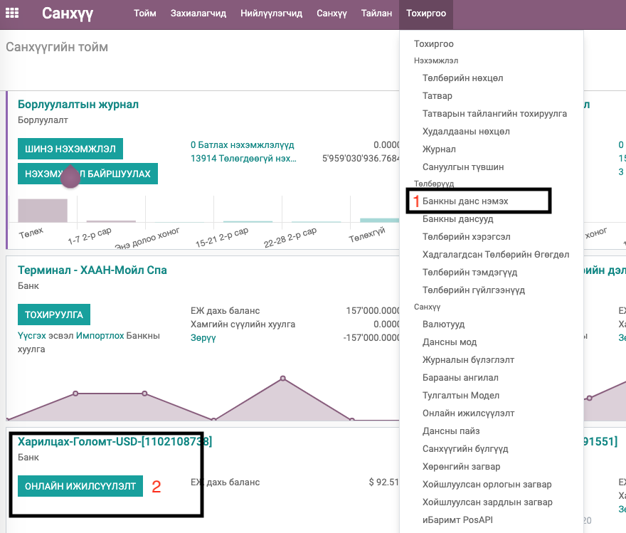
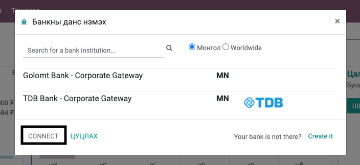
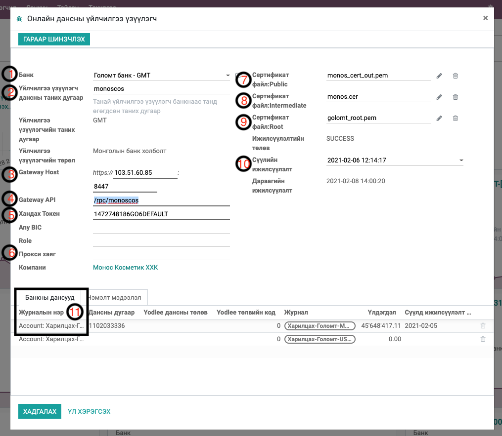
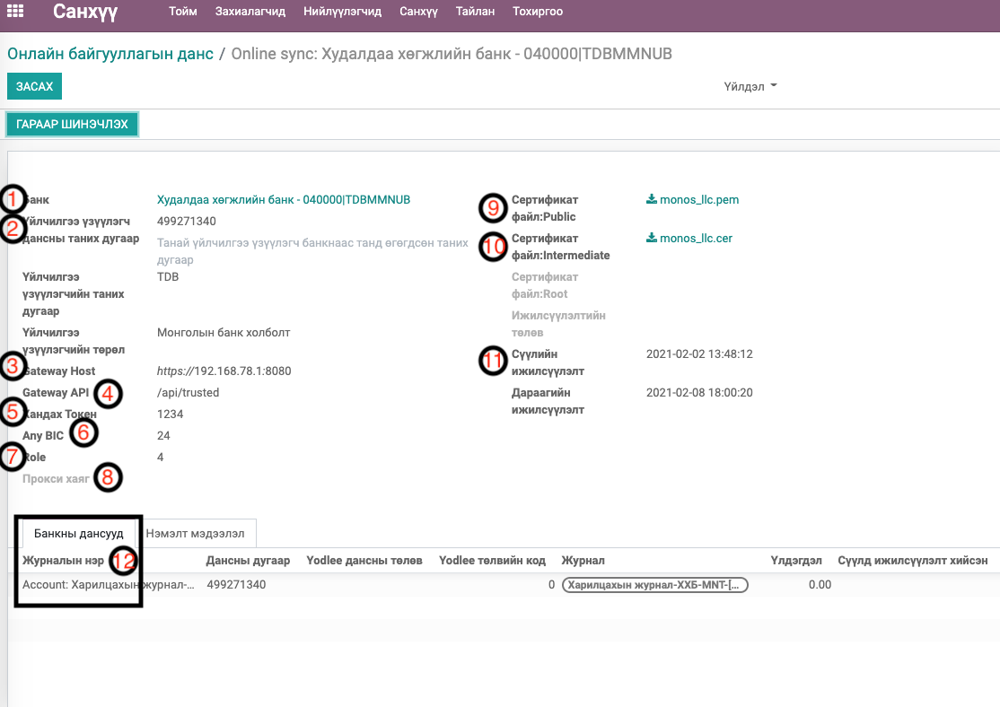
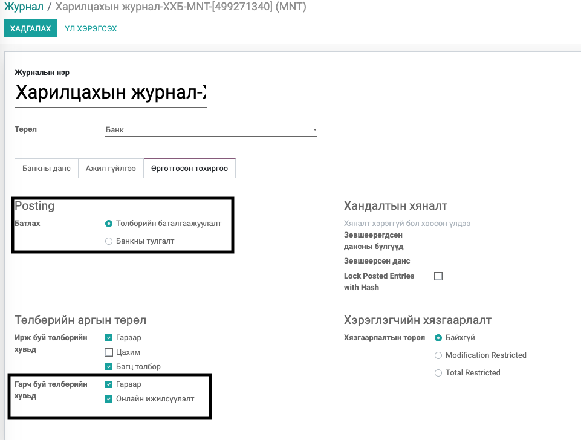

Mongolian Bank Synchronization
********************************************

Монголын онлайн банк холболтын модуль

Техникийн нэр
===========================
:guilabel:`bumanit_account_online_sync`

Уялдаа холбоо
===============

:guilabel:`bumanit_account`
:guilabel:`account_online_sync`

Энэ модуль нь ODOO V-13 системийн Онлайн банкны өргөтгөл бөгөөд ODOO V-13 системийн Онлайн банкны модуль нь төлбөрт модуль юм.

Модуль суулгахад нэмэгдэх цэсүүд
----------------------------------

| Апп ==> Санхүү ==> Тохиргоо ==> Онлайн ижилсүүлэлт

Тохиоргоо
==================

Corporate Gateway буюу онлайн банкны тохиргоог 2 замаар тохиргоо хийх боломжтой. Энэ тохиргоог Тохиргооны эрхтэй хэрэглэгч debug горимоор системд хандаж хийнэ.

1. Апп ==> Санхүү ==> Тохиргоо ==> Онлайн ижилсүүлэлт
2. Апп ==> Санхүү ==> Тойм ==> Журналын ОНЛАЙН ИЖИЛСҮҮЛЭЛТ

Онлайн ижилсүүлэлтийн (Corporate Gateway) тохиргоо нь дараах 2 багц тохиргооноос бүрдэнэ.

1. Онлайн ижилсүүлэлтийн банктай холбогдох холболтын тохиргоо
2. Холбогдох журналын тохиргоо

Онлайн ижилсүүлэлт тохиргоо хийх товч дээр дарахад дараа дэлгэц гарч ирэх бөгөөд энэд харагдахгүй байгаа банкны Corporate Gateway холболт хийгдээгүй байгааг итгэнэ. (Одоогоор манай систем Голомт, Худалдаа Хөгжлийн банкны Corporate Gateway холболтын хөгжүүлэлт хийгдсэн байна.)

Эндээс банкаа сонгоод CONNECT товч дээр дарахад тохиргооны дэлгэц харагдана. Банкнаас хамаарч тохиргоонд бага зэргийн ялгаа гарна.

1. Голомт банкны тохиргоо
===============================

1. Банк - Энд банк сонгох ба өмнөх дэлгэцээс аль банк сонгосоноос хамаарч автоматаар сонгогдсон байх бөгөөд солихгүй.
2. Үйлчилгээ үзүүлэгч дансны таних дугаар - Энэ нь тухайн компанын Голомтын интернет банкны нэвтрэх нэр байна.
3. Gateway Host - Тухайн банктай холбогдо ip хаяг, port байх ба энэ мэдээллийн компанын систем админаас авна.
4. Gateway API - Энд банкнаас өгсөн Gateway API гэсэн мэдээллийг оруулна.
5. Хандах Токен - Энд нь банкны токен төхөөрөмжийн анд байх дугаарыг оруулж өгнө. Энэ мэдээллийн тухайн компанын токен төхөөрөмж хариуцдаг нягтланаас авна.
6. Прокси хаяг - Хэрэв банктай холбогдохдоо прокси хаяг ашиглах бол энэ талбарт прокси хаяг тохируулж өгнө. Энэ талбарт прокси хаяг тохируулснаар прокси токен оруулах талбар доор нь нэмэгдэж харагдах бөгөөд прокси токенг тухайн талбарт тохируулна. Энд бөглөх утгуудыг хариуцсан хөгжүүлэгч болон систем админуудаас лавлаж тохируулах юм.
7. Сертификат файл:Public - Банкнаас өгсөн .pem өргөтгөл бүхий public Сертификат файлыг тохируулах бөгөөд банк талаас сертификат солигдсон бол энэ шинэ сертификатыг тохируулахад болно.
8. Сертификат файл:Intermediate - Банкнаас өгсөн .cer өргөтгөл бүхий Intermediate Сертификат файлыг тохируулах бөгөөд банк талаас сертификат солигдсон бол энэ шинэ сертификатыг тохируулахад болно.
9. Сертификат файл:Root - Банкнаас өгсөн .pem өргөтгөл бүхий Root Сертификат файлыг тохируулах бөгөөд банк талаас сертификат солигдсон бол энэ шинэ сертификатыг тохируулахад болно.
10. Сүүлийн ижилсүүлэлт - Энд банктай холболт хийсэн сүүлийн огноо хадгалгдах бөгөөд шаардлагатай үед энэ огноор урагшлуулан дахин холболт хийснээр урагшлуулсан хугацааны хуулга татах боломж бүрднэ. Гэхдээ ийм үйлдэл хийснээр банкны хуулга давхардах магадлалтай тул нэгэнт ашиглаж эхэлсэн өдөр тутамдаа хуулгаа татаад явж байгаа бол энэ талбарын утгыг өөрчлөхгүй байх нь зүйтэй.
11. Банкны дансууд - Корпорэйт Гэйтвэй эрх бүхий журналын холболт энд хийгдэнэ.

2. Худалдаа хөгжлийн банкны тохиргоо
==========================================

1. Банк - Энд банк сонгох ба өмнөх дэлгэцээс аль банк сонгосоноос хамаарч автоматаар сонгогдсон байх бөгөөд солихгүй.
2. Үйлчилгээ үзүүлэгч дансны таних дугаар - Энэ нь тухайн компанын Голомтын интернет банкны нэвтрэх нэр байна.
3. Gateway Host - Тухайн банктай холбогдо ip хаяг, port байх ба энэ мэдээллийн компанын систем админаас авна.
4. Gateway API - Энд банкнаас өгсөн Gateway API гэсэн мэдээллийг оруулна.
5. Хандах Токен - Энд нь банкны токен төхөөрөмжийн анд байх дугаарыг оруулж өгнө. Энэ мэдээллийн тухайн компанын токен төхөөрөмж хариуцдаг нягтланаас авна.
6. Any BIC - Энд банкнаас өгсөн Any BIC дугаар оруулна.
7. Role - Энд банкнаас өгсөн Role дугаар оруулна.
8. Прокси хаяг - Хэрэв банктай холбогдохдоо прокси хаяг ашиглах бол энэ талбарт прокси хаяг тохируулж өгнө. Энэ талбарт прокси хаяг тохируулснаар прокси токен оруулах талбар доор нь нэмэгдэж харагдах бөгөөд прокси токенг тухайн талбарт тохируулна. Энд бөглөх утгуудыг хариуцсан хөгжүүлэгч болон систем админуудаас лавлаж тохируулах юм.
9. Сертификат файл:Public - Банкнаас өгсөн .pem өргөтгөл бүхий Сертификат файлыг тохируулах бөгөөд банк талаас сертификат солигдсон бол энэ шинэ сертификатыг тохируулахад болно.
10. Сертификат файл:Intermediate - Банкнаас өгсөн .cer өргөтгөл бүхий Сертификат файлыг тохируулах бөгөөд банк талаас сертификат солигдсон бол энэ шинэ сертификатыг тохируулахад болно.
11. Сүүлийн ижилсүүлэлт - Энд банктай холболт хийсэн сүүлийн огноо хадгалгдах бөгөөд шаардлагатай үед энэ огноор урагшлуулан дахин холболт хийснээр урагшлуулсан хугацааны хуулга татах боломж бүрднэ. Гэхдээ ийм үйлдэл хийснээр банкны хуулга давхардах магадлалтай тул нэгэнт ашиглаж эхэлсэн өдөр тутамдаа хуулгаа татаад явж байгаа бол энэ талбарын утгыг өөрчлөхгүй байх нь зүйтэй.
12. Банкны дансууд - Корпорэйт Гэйтвэй эрх бүхий журналын холболт энд хийгдэнэ.
    
Corporate Gateway тохиргоо ингээд болно. Харин холбогдох журнал талд доохи тохиргоонуудыг хийх шаардлагатай.

2. Холбогдох журналын тохиргоо
==========================================

Журнал талд үндсэн холболттой холбоотойгоор дараах тохиргоонууд хийгдэнэ.

Банкны данс хэсэгт

1. Тохиргоо хийх журналын төрөл нь Банк төрөлтэй байна
2. Банкны данс талбарт дансны дугаар, Банк талбарт банкыг заавал тохируулсан байх шаардлагатай.
3. Банкны холболт хэсэгт Автомат банк ижилсүүлэлт гэсэн сонголтыг сонгож өгнө.
4. Synchronization Frequency - талбарт Автомат банкны ижилсүүлэлт ажиллах үед банкны хуулгыг ямар хугацаагаар үүсгэхийг тохируулна. Энэ Онлайн банкны тохиргоо хийснээс хойш нууц үг шаардалгүй хуулга авах боломж бүрддэг банкнуудад (Голомт банк) хэрэгжих боломжтой юм. Сонголтуудыг 2дах зурагт харууллаа.

- Create one statement per synchronization - Гүйлгээ тус бүрээр хуулга үүсгэх
- Create daily statements - Өдөр өдрөөр хуулга үүсгэх
- Create weekly statements - 7 хоногоор хуулга үүсгэх
- Create bi-monthly statements - Хагас сараар хуулга үүсгэх
- Create monthly statements - Сараар хуулга үүсгэх

.. figure::
    ../../../img/modules/bumanit_account_online_sync/frame4-2.png

Өргөтгөсөн тохиргоо хэсэгт

1. Батлах - Энд Банкны тулгалтыг сонговол Хуулга татахад автоматаар тулгалт хийнэ.
2. Гарч буй төлбөрийн хувьд - Энд Онлайн ижилсүүлэлт-ийг сонгосоноор системээс шууд гүйлгээ хийх боломж бүрдэнэ.

3. Хуулга татах, Дансны үлдэгдэл харах
===============================================

Голомт банк нь дансны үлдэгдэл авах, дансны хуулга татахад нууц үг шаарддаггүй тул Техникийн тохиргоо хэсэгт Санхүү: Банкны журналын бүртгэл онлайнаар ижилсүүлэх гэсэн төлөвлөгөөт үйлдлийг идэвхижүүлснээр4 цаг тутамд хуулга татах, үлдэгдэл авах үйлдлийг систем автоматаар хийнэ. Энхүү автомат үйлдэл ажилласнаар журналд тохируулсан хугацаагаар дансны Хуулга үүсгэгдэж явна.

Мөн Голомт болон Худалдаа Хөгжлийн банкны тохиргоо хийсэн журналын дансны үлдэгдэл авах, дансны хуулга татах үйлдлийг дараах эрхтэй хэрэглэгчид гараас гүйцэтгэх боломжтой. 
- Санхүү / Нэхэмжлэл
- Онлайн банкны дансны үлдэгдэл харах
- Онлайн банкны дансны хуулга татах

Худалдаа хөгжлийн банкны үлдэгдэл харах, хуулга татахад интернет банкны нэвтрэх нууц үгээ гараас оруулж татна. Харин Голомт банк үед нууц үг оруулах талбар харагдахгүй.

4. Гүйлгээ хийх
========================

Журналын тохиргоонд Гарч буй төлбөрийн хувьд - Энд Онлайн ижилсүүлэлт-ийг сонгосон үед төлбөр бүртгэхэд дараах боломж бүрдэнэ.

Төлбөрийн арга дээр Онлайн ижилсүүлэлт гэсэн сонголт нэмэгдэж харагдах бөгөөд энэ сонголтыг сонгосоноор Токен нууц үг гэсэн талбар мөн нэмэгдэнэ. 

.. figure::
    ../../../img/modules/bumanit_account_online_sync/frame9.png

Төлбөрийг БАТЛАГДСАН төлөвт шилжүүлснээр дараах товч нэмэгдэж харагдах ба энэ үед Токен нууц үг талбарт Голомт банкны гүйлгээ бол гүйлгээний нэг удаагын токен утгыг харин Худалдаа хөгжлийн банкны гүйлгээ бол интернет банкны гүйлгээний нууц үгээ оруулаад БАНКТАЙ ИЖИЛСҮҮЛЭХ товчыг дарснаар гүйлгээ хийгдэнэ.

