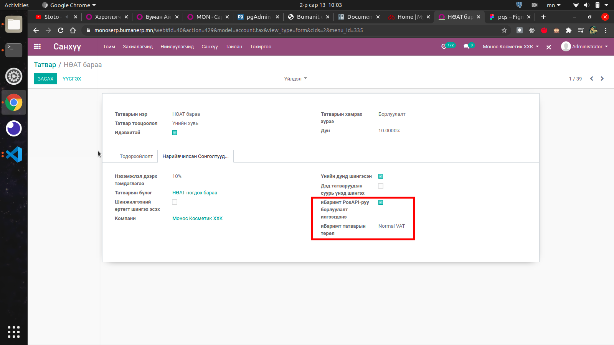
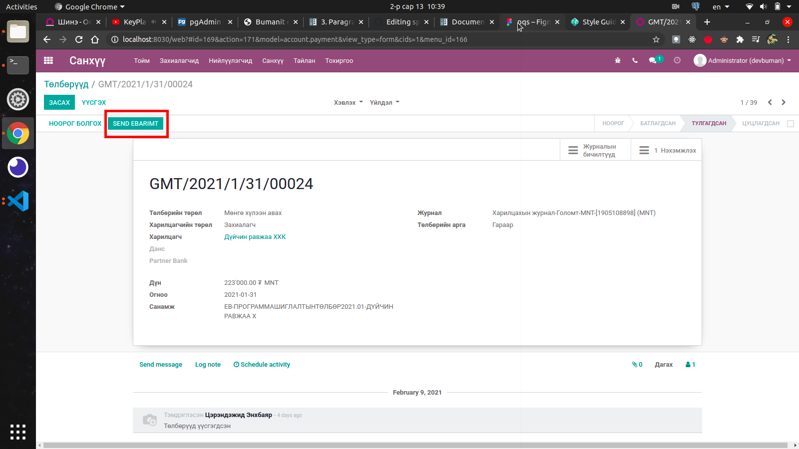
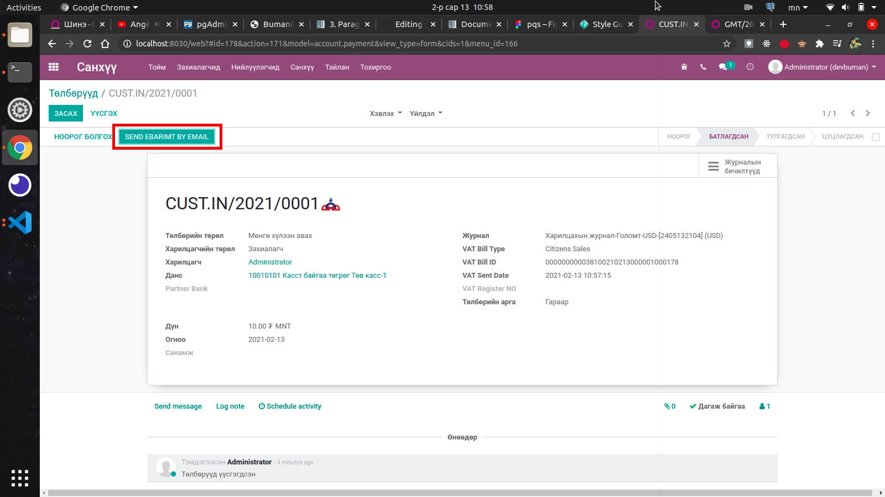
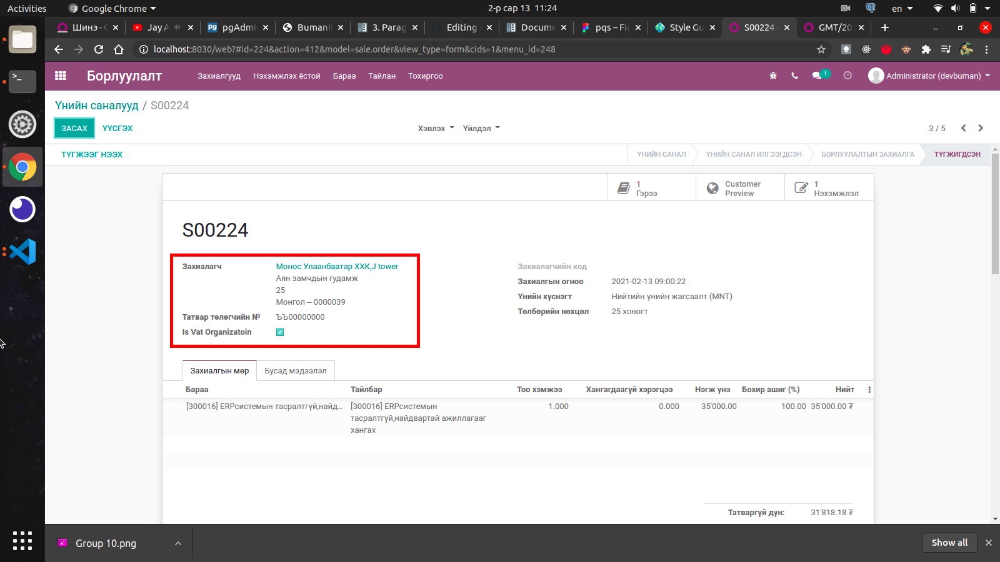

******************************
Bumanit eBarimt.mn Integration
******************************

Техникийн нэр
===========================
:guilabel:`bumanit_ebarimt`

Уялдаа холбоо
===============

:guilabel:`sale`
:guilabel:`bumanit_account`
:guilabel:`bumanit_stock`

Тайлбар
=======

Монгол улсын НӨАТ-ын eBarimt.mn системтэй интеграци хийх модуль 

Системийн ерөнхий тохиргоо
--------------------------

:guilabel:`Удирдлага => Тохиргоо` эрхтэй хүн модулийн бүх тохиргоог хийх боломжтой

.. figure::
    ../../../img/modules/bumanit_ebarimt/frame1.png

1. **eBarimt-тай холбогдох:** идэвхижүүлснээр bumanit_ebarimt модуль сууна.

.. note:: 
    Дээрх сонголтыг идэвхигүй болгосноор bumanit_ebarimt модуль устаж системд 
    бүртгэгдсэн бүх eBarimt.mn-н датаг устгах тул болгоомжтой харьцана уу!!!

2. **Vat Send Type:** eBarimt.mn-г нэхэмжлэхээс илгээх эсвэл төлбөрөөс илгээхийг шийднэ.
3. **Борлуулалт дээр ТТД-г заавал шаардана:** Борлуулалтын мөр болгон дээр НӨАТ-ын татвар оруулахыг шаардана. 
4. **Борлуулалт дээрх ТТД-г шалгах:** Борлуулалт дээрх татвар төлөгчийн дугаарыг шалгана.
5. **Auto sync Sales Invoice to eBarimt:** Нэмэмжлэл батлах үед автоматаар eBarimt.mn уруу илгээнэ

Татварын тохиргоо
--------------------------

1.  **иБаримт PosAPI-руу борлуулалт илгээгдэнэ:** тохиргоог идэвхижүүлснээр тус татвар сонгосон 
    борлуулалтын мөрүүдийг eBarimt.mn уруу илгээнэ.
2.  **иБаримт татварын төрөл:** татварын илгээх төрөл

..  note::
    - Татварын илгээх төрөл нь *"Normal VAT"*, *"VAT Zero %"*, *"VAT Free"* гэсэн сонголтуудтай.
    - *"Normal VAT"* - энгийн НӨАТ-ын татвар гэж илгээнэ.
    - *"VAT Zero %"* - харилцагчийн eBarimt.mn уруу илгээх ТТД-г 2000000-тай болгож татварын хувь тооцохгүй.
    - *"VAT Free"* - харилцагчийн eBarimt.mn уруу илгээх ТТД-г 3000000-тай болгож татвараас чөлөөлөгдсөн борлуулалтаар илгээнэ.

Төлбөрөөс eBarimt.mn уруу илгээх
--------------------------------

..  note::
    - Төлбөр батлагдах үед автоматаар илгээхгүй.
    - Төлбөрөөс eBarimt.mn уруу илгээхэд татвар дээрх болон системийн тохиргоонууд хамаарахгүй бөгөөд татварын төрлийг *"Normal VAT"* гэж үзэн төлбөрийн дүнг 1.1-т хувааж илгээнэ.
    - Харилцагч дээр тохируулсан ТТД-с хамаарч хувь хүн эсвэл байгууллага гэдгийг шийднэ.
    - Зөвхөн нэхэмжлэхтэй тулгагдсан захиалагчийн төлбөр төлөлтийг eBarimt.mn уруу илгээнэ.
    - Илгээгдсэн төлбөрийн баримтыг имэйлээр харилцагч уруу илгээх шинэ боломж (Доорх зурагт үзүүлэв).

Нэхэмжлэхээс eBarimt.mn уруу илгээх ойлголтууд
-----------------------------------------------

#)  Борлуулалттай холбоотой нэхэмжлэхийн холбоотой борлуулалт дээр ТТД байвал борлуулалтын ТТД-аар 
    eBarimt.mn уруу илгээнэ эсрэг тохиолдолд харилцагч дээр тохируулсан ТТД-ыг илгээнэ.
#)  eBarimt.mn уруу илгээх ТТД 1000000-тай байвал eBarimt.mn уруу илгээхгүй.
#)  eBarimt.mn уруу илгээх ТТД нь 1000000-с ялгаатай 7 оронтой тоо байвал байгууллага эсрэг тохиолдолд хувь хүн гэж илгээнэ.

..  note:: 
    -   Харилцагчийн ТТД-г 1000000 гэж тохируулсан боловч борлуулалтын ТТД дээр ЬЬ000000 гэсэн утга оруулвал 
        эцсийн хэрэглэгчээр илгээнэ эсвэл 1000000-с ялгаатай 7 оронтой тоо оруулвал байгууллага гэж илгээнэ.
    -   Харилцагчийн ТТД-д дурын хувь хүний регистер эсвэл албан байгууллагын регистер тохируулсан бөгөөд
        борлуулалтын ТТД-д 1000000 гэж оруулвал eBarimt.mn уруу илгээхгүй.

Хувь хүний регистерийн дугаараар татвар төлөх боломжтой шинэчлэлтийн хөгжүүлэлт

..  note:: 
    Дээрх логикуудтай зөрчилдөх тохиолдол нь eBarimt.mn уруу илгээх ТТД нь хувь хүний регистерийн дугаар 
    байвал *"Is Vat Organization"* талбар харагдах бөгөөд тухайн талбарыг идэвхижүүлснээр харилцагчийг хувь хүний 
    регистерээр нь байгууллага гэж татвар уруу илгээнэ.