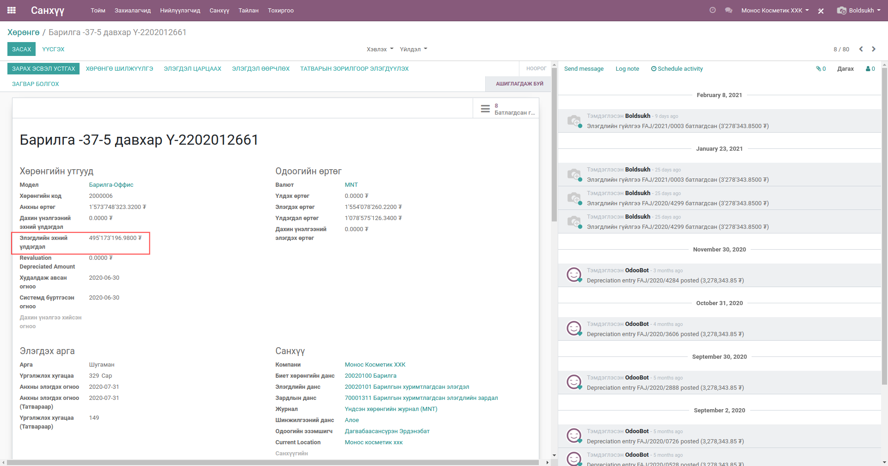
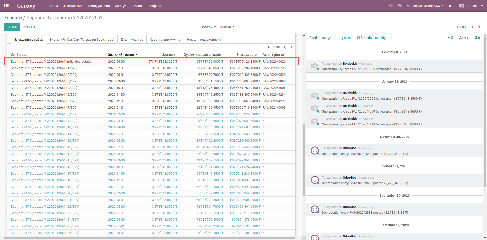
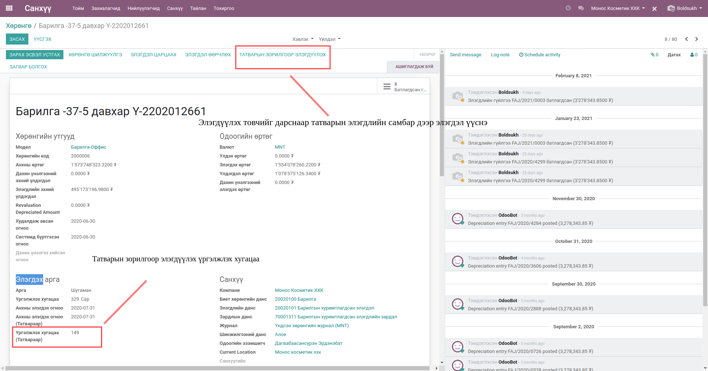
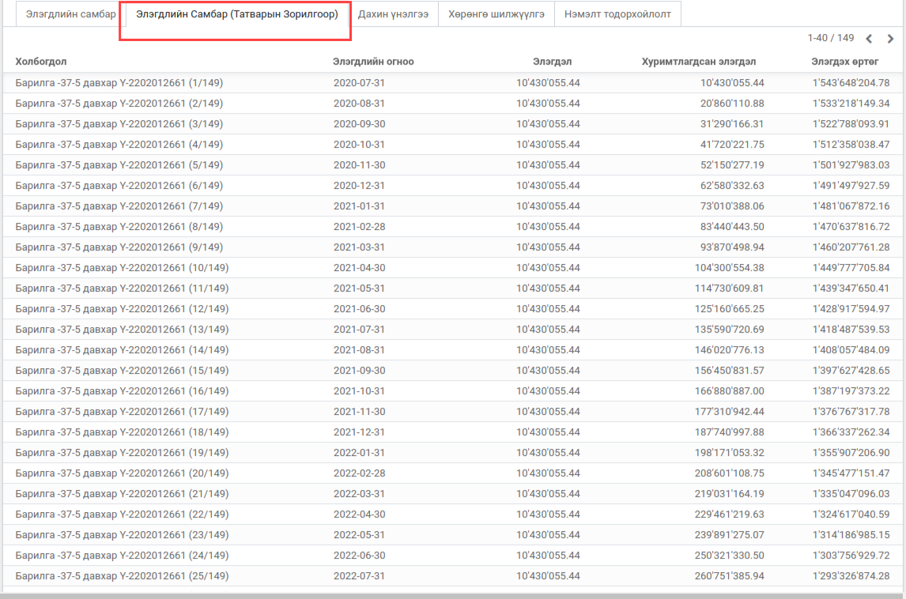
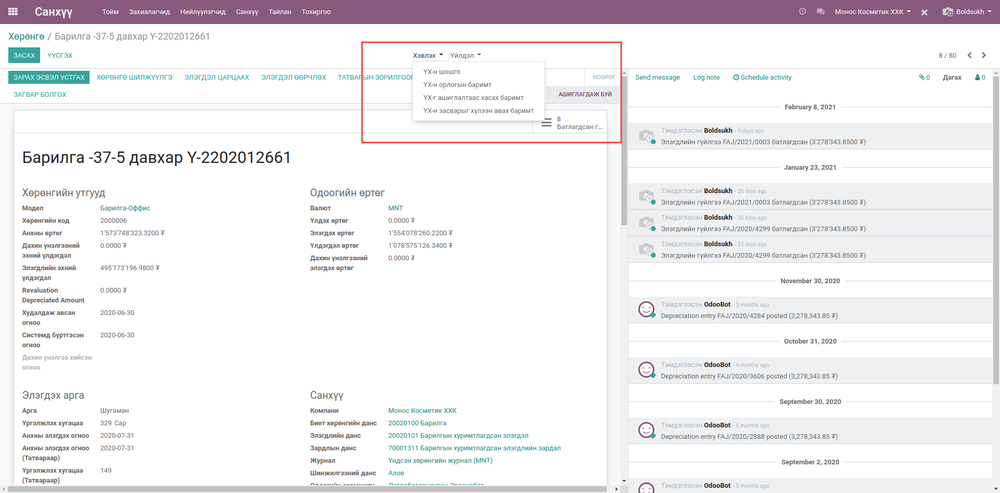
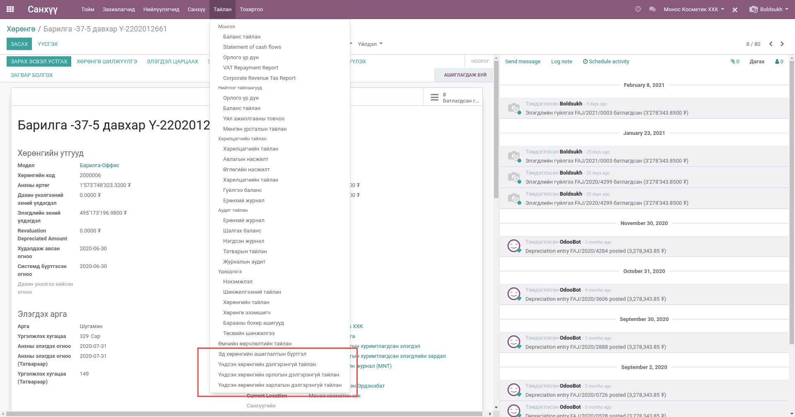

*************
Үндсэн хөрөнгө
*************

.. |

Техникийн нэр
=============
:guilabel:`bumanit_asset`

.. |

Тайлбар
=======

Odoo v13 санхүү үндсэн хөрөнгө модулийн өргөтгөл бөгөөд өөрсдийн шаардлагын хүрээнд дахин засварлаж
нэмэлт боломжуудаар хангаж өгсөн болно.

.. |

Уялдаа холбоо
=============
:guilabel:`account`
:guilabel:`sale`
:guilabel:`bumanit_account`
:guilabel:`account_asset`
:guilabel:`bumanit_asset_ownership`
:guilabel:`bumanit_asset_first_balance`

.. |

Хөгжүүлэлт
==========

Элэгдлийн эхний үлдэгдэл оруулах
-------------------------------------

Системд шинээр хөрөнгө бүртгэх үед өмнө нь элэгдэлтэй байсан хөрөнгүүдийн өртгийг хасаж тооцолно.

1. Эхний үлдэгдэл оруулах 

2. Эхний үлдэгдэл оруулсны дараа элэгдлийн самбар дараах байдлаар үүснэ.

3. Анхны өртөг - Элэгдлийн эхний үлдэгдэл = Үлдэгдэл өртөг
4. Үлдэгдэл өртөг / Үргэлжлэх хугацаа -нд хувааж элэгдлийн самбар үүснэ.

Үндсэн хөрөнгө татварын зорилгоор элэгдүүлэх
-------------------------------------

1. Татварын зорилгоор элэгдүүлэхдээ үргэлжлэх хугацааг оруулж өгнө.
2. Элэгдүүлэх эхний огноог оруулна.
3. Татварын зорилгоор элэгдүүлэх гэсэн товчийг дарснаар элэгдлийн самбар үүснэ.

.. note::
    Татварын зорилгоор элэгдүүлэх үед ажил гүйлгээ үүсэхгүй.

PDF тайлангууд 
-------------------------------------

1. Үдсэн хөрөнгийн шошго
2. Үдсэн хөрөнгийн орлогын баримт
3. Үдсэн хөрөнгийн ашиглалтаас хасах баримт
4. Үдсэн хөрөнгийн засварыг хүлээн авах баримт
5. Үдсэн хөрөнгийн шилжүүлэгийн баримт

Excel тайлангууд
-------------------------------------

    Хөрөнгө -> Тайлан

1. Эд хөрөнгө ашиглалтын бүртгэл
2. Үндсэн хөрөнгийн дэлгэрэнгүй тайлан
3. Үндсэн хөрөнгийн орлогын дэлгэрэнгүй тайлан
4. Үндсэн хөрөнгийн зарлагын дэлгэрэнгүй тайлан

.. note:: 
    Тайлан хэвлэхийн тулд ерөнхий тохиргоонд байгаа ажилчид дээр мэргэжилтэн байх шаардлагатай.

Бусад хөгжүүлэлтүүд
-------------------------------------

1. Системд бүртгэгдсэн огноо оруулах 
2. Хөрөнгөнд код оноох 
3. Хөрөнгө устгах үед ажил гүйлгээ үүсгэх
4. Баримтуудад автомат дугаарлалт өгөх г.м хөгжүүлэлтийг энэхүү модуль дээр хийж гүйцэтгэсэн болно.
