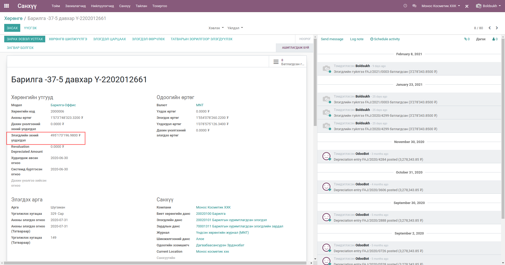
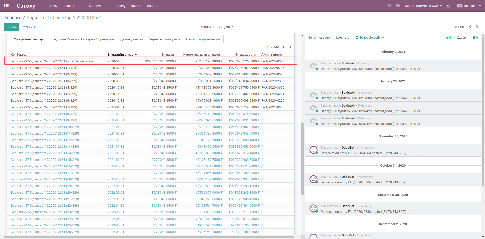
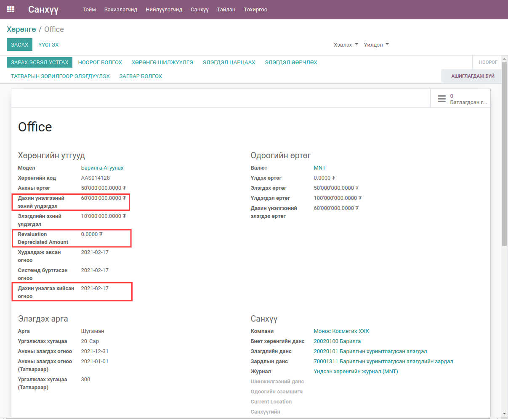
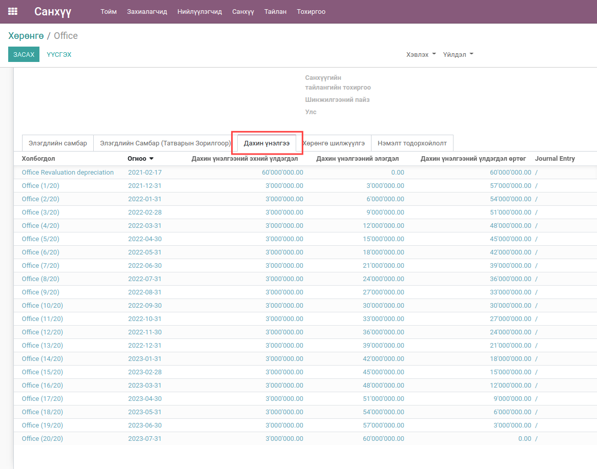
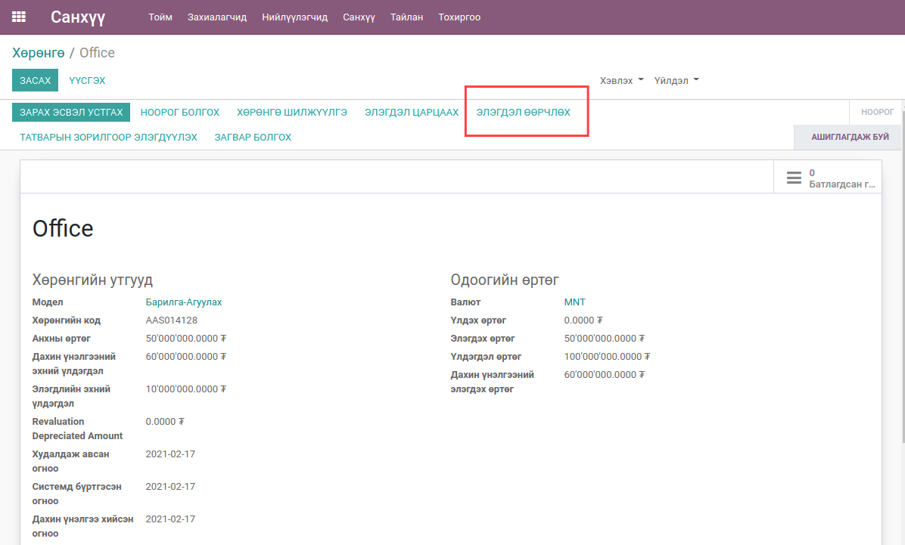
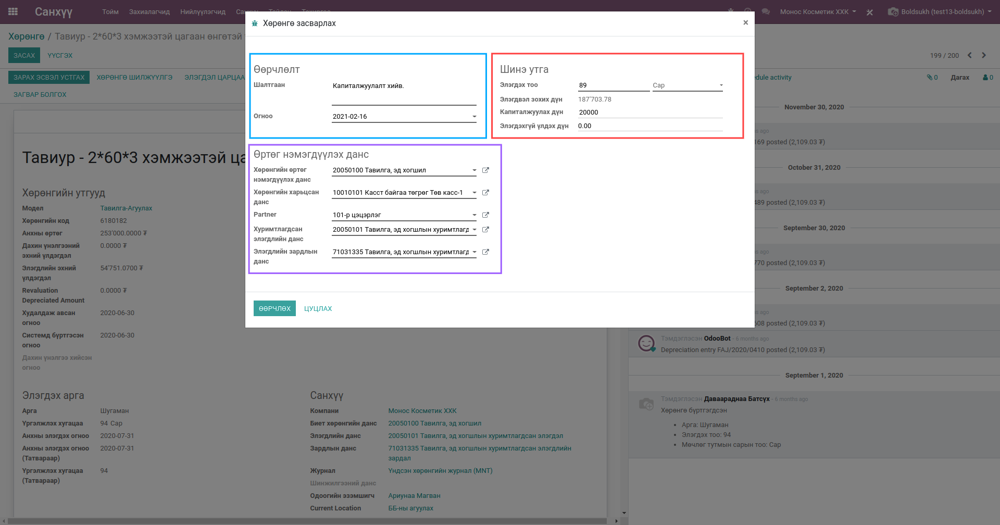
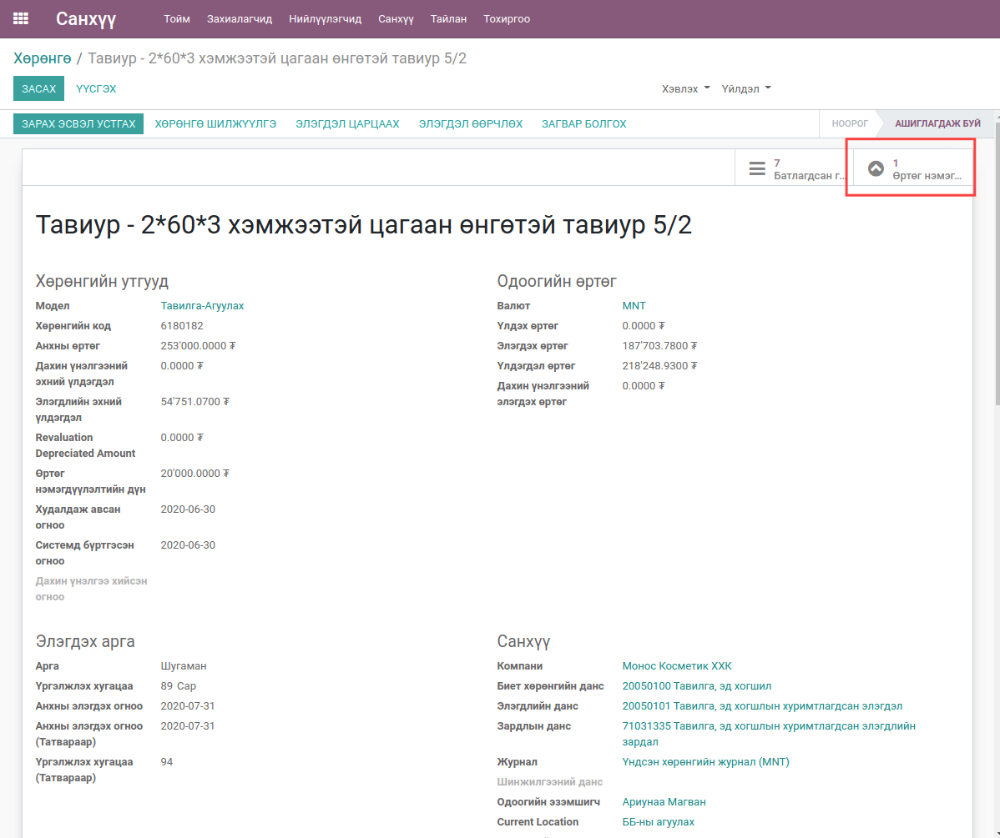
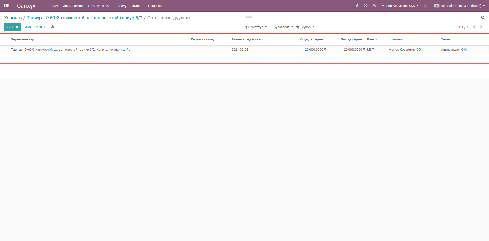
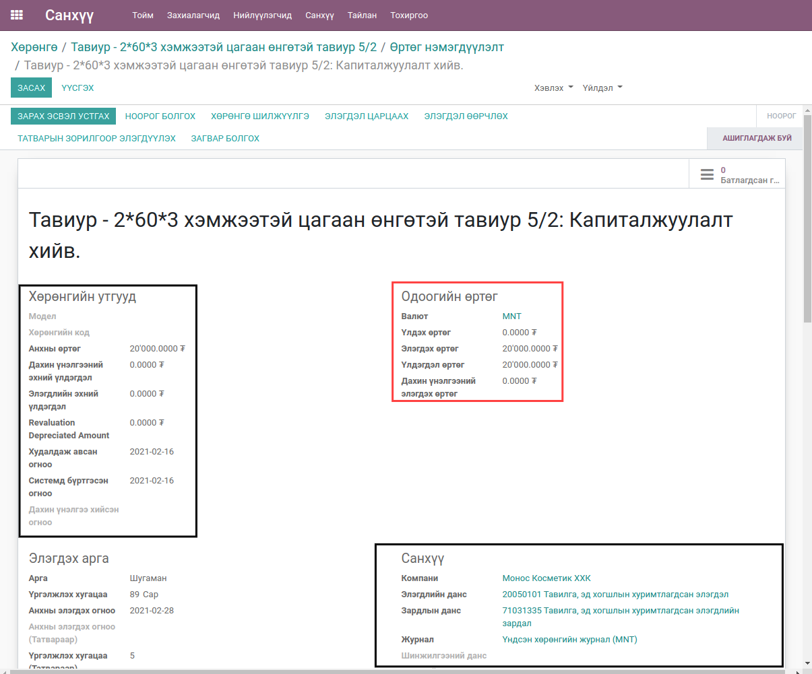
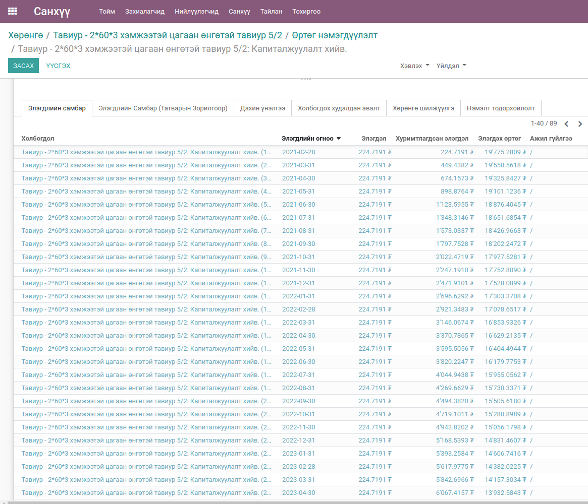

******************************
Үндсэн хөрөнгө хуримтлагдсан элэгдэл тооцох
******************************

.. |

Техникийн нэр
=============

``bumanit_asset_first_balance``

.. |

Уялдаа холбоо
=============

| ``account_asset``

Тайлбар
=======

Үндсэн хөрөнгийн хуримтлагдсан элэгдэл бүртгэн элэгдэл тооцох, эхний үлдэгдлээр дахин үнэлэх, капиталжуулалт

.. |

Хөгжүүлэлт
==========

Элэгдлийн эхний үлдэгдэл оруулах
-------------------------------------

Системд шинээр хөрөнгө бүртгэх үед өмнө нь элэгдэлтэй байсан хөрөнгүүдийн өртгийг хасаж тооцолно.

1. Эхний үлдэгдэл оруулах 

2. Эхний үлдэгдэл оруулсны дараа элэгдлийн самбар дараах байдлаар үүснэ.

3. Анхны өртөг - Элэгдлийн эхний үлдэгдэл = Үлдэгдэл өртөг
4. Үлдэгдэл өртөг / Үргэлжлэх хугацаа -нд хувааж элэгдлийн самбар үүснэ.

Үндсэн хөрөнгийн дахин үнэлгээ
-------------------------------------

1. Дахин үнэлгээний эхний үлдэгдэл 

2. Дахин үнэлгээ оруулсны дараа элэгдлийн самбар дараах байдлаар үүснэ.

3. Дахин үнэлгээний эхний үлдэгдэл - Дахин үнэлгээний элэгдэл = Үлдэгдэл өртөг
4. Үлдэгдэл өртөг / Үргэлжлэх хугацаа -нд хувааж элэгдлийн самбар үүснэ.

Үндсэн хөрөнгийн капиталжуулалт
-------------------------------------

1. Капиталжуулалт хийхдээ элэгдэл өөрчлөх гэсэн товч дээр дарна.

2. Капиталжуулалттай холбоотой цонх нээгдэнэ.

.. note:: 
    1. Цэнхрээр тодруулсан хэсэгт: 
        1.1 Капиталжуулалталт хийх шалтгаан 
        1.2 Ажил гүйлгээ үүсгэх огноо
    2. Улаанаар тодруулсан хэсэг:
        2.1 Элэгдэх тоо 
        2.2 Элэдвэл зохих дүн
        2.3 Капиталжуулалт хийх дүн
        2.4 Элэгдэхгүй үлдэх дүн
    3. Ягаанаар тодруулсан хэсэгт 
        3.1 Хөрөнгийн өртгийн данс
        3.2 Хөрөнгийн харьцсан данс
        3.3 Харилцагч 
        3.4 Хуримтлагдсан элэгдлийн данс
        3.5 Элэгдлийн зардлын данс

3. Эдгээр шаардлагатай талбаруудыг бөглөж батласнаар эцэг хөрөнгөнд child хөрөнгө шинээр үүсдэг ба өртөг нэмэгдүүлэлт гэсэн товч харагдана.

4. Өртөг нэмэгдүүлэлт дээр дарснаар капиталжуулалт хийгдсэн child хөрөнгө лист байдлаар харагдана.

.. note:: 
    Капиталжуулалт хийгдсэн хөрөнгө болгон дээр child хөрөнгө үүснэ. 

5. Child хөрөнгийн нэр нь эцэг хөрөнгийн нэр + капиталжуулалтын шалтгаан байна.
6. Child хөрөнгийн худалдаж авсан огноо, системд бүртгэгдсэн огноо, данс, журнал, шинжилгээний данс, шинжилгээний пайзийг эцэг хөрөнгөөс авна.

7. Өртөг нэмэгдүүлэлт хийсэн дүнгээр самбар байгуулагдана.

Системийн ерөнхий тохиргоонд хийгдсэн хөгжүүлэлтүүд
-------------------------------------------------------------
