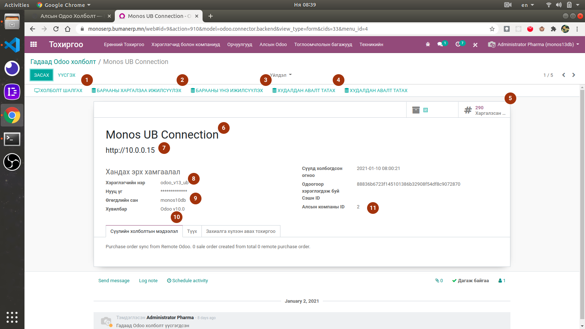
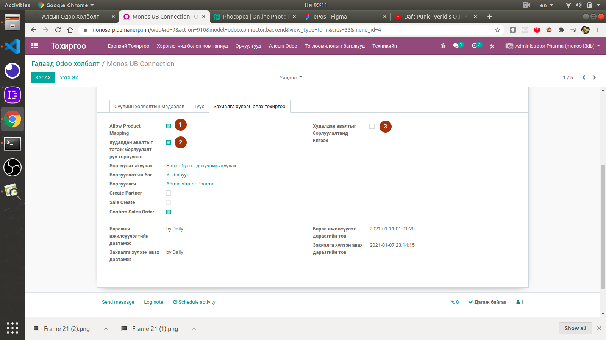
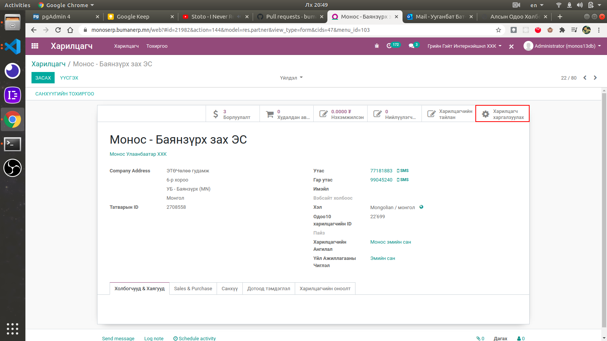
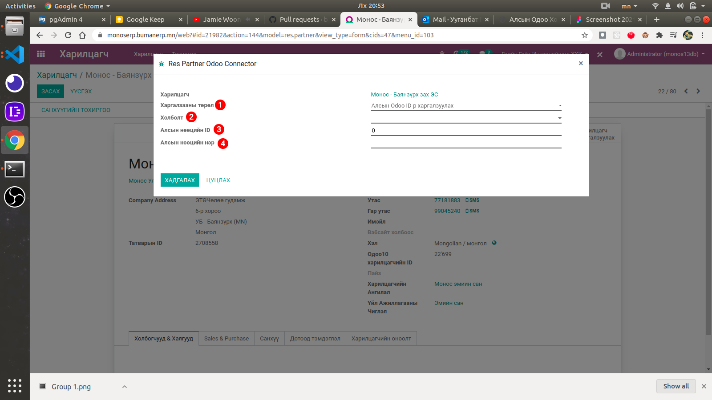
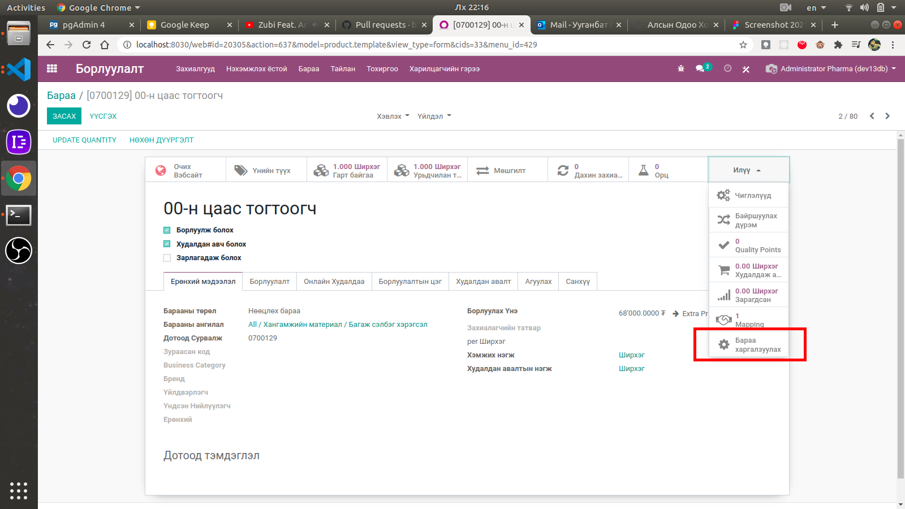

Алсын Одоо Холболт
****************************

Odoo 10 болон Odoo 13 систем хооронд худалдан авалт болон борлуулалтыг илгээх зорилготой нэмэлт модуль юм.

Техникийн нэр
===========================
:guilabel:`bumanit_odoo_connector`

Уялдаа холбоо
===============

:guilabel:`bumanit_stock`
:guilabel:`bumanit_connector`
:guilabel:`bumanit_sale_availability`
:guilabel:`delivery`

Ерөнхий тохиргоо
=========================

Системд нэмэгдэх групп, цэс хэрхэн ажиллах ойлголт

Групп
----------------------------------
:guilabel:`Гадаад одоо холболт удирдах`

Модуль суулгахад нэмэгдэх цэсүүд
----------------------------------

| Тохиргоо ==> Алсын одоо

Тохиргооны форм харагдац
----------------------------------

1) Алсын одоо системтэй холболт тогтооно.
2) Барааны мэдээлэл татаж өөрийн системийн бараатай харгалзуулна.
3) Өөрийн системийн борлуулах үнийг алсын одоо систем уруу илгээнэ.
4) Алсын одоо системийн "Нийлүүлэгч батлахыг хүлээж буй" төлөвтэй худалдан авалтыг татаж өөрийн систем дээр борлуулалт үүсгэнэ.
5) Харгалзааны мэдээлэл харна.
6) Холболтын нэр.
7) Холбогдох хаяг.
8) Холбогдох хэрэглэгчийн нэр (10 систем дээрх хэрэглэгч тул санамсаргүй байдлаар 10-с утсгах тохиолдол гардаг анхаараарай).
9) Холбогдох өгөгдлийн баазын нэр
10) Холбогдох хувилбар
11) Алсын одоотой холбогдсон компаний ID

1) Барааны харгалзаа ижилсүүлэлтийг зөвшөөрнө.
2) Худалдан авалт татаж борлуулалт үүсгэхийг зөвшөөрнө.
3) Худалдан авалт үүсгэж алсын Одоо систем уруу борлуулалт илгээхийг зөвшөөрнө.

Харгалзаа
=========================

Өгөгдлийн бохирдол үүсэж харгалзааны мэдээлэл буруу хийгдэх тохиолдол гарах 
бөгөөд улмаар хоёр систем хоорондоо холбогдож мэдээлэл солилцож чадахгүйд хүргэж 
байгаа бөгөөд үүнийг шийдэхийн тулд харилцагч болон барааны харгалзааг зөв 
болгож засах зорилготой доорх хөгжүүлэлтийг хийлээ.

Харилцагч харгалзуулах
----------------------------------

Доорх зурагт үзүүлсэн товч :guilabel:`Гадаад одоо холболт удирдах` эрхтэй хэрэглэгчид харагдах 
бөгөөд шууд Odoo 10 дээрх :guilabel:`res.partner`-н ID аар харгалзаа хийнэ.

#) Харгалзааны төрөл
#) Алсын одоо холболт
#) Алсын нөөцийн ID: Одоо 10 дээрх :guilabel:`res.partner` ID өгнө
#) Алсын нөөцийн нэр

Бараа харгалзуулах
----------------------------------

Доорх зурагт үзүүлсэн товч :guilabel:`Гадаад одоо холболт удирдах` эрхтэй хэрэглэгчид харагдах 
бөгөөд шууд Odoo 10 дээрх :guilabel:`product.product`-н ID аар харгалзаа хийнэ.

#) Алсын одоо холболт
#) Алсын нөөцийн ID: Одоо 10 дээрх :guilabel:`product.product` ID өгнө
#) Алсын нөөцийн нэр