Bumanit HR
****************************

Хүний нөөцийн модуль

Техникийн нэр
===========================
:guilabel:`bumanit_hr`

Уялдаа холбоо
===============

:guilabel:`hr`
:guilabel:`hr_contract`

Модуль суулгахад нэмэгдэх цэсүүд
----------------------------------

| Апп ==> Ажилтнууд

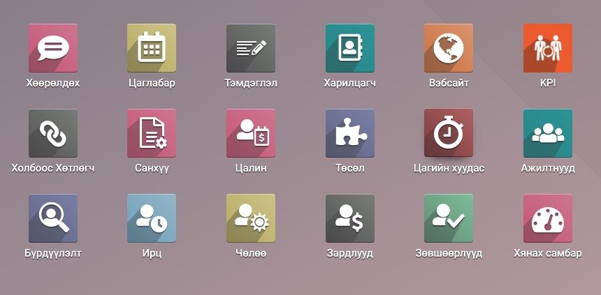

Ажилтны мэдээлэл
=========================

Ажилтны мэдээлэлд дараах бүртгэлүүдийг нэмэв

1. HR Тохиргоонууд хэрэгт - Албан тушаалын зэрэглэл сонгох талбар /Зураг 1/

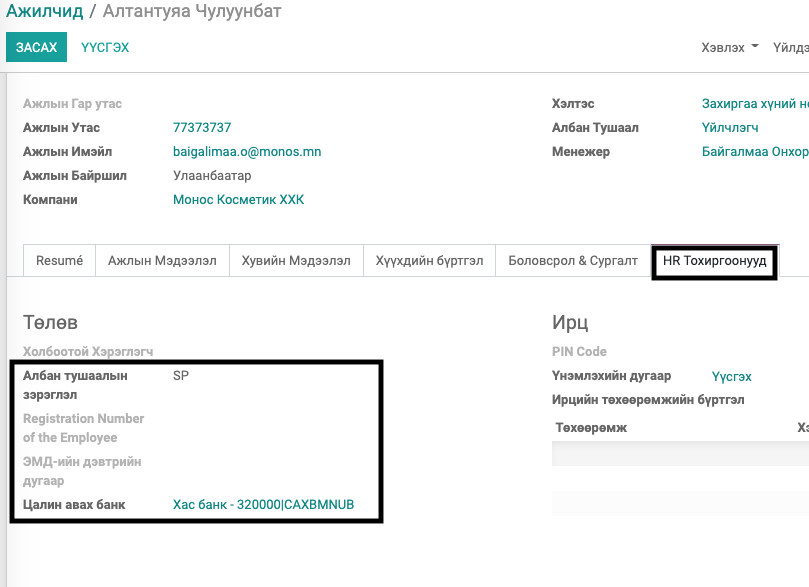

2. Ажилтны Хувийн мэдээлэл хэрэгт - Ажилласан жилийн мэдээлэл  /Зураг 2 - 1/
3. Ажилтны Хувийн мэдээлэл хэрэгт - Ажилтны хөдөлмөрийн чадвар алдалт (Тохиргоо хэсэгт Ажилтны хөдөлмөрийн чадвар алдалтын бүртгэлүүд үүсгэж түүнээс тохирохыг ажилтанд сонгох)  /Зураг 2 - 2/

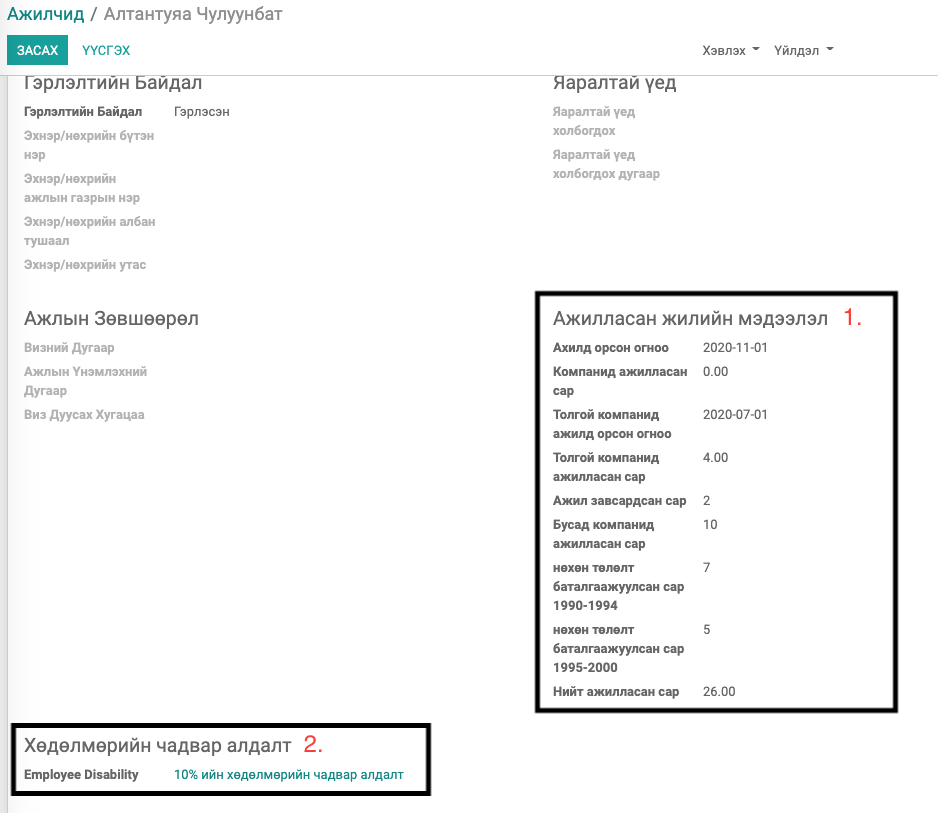
    
4. Хүүхдийн бүртгэл - Ажилтны бүртгэлийн хэсэгт шинэ таб нэмэв /Зураг 4/
5. Боловсролын зэрэг, Мэргэжлийн болон мэргэшүүлэх сургалтын бүртгэл (Боловсролын зэрэг, Мэргэжлийн болон мэргэшүүлэх сургалтын ерөнхий бүртгэлийг тохиргоо хэсэгт хийж ажилтанд сонгож бүртгэх /Зураг 3/) /Зураг 4 - 1, 3/
6. Мэргэжлийн үйл ажиллагаа эрхлэх зөвшөөрлийн гэрчилгээ, Ажилтны шагналын бүртгэл /Зураг 4 - 2/
7. Ажилтны шагналын бүртгэл /Зураг 4 - 4/
8. Ажилтны зарим шаардлагагүй мэдээлэл нуух
    
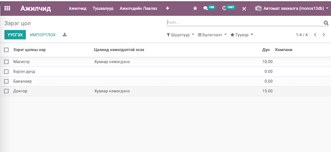

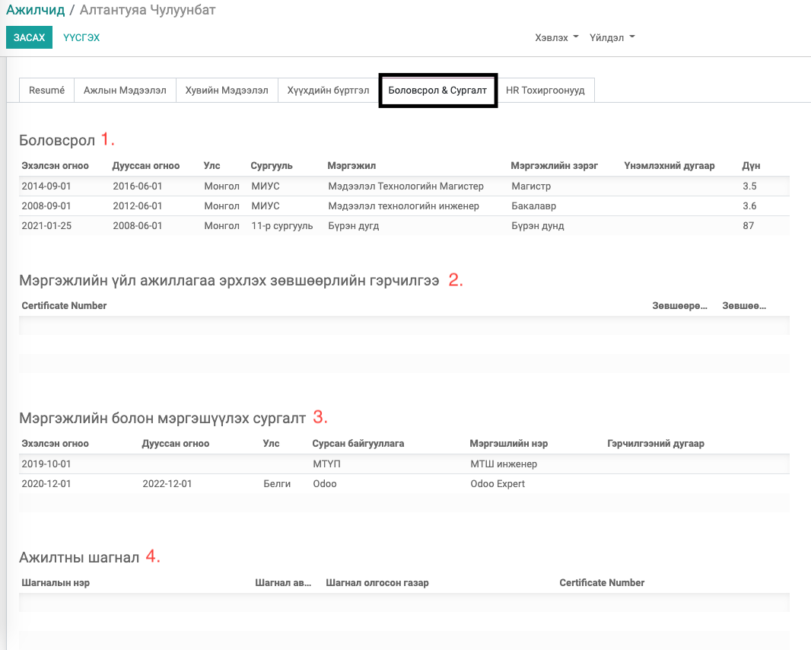

Боловсролын зэрэг, Мэргэжлийн болон мэргэшүүлэх сургалтын бүртгэл
=================================================================

Боловсролын зэрэг, Мэргэжлийн болон мэргэшүүлэх сургалтын бүртгэл нь цалин дээр нэмэгдэл бодоход нөлөөлдөг тул чухал ач холбогдолтой.

Тохиргоо хэсэгт /Зураг 5 - 1/ цэсүүд нэмэгдэнэ. Боловсролын зэрэг, Мэргэжлийн болон мэргэшүүлэх сургалт нь цалин дээр нэмэгдэх бол Хувь, Тогмол дүнгээр гэсэн сонголтоор нэмэгдлийн тохиргоог бүртгэнэ. Хэрэв цалингийн нэмэгдэл эсвэл үндсэн мэдээлэл нь Грүпп компани дотор хамт ашиглах бол Компани-ыг хоосон орхино. Харин зөвхөн танай компанид ашиглах бол Компани дээр өөрийн компаныг сонгох юм.

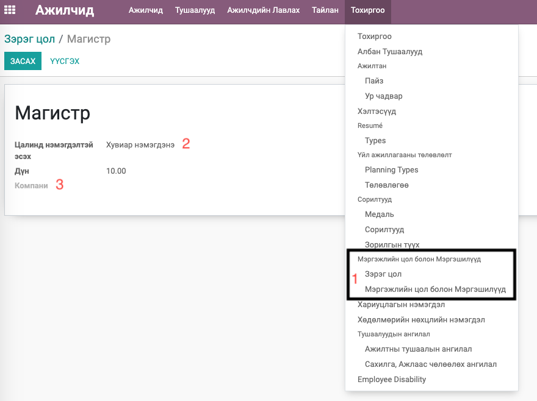

Ажилтны мэдээлэлд тухайн ажилтны Боловсролын зэрэг, Мэргэжлийн болон мэргэшүүлэх сургалтын бүртгэхдээ дараах зүйлсийг анхаарна

1. Боловсролын зэрэг, Мэргэжлийн болон мэргэшүүлэх сургалтын бүртгэл нь цалин дээр тусдаа бодогддог тул тохирох газар бүртгэнэ.
2. Боловсролын зэрэг, Мэргэжлийн болон мэргэшүүлэх сургалтын бүртгэл дээр Магистер, Доктор гэх мэт нэг бүлэгт олонг бүртгэвэл цалин дээр аль өндөр дүнгээр нэмэгдэх болно.
3. Мэргэжлийн болон мэргэшүүлэх сургалтын бүртгэл дээрхи эхлэх болон дуусах хугацаа нь цалингийн хугацаанд тохирохгүй үед цалин дээр нэмэгдэл бодогдохгүй тул энэ огноог чухал анхаарч бүртгэх

Ажилтны гэрээний мэдээлэл
=========================

Ажилтны гэрээний мэдээлэлд 
Ажлын нөхцөл 
Холбоотой өмнөх гэрээг сонгох боломжуудыг нэмж оруулав

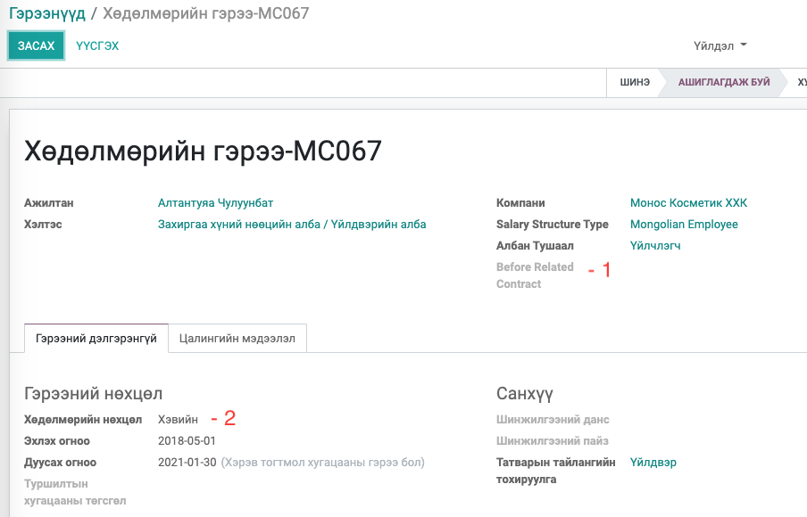

Ажилтны тушаал
=========================

Нийт 5 төрлийн ажилтны тушаал болон, Сахилгын шийтгэл, Ажлаас чөлөөхөх тушаал гэсэн 7 төрлийн тушаал бүртгэж хэвлэнэ.

1) Ажилтны тушаал 
    1. Туршилтын хугацаагаар ажилд томилох
    2. Албан тушаалд томилох
    3. Үндсэн албан тушаалд томилох
    4. Албан тушаалд өөрчлөлт оруулах
    5. Цалинд өөрчлөлт оруулах
2) Сахилга, ажлаас чөлөөлөх тушаал 
    1. Ажлаас чөлөөлөх
    2. Сахилга

Ажилтнууд модульд доорхи Цэсүүд нэмэгдэнэ
    Ажилтны тушаал, Сахилга, ажлаас чөлөөлөх тушаал /Зураг 6 - 1/
    
    Тушаалын ангилал цэсүүд шинээр нэмэгдэнэ /Зураг 6 - 2/

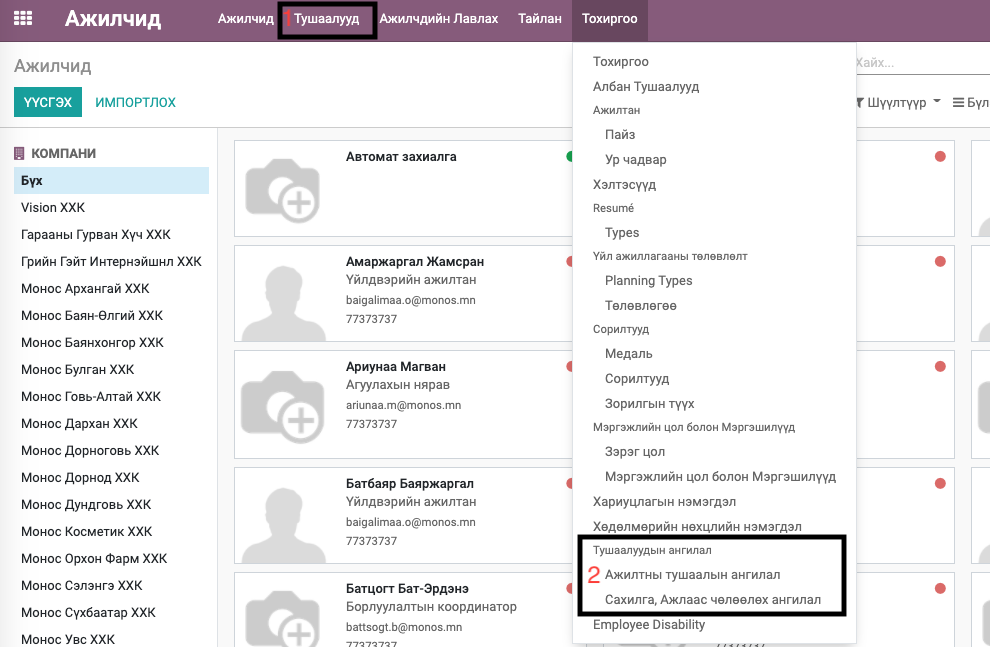

Ажилтны тушаалын ангилалын бүртгэл. Тушаал хэвлэхэд Ангилалын нэрийг тушаалын нэрээр авна. /Зураг 7/

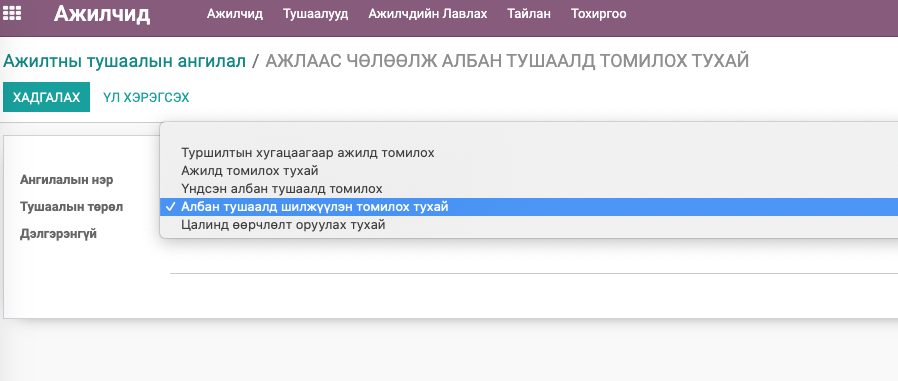

Ажилтны тушаалын бүртгэл Тушаалын хэрэгжих огноог Ажилтны гэрээнээс шууд авна. /Зураг 8/

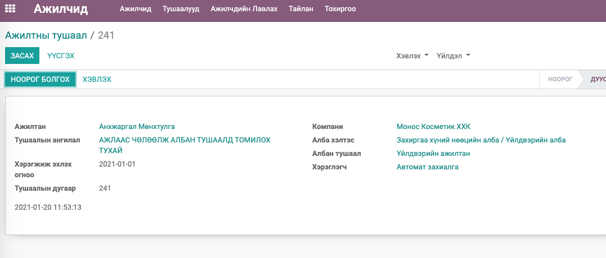

Батлагдсан тушаал хэвлэх (Тушаалтай холбоотой хэрэглэгчид (Батлах, Цалин зөвшөөрөх, Тушаалын хяналт) болон холбогдох хууль журмуудын зүйл заалтуудыг гараас авч хэвлэнэ.) /Зураг 9/

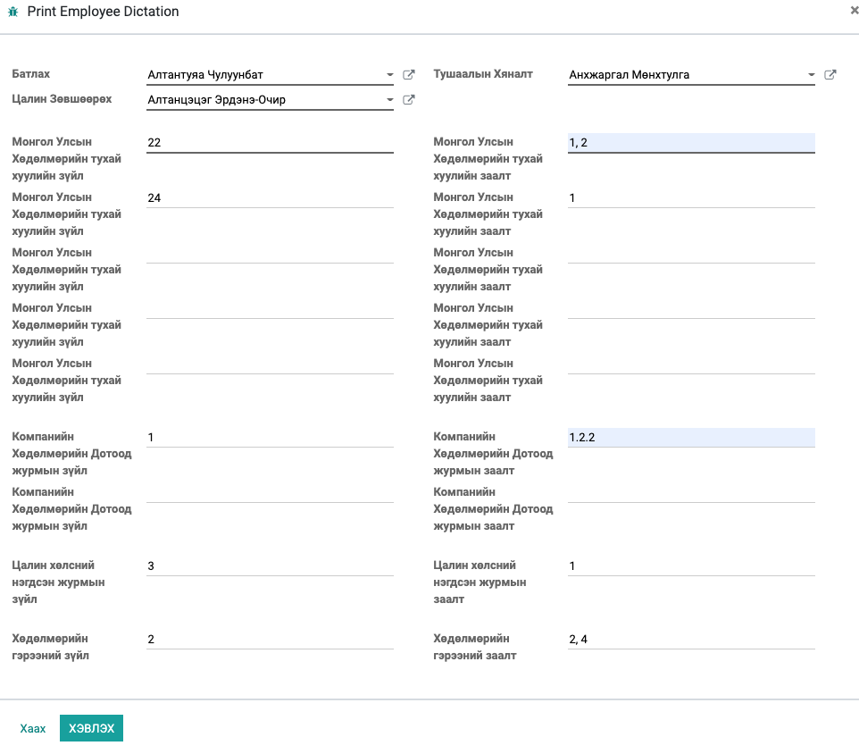