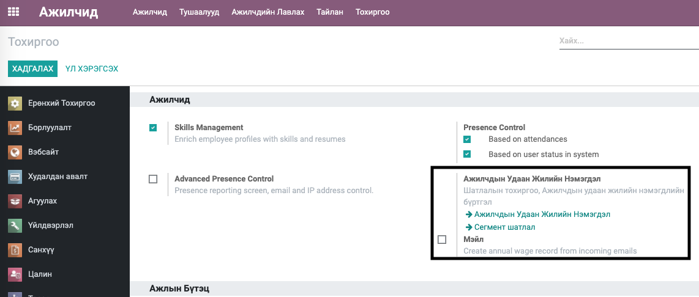
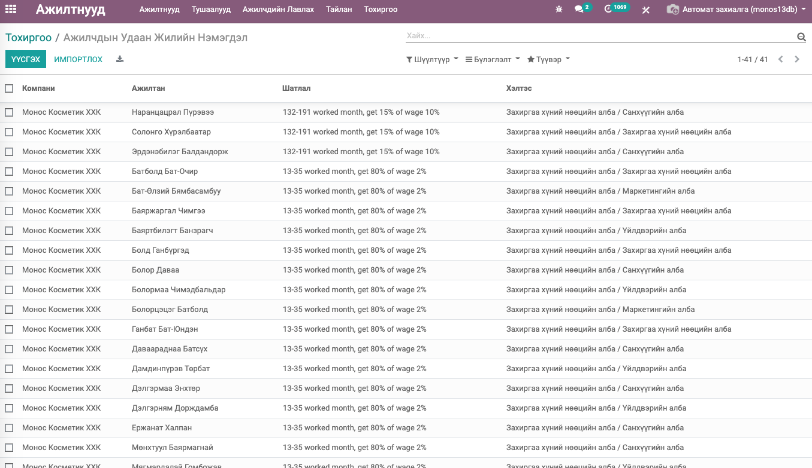
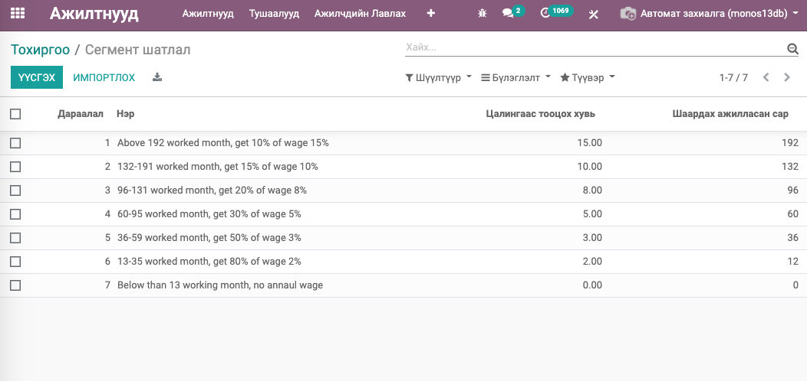

HR Annual Wage
****************************

Хүний нөөцийн модуль

Техникийн нэр
===========================
:guilabel:`bumanit_hr_annual_wage`

Уялдаа холбоо
===============

:guilabel:`hr`
:guilabel:`bumanit_hr`
:guilabel:`digest`
:guilabel:`web_dashboard`

Модуль суулгахад нэмэгдэх цэсүүд
----------------------------------

| Апп ==> Ажилтнууд => Тохиргоо => Тохиргоо

Ажилтны мэдээлэл
=========================

HR Annual Wage модуль сууснаар Ажилтнууд => Тохиргоо => Тохиргоо хэсэг дээрхи 2 цэс нэмэгдэнэ. 
Энэ модуль нь сар бүрийн 1-ний өдөр ажиллах Төлөвлөгөөт үйлдэлтэй бөгөөд энэ үйлдлээр Ажилчдын Удаан Жилийн Нэмэгдэлийг Ажилтны толгой компанид ажилласан сар нь Сегмент шатлалын аль нэгд хамаарч байгаа эсэхийг шалгаж Ажилчдын Удаан Жилийн Нэмэгдэлийн бүртгэлийн мэдээллийг шинэчлэдэг. 
Энэ мэдээллийг шинэчлэхээс гадна Удаан жилийн нэмэгдэл шинэчлэгдсан ажилтнууд болон Хүний нөөцийн менежер, Нягтлангуудад энэ мэдээллийг мэйлээр илгээх үйлдлийг хийдэг болно.
1. Ажилчдын Удаан Жилийн Нэмэгдэл /Зураг 1/

2. Сегмент шатлал

