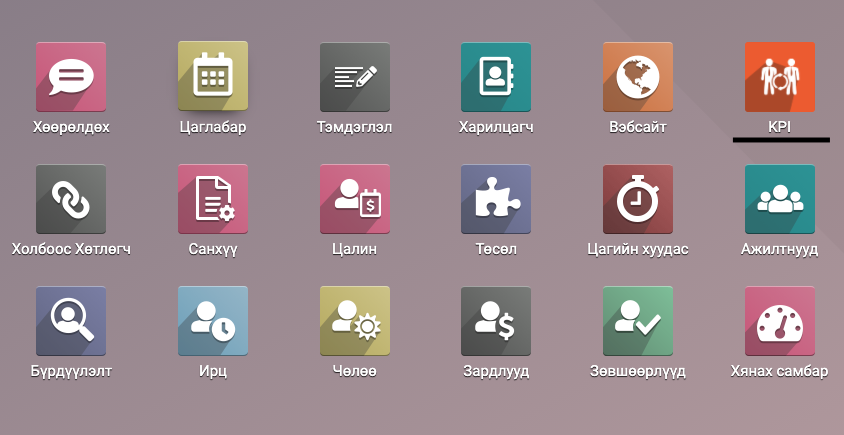
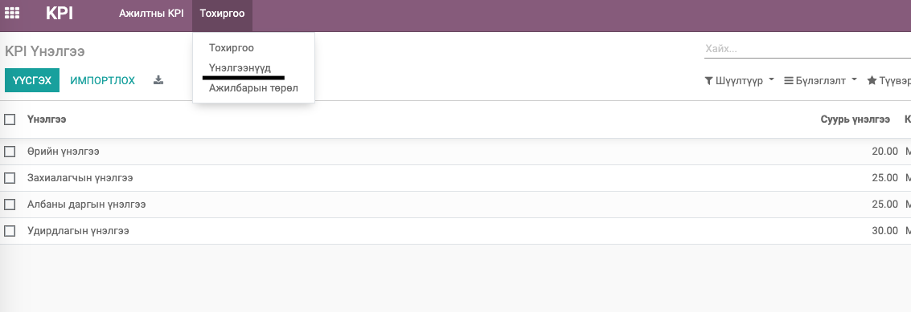
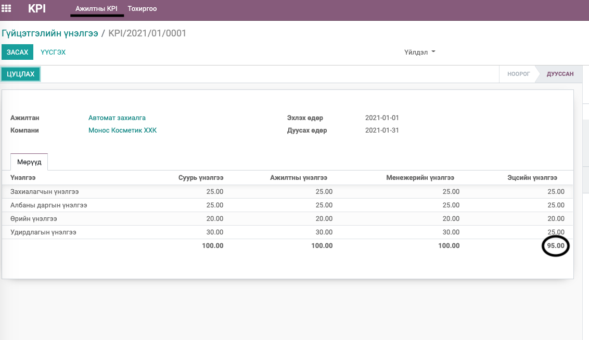
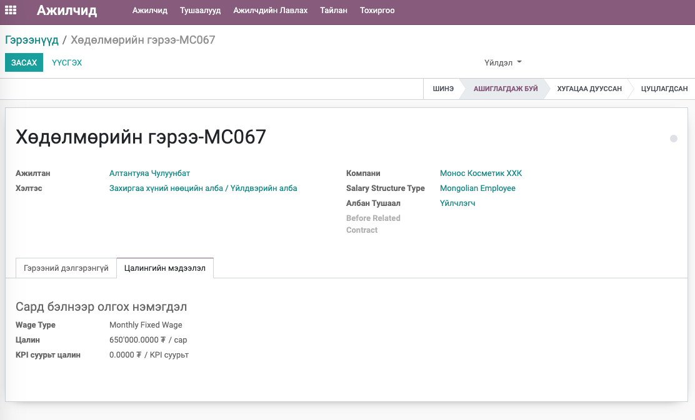
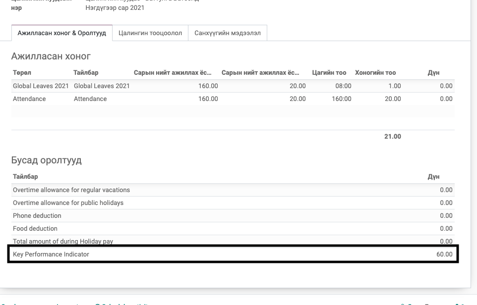

Employee - Key Performance Indicator
*****************************************

Гүйцэтгэлийн үнэлгээний модуль

Техникийн нэр
===========================
:guilabel:`bumanit_hr_kpi`

Уялдаа холбоо
===============

:guilabel:`hr_payroll`
:guilabel:`bumanit_l10n_mn_payroll`
:guilabel:`bumanit_hr`

Модуль суулгахад нэмэгдэх цэсүүд
----------------------------------

| Апп ==> Ажилтнууд

Гүйцэтгэлийн үнэлгээ
=======================

Сар бүрийн KPI үнэлгээг бүртгэж баталсанаар тухайн сарын үндсэн цалинд гүйлцэтгэлийн үнэлгээний хувиар оролт орж ирнэ. Гүйцэтгэлийн дүрэм нь Ажилтны гүйцэтгэлийн цалинг орж ирсэн хувиар тооцоолж ажилласан цагт ногдуулан гүйцэтгэлийн цалинг автоматаар тооцоолно. 

Тухайн ажилтанд өмнө гүйцэтгэлийн үнэлгээ бүртгэгдсэн бол шинээр үүсгэх үед өмнөх гүйцэтгэлийн мэдээллийг автоматаар татаж харуулдаг нь олон ажилтны гүйцэтгэлийг бүртгэхэд цаг хэмнэх боломжыг олгож байгаа юм.

1. Тохиргоо -> Үнэлгээ цэсээр орж шаардлагатай үнэлгээнүүдийг бүртгэнэ. Ажилтан, албан тушаал, хэлэс гэх мэтээр ялгаатай үнэлгээ тус бүрийг бүртгэх юм.

2. Ажилтны KPI цэсээр орж ажилтнуудын гүйцэтгэлийг бүртгэж батална. Цалинд батгалдсан үнэлгээний эцсийн хувь орж ирнэ.

Гүйцэтгэлийн цалингийн тооцоолол
======================================

Сар бүрийн KPI үнэлгээг бүртгэж баталсанаар тухайн сарын үндсэн цалинд гүйлцэтгэлийн үнэлгээний хувиар оролт орж ирнэ. Гүйцэтгэлийн дүрэм нь Ажилтны гүйцэтгэлийн цалинг орж ирсэн хувиар тооцоолж ажилласан цагт ногдуулан гүйцэтгэлийн цалинг автоматаар тооцоолно.

1. Энэ модуль суусанаар ажилтын гэрээний мэдээлэлд гүйцэтгэлийн цалин бүртгэх талбар нэмэгдэнэ.

    
2. Мөн цалингийн дүмэнд Гүйцэтгэлийн үнэлгээ гэсэн дүрэм нэмэгдэж орж ирэх юм.
3. Гүйцэтгэлийн үнэлгээ нь цалинд лдараах байдлаар харагдана.

