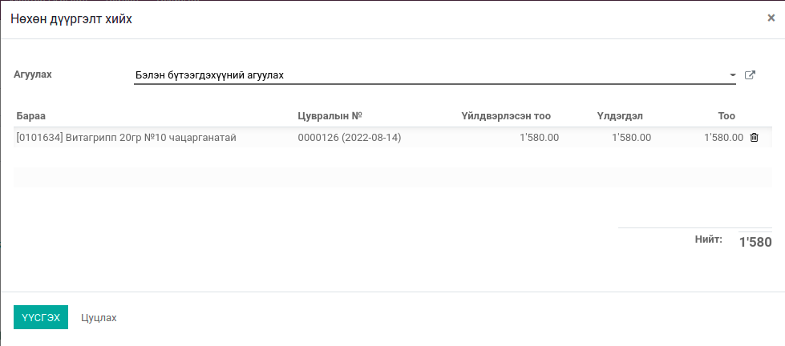

****************************
Үйлдвэрлэлийн нөхөн дүүргэлт
****************************

.. |

Техникийн нэр
=============

``bumanit_transit_mrp``

.. |

Уялдаа холбоо
=============

| ``bumanit_transit``       Нөхөн дүүргэлтийн модуль
| ``bumanit_mrp``           Үйлдвэрлэлийн модуль

Тайлбар
=======

Үйлдвэрлэлийн захиалгаас Бэлэн бүтээгдэхүүний агуулах руу бараа шилжүүлэх, нөхөн дүүргэлтийн мэдээлэл харах

Хөгжүүлэлтүүд
=============

1. Үйлдвэрлэлийн захиалга
*************************

Нөхөн дүүргэлт хийх
-------------------

Эцсийн бүтээгдэхүүн болон дайвар бүтээгдэхүүнийг гараар тохируулсан тоо хэмжээгээр өөр агуулах руу нөхөн дүүргэлт хийнэ.

.. note::
    Үлдэгдэл тооцоолохдоо: Үлдэгдэл = Бодитоор үйлдвэрлэсэн тоо хэмжээ - Нөхөн дүүргэлт хийсэн тоо - Хаягдал болон дээж рүү гаргасан тоо.

Нөхөн дүүргэлт харуулах
-----------------------

Үйлдвэрлэлийн захиалгын дэлгэрэнгүй хуудаст Нөхөн дүүргэлт хийсэн тоог харуулах ба жагсаалт руу шилжин орох боломжтой
    