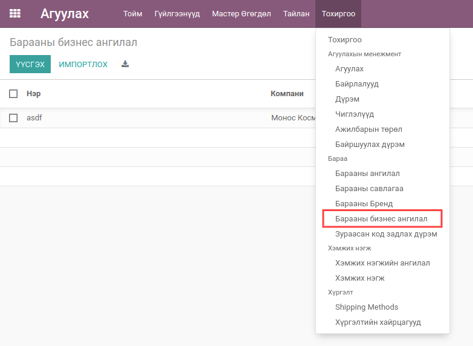
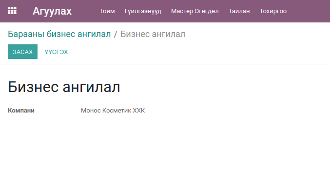
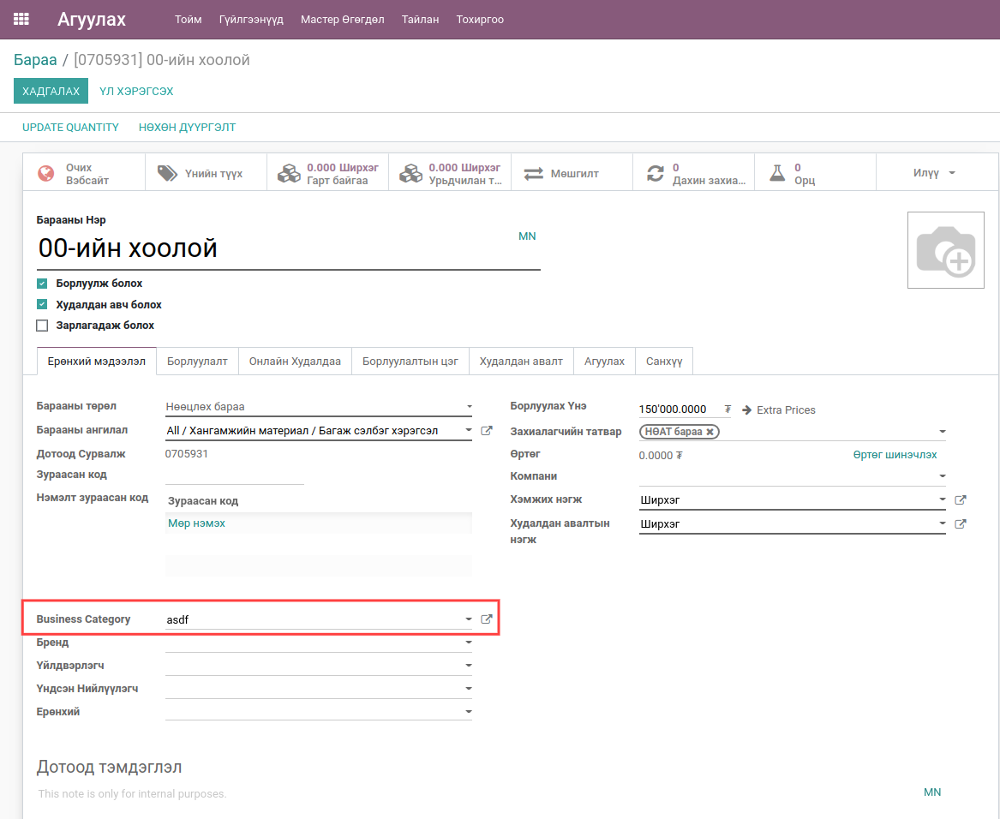
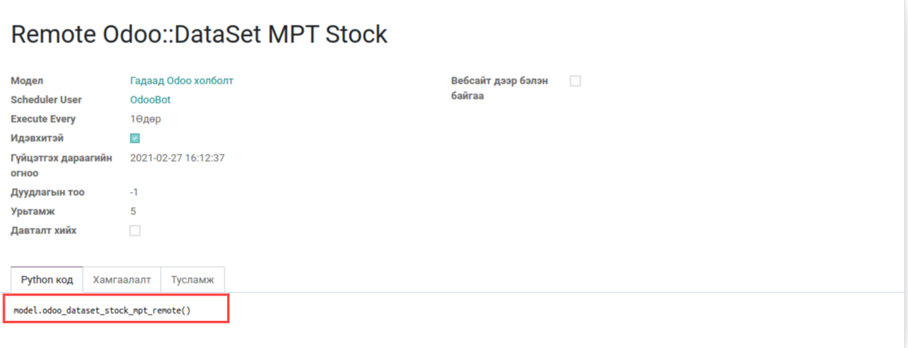

*********************************
Bumanit Monos Product
*********************************

.. |

Техникийн нэр
=============

``bumanit_monos_product``

.. |

Уялдаа холбоо
=============

:guilabel:`product`
:guilabel:`stock`
:guilabel:`bumanit_purchase_refund`
:guilabel:`bumanit_sale_refund`

Тайлбар
=======

Энэхүү модуль нь барааны бизнес ангилал болон МФТ датаг бусад компанируу илгээх зориулалттай.

.. |

Хөгжүүлэлт
==========

1. Барааны бизнес ангилал 

Цэс --> Агуулах -> Тохиргоо -> :guilabel:`Барааны бизнес ангилал`

2. Бизнес ангилал үүсгэх

3. Бараан дээр бизнес ангилал сонгох

4. МФТ-н барааны нөөцийн датаг Odoo v13 BI-с боловсруулан бусад компанируу явуулах

