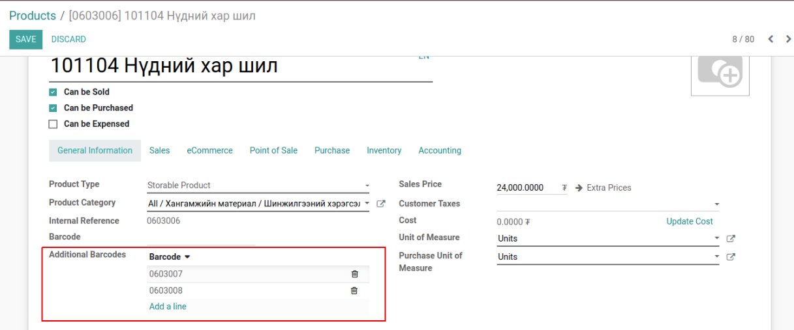
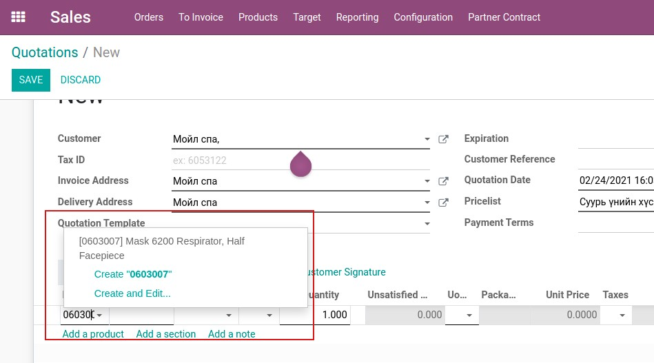

*********************************
Bumanit Product Multiple Barcodes
*********************************

.. |

Техникийн нэр
=============

``bumanit_multi_barcode``

.. |

Уялдаа холбоо
=============

| ``bumanit_stock``   үндсэн агуулахын модуль

Тайлбар
=======

Бараанд нэмэлт баркод бүртгэх ба барааг нэмэлт баркодоор хайх

.. |

Хөгжүүлэлт
==========

1. Бараанд нэмэлт баркод бүртгэх
2. Барааг нэмэлт баркодоор хайх
3. Агуулахын хүргэлтийн баримт нэмэлт баркод хэвлэх

Бараанд нэмэлт баркод бүртгэх
-----------------------------

Бараанд олон баркод бүртгэх боломжтой болох бөгөөд тухайн бүртгэгдсэн баркод давтагдахгүй

Барааг нэмэлт баркодоор хайх
-----------------------------

Бүртгэгдсэн нэмэлт баркодоор барааны цэснээс хайлт хийх
мөн Борлуулалтын захиалгын мөр дээрээс бараа сонгохдоо нэмэлт баркодоор хайх боломжтой

Агуулахын баримт дээр нэмэлт баркод хэвлэх
------------------------------------------

 - Барааны баркод (Агуулах -> Бараа -> хэвлэх)
 - Хүргэлтийн баримт (Агуулах -> Бараа -> хэвлэх)
 - Баркод  (Агуулах -> Гүйлгээнүүд -> хэвлэх)
 - Орлого/Зарлагын баримт (Агуулах -> Гүйлгээнүүд -> хэвлэх)