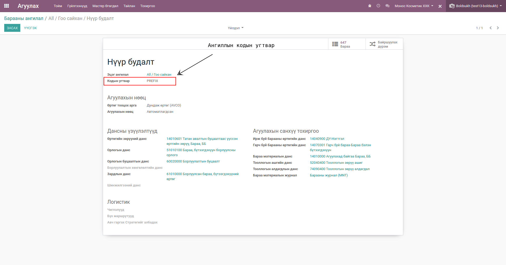

Барааны код шинээр оноох
****************************

Энэхүү модуль нь шинээр үүсгэсэн бараанд систем автоматаар код оноох зорилготой модуль юм.
Дотоод код = Барааны ангилалын угтвар + Барааны дотоод код

Техникийн нэр
===========================
:guilabel:`bumanit_product_code`

Уялдаа холбоо
===============

:guilabel:`product`
:guilabel:`bumanit_stock`

Ерөнхий тохиргоо
=========================

Тохиргоо -> Агуулах -> Мөшгилт -> Барааны кодыг автоматаар оноох

Тохиргооны форм харагдац
----------------------------------

1. Барааны кодыг автоматаар оноох гэсэн тохиргоог идэвхижүүлснээр шинээр үүсгэж буй бараа болгонд систем автоматаар дотоод код онооно.
2. Дотоод кодын дарааллын оронгын урт дээр тухайн барааны дотоод код хэдэн оронтой байхыг зааж өгнө. 

Барааны ангилалд угтвар код өгөх
=========================

1. Агуулахын тохиргоо цэсэнд байрлах барааны ангилалруу ороод тухайн ангиллуудад угтвар код өгнө.
2. Хэрэв угтвар оноогоогүй байвал эцэг ангилалын угтварыг авна. Эцэг байхгүй бол тухайн ангилал 01-с эхэлж дугаарлагдана.

Барааны дотоод код 
=========================

1. Барааны дотоод код автоматаар оноохдоо тухайн ангилалын угтварыг авж барааны кодын урд залгана.
2. Хэрэв тухайн ангилал бараагүй байвал дарааллын оронгын урт дээр тохируулсан оронгоор 00001-с эхэлж дугаарлана.
3. Хэрэв тухайн ангилал бараатай байвал хамгийн их оронтой бараан дээр 1-г нэмж дугаарлагдана.