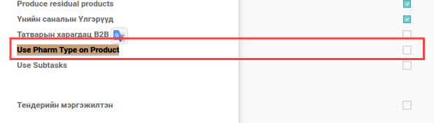

Bumanit Product Pharmacy types
******************************
Эмийн бүтээгдэхүүний төрөл ба ерөнхий эм

Техникийн нэр
=============

:guilabel:`bumanit_product_pharmacy_types`

Уялдаа холбоо
=============

:guilabel:`base`
:guilabel:`stock`
:guilabel:`product`
:guilabel:`sale`

Хөгжүүлэлт
==========

Эмийн бүтээгдэхүүний төрөл болон ерөнхий нэршил
-----------------------------------------------

:guilabel:`Use Pharm Type on Product` груп тохируулагдсан хэрэглэгчидэд :guilabel:`Product Type for Medicine` цэс харагдана.

Цэс --> Борлуулалт -> Тохиргоо -> :guilabel:`Product Type for Medicine`

1. Худалдан авалт дээрх талбар нь :guilabel:`Олон валютууд` групп сонгосон хэрэглэгчидэд харагдана.
   Additional Rate талбар нь худалдан авалтын захиалга дээр сонгосон валют болон компани дээр тохируулсан валютаас ялгаатай тохиолдолд дэлгэцэнд харагдана.

   Тухайн талбар нь сонгосон валютын нэгж үнэ нь МНТ гээр хэдтэй тэнцэж байгааг харуулна.

2. Худалдан авалтын мөр дээрх барааны нэгж үнэ Additional Rate дээрх нэгж үнээр
сонгосон валютанд хөрвөнө

.. figure::
    ../../../img/modules/bumanit_purchase_currency_rate/frame2.png

Худалдан авалтаас үүссэн нэхэмжлэл дээрх журналын бичилт :guilabel:`Additional Rate` талбар дээрх нэгж ханшаар журналын бичилт үүснэ.

.. centered:: Гарын авлага боловсруулсан: Амарсанаа. А
