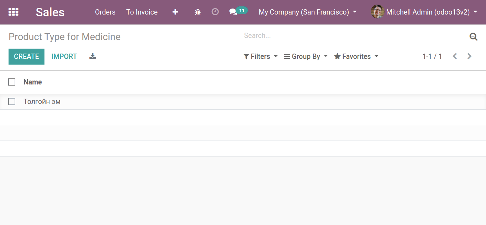
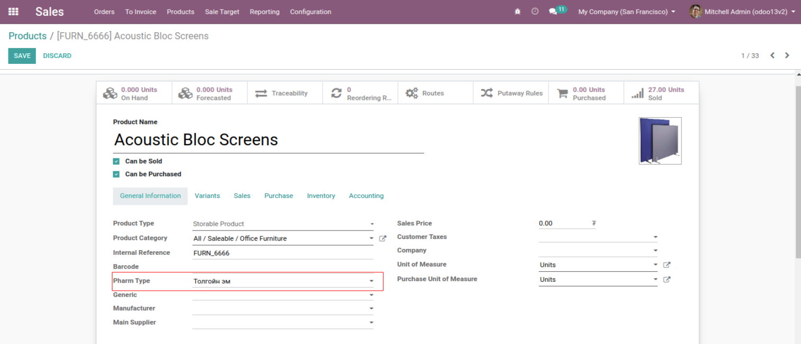

Bumanit Product Pharmacy types
******************************
Эмийн бүтээгдэхүүний төрөл ба ерөнхий эм

Техникийн нэр
=============

:guilabel:`bumanit_product_pharmacy_types`

Уялдаа холбоо
=============

:guilabel:`base`
:guilabel:`stock`
:guilabel:`product`
:guilabel:`sale`

Хөгжүүлэлт
==========

Эмийн бүтээгдэхүүний төрөл
--------------------------

:guilabel:`Use Pharm Type on Product` груп тохируулагдсан хэрэглэгчидэд :guilabel:`Product Type for Medicine` цэс харагдана.

Цэс --> Борлуулалт -> Тохиргоо -> :guilabel:`Product Type for Medicine`

Эмийн төрлийг гараар болон импортоор үүсгэх боломжтой.

Эмийн төрлийг үүсгэсний дараа бараан дээр тухайн бараа ямар төрөлд ангилагдахыг сонгож өгнө

Эмийн бүтээгдэхүүний ерөнхий нэршил
-----------------------------------

Цэс --> Агуулах -> Мастер Өгөгдөл -> :guilabel:`Product Generic Drugs`

        Эмийн ерөнхий нэршил үүсгэх дэлгэц

Эмийн ерөнхий нэршил бүртгэхдээ бараануудыг сонгож болно эсвэл бараа цэсрүү орж сонгосон бараан дээрээ ерөнхий нэршлийг сонгож болно.

..  note::
    Бараан дээрх эмийн нэршил олон байж болно.