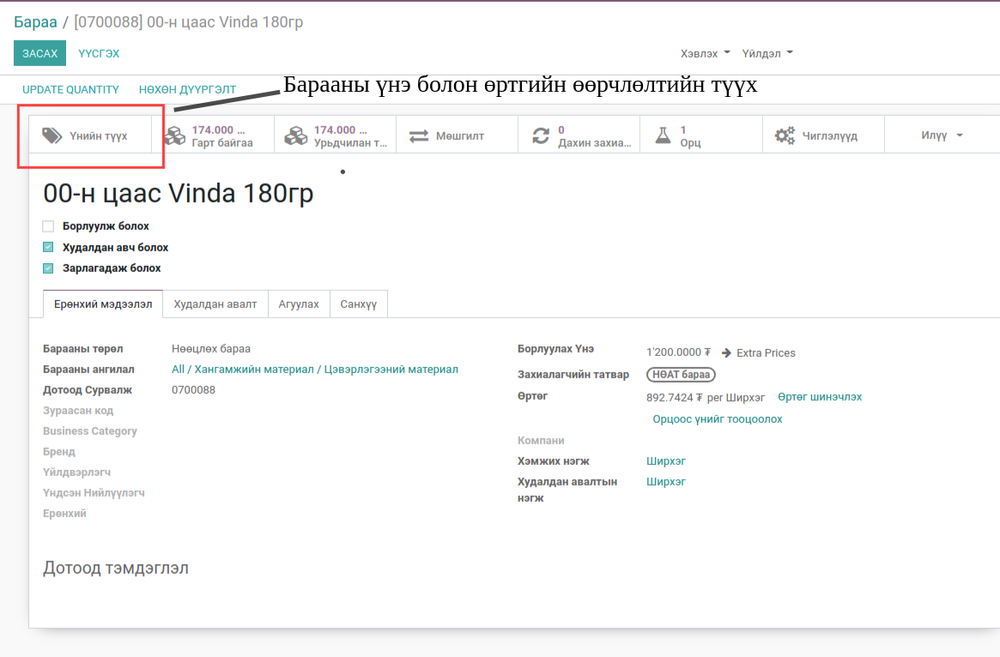
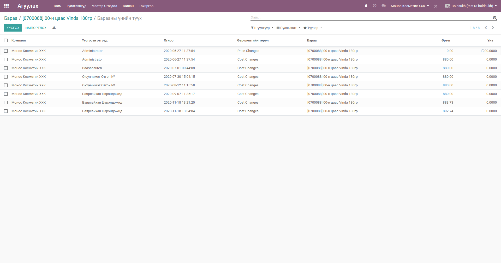
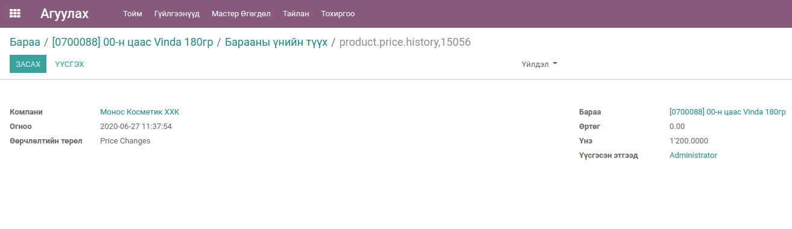

Барааны үнэ өөрчлөлтийн түүх
****************************

Энэхүү модуль нь барааны үнэ болон өртөгийн өөрчлөлтийг хянах зорилготоор хөгжүүлэдсэн.

Техникийн нэр
===========================
:guilabel:`bumanit_product_price_history`

Уялдаа холбоо
===============

:guilabel:`bumanit_stock`

Бараан дахь үнэ өөрчлөлтийн харагдац
----------------------------------

1. Барааны үнэ болон өртөг өөрчлөгдсний дараа үнийн түүх гэсэн товч дээр дарж өөрчилөлтийг харна.
2. Өөрчилсөн ажилтан, огноо, өртөг эсвэл үнэ өөрчлөлтийн алийг хийснийг хянах боломжтой.

Үнийн өөрчлөлтийн лист харагдац
=========================

Үнийн өөрчлөлтийн лист форм харагдац
=========================

Олон компаний дүрэм 
=========================

Энэхүү модуль нь олон компаний дүрмээр зохицуулагдсан. 