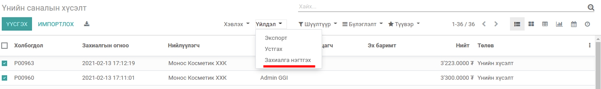
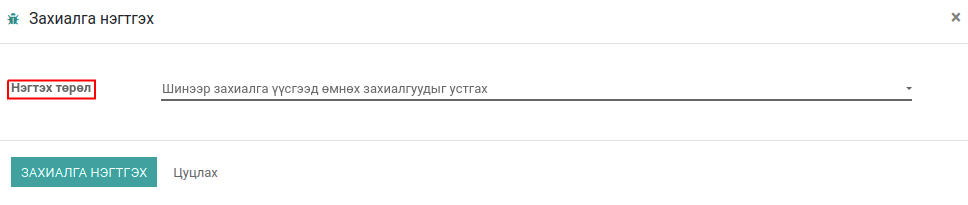
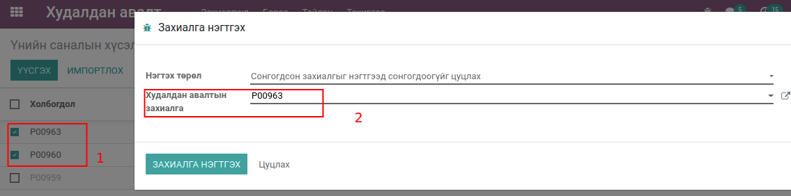
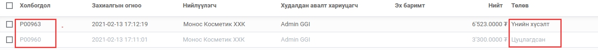
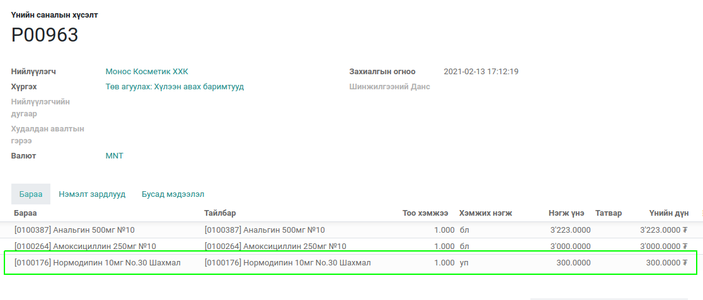

Худалдан авалтын захиалга нэгтгэх
*********************************

Энэ модуль нь худалдан авах захиалгыг нэгтгэх болно

Техникийн нэр
=============

:guilabel:`bumanit_merge_purchase_order`

Уялдаа холбоо
=============

:guilabel:`purchase`
:guilabel:`stock`

bumanit_merge_purchase_order модулийг суулгавал дээрх 2 модуль дагаж суух болно

Хөгжүүлэлт
==========

.. note::
    Үнийн санал төлөвтэй худалдан авалтын мөн 2 болон түүнээс дээш худалдан авалтын үнийн санал сонгосон тохиолдолд хэрэгжинэ

Үнийн саналуудын мөрийг сонгон Үйлдэл цэснээс захиалга нэгтгэх цэсийг сонгосноор Захиалгууд нэгтгэх дэлгэрэнгүй Визард дэлгэц гарч ирнэ.

Захиалгууд нэгтгэх төрөл:
    1. Шинээр захиалга үүсгээд өмнөх захиалгуудыг цуцлах
    2. Шинээр захиалга үүсгээд өмнөх захиалгуудыг устгах
    3. Сонгогдсон захиалгыг нэгтгээд сонсогдоогүйг цуцлах
    4. Сонгогдсон захиалгыг нэгтгээд сонсогдоогүйг устгах

1. Нэгтгэх захиалгууд
2. Сонгосон захиалга

    Сонгогдсон захиалгыг нэгтгээд сонсогдоогүйг цуцлах  

.. note::
    Үнийн санал нэгтгэхэд үнийн саналуудын мөр дээрх бараа адилхан тохиолдол тоо ширхэгийг нь нэгтгэнэ.

    Нэгтгэгдсэн захиалгын мөр

.. centered:: Гарын авлага боловсруулсан: Амарсанаа. А