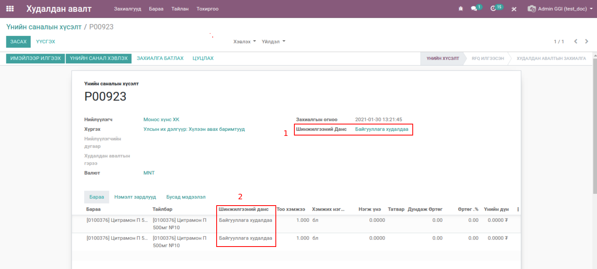
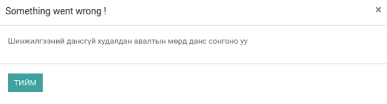

Худалдан авалтын өргөтгөл
**************************

Odoo v13 худалдан авалт модулийн өргөтгөл бөгөөд өөрсдийн шаардлагын хүрээнд дахин засварлаж
нэмэлт боломжуудаар хангаж өгсөн

Техникийн нэр
===========================
:guilabel:`bumanit_purchase`

Уялдаа холбоо
===============

:guilabel:`bumanit_stock`
:guilabel:`purchase`

bumanit_purchase модулийг суулгавал дээрх 2 модуль дагаж суух болно

Ерөнхий тохиргоо
=========================

Системд нэмэгдэх групп, цэс хэрхэн ажиллах ойлголт

Групп
----------------------------------
:guilabel:`Худалдан авах захиалгын татварыг өөрчлөх`

Хөгжүүлэлт
==========

Худалдан авалтын үндсэн аналитик данс
-------------------------------------

Худалдан авалт -> Тохиргоо -> :guilabel:`Шинжилгээний данс шаардах`

.. figure::
    ../../../img/modules/bumanit_purchase/frame2.gif

Худалдан авалт дээр шинжилгээний данс сонгосноор худалдан авалтын мөр дээрх шинжилгээний данс тухайн үндсэн шинжилгээний дансаар цэнэглэгдэнэ.

Шинжилгээний данс шаардах тохиргоог хийснээр худалдан авалтын мөр дээр шинжилгээний данс заавал сонгох сануулга гарч ирнэ

1. Худалдан авалтын мөр цэнэглэх үндсэн шинжилгээний данс
2. Худалдан авалтын мөр дээрх шинжилгээний данс

Худалдан авалтын мөр дээрх татварын нэмэлт групп
------------------------------------------------
.. figure::
    ../../../img/modules/bumanit_purchase/frame3.gif

Энэхүү модул сууснаар худалдан авалтын мөр дээрх барааны татварыг 

1. :guilabel:`Худалдан авалтын менежер`
2. :guilabel:`Худалдан авах захиалгын татварыг өөрчлөх`

групптэй хэрэглэгч засварлаж чадна

Худалдан авалтын барааны брэнд пивот тайлан
-------------------------------------------

Системийн ерөнхий тохиргоонд хийгдсэн хөгжүүлэлтүүд
---------------------------------------------------
1. Purchase Required Analityc Account (multi company)
2. Modify Purchase Price Approve Manager (multi company)