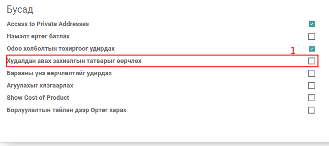
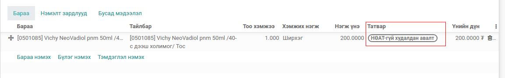
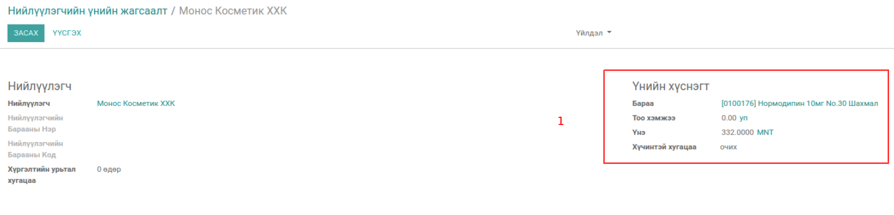
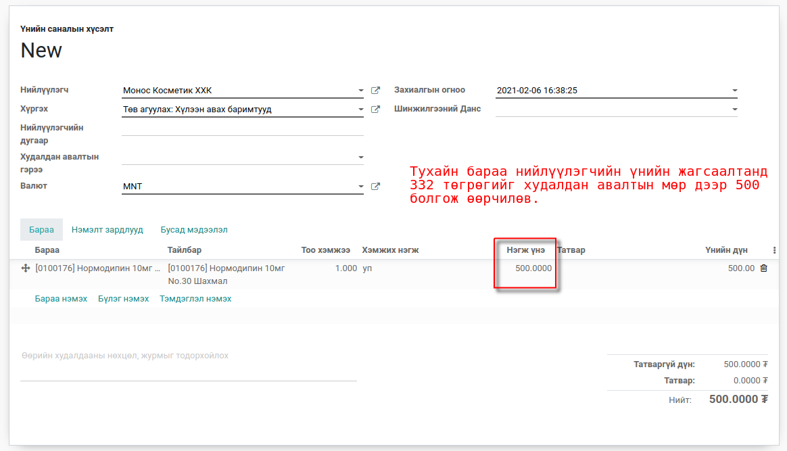
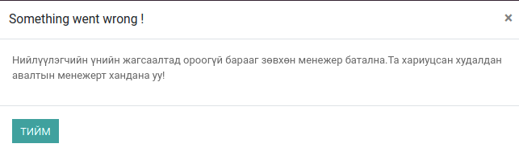

Худалдан авалтын өргөтгөл
**************************

Odoo v13 худалдан авалт модулийн өргөтгөл бөгөөд өөрсдийн шаардлагын хүрээнд дахин засварлаж
нэмэлт боломжуудаар хангаж өгсөн

Техникийн нэр
===========================
:guilabel:`bumanit_purchase`

Уялдаа холбоо
===============

:guilabel:`bumanit_stock`
:guilabel:`purchase`

bumanit_purchase модулийг суулгавал дээрх 2 модуль дагаж суух болно

Ерөнхий тохиргоо
=========================

Системд нэмэгдэх групп, цэс хэрхэн ажиллах ойлголт

1. Олон компани :guilabel:`Шинжилгээний данс шаардах` 
2. Олон компани :guilabel:`Үнийн жагсаалттай холбоотой худалдан авалтыг менежер батлах`

Групп
----------------------------------
:guilabel:`Худалдан авах захиалгын татварыг өөрчлөх`

Хөгжүүлэлт
==========

Худалдан авалтын үндсэн аналитик данс
-------------------------------------

    Худалдан авалт -> Тохиргоо -> :guilabel:`Шинжилгээний данс шаардах`

.. figure::
    ../../../img/modules/bumanit_purchase/frame1.png

Худалдан авалт дээр шинжилгээний данс сонгосноор худалдан авалтын мөр дээрх шинжилгээний данс тухайн үндсэн шинжилгээний дансаар цэнэглэгдэнэ.

1. Худалдан авалтын мөр цэнэглэх үндсэн шинжилгээний данс
2. Худалдан авалтын мөр дээрх шинжилгээний данс

.. figure::
    ../../../img/modules/bumanit_purchase/frame2.png

Шинжилгээний данс шаардах тохиргоог хийснээр худалдан авалтын мөр дээр шинжилгээний данс заавал сонгох сануулга гарч ирнэ

Худалдан авалтын мөр дээрх татварын нэмэлт групп
------------------------------------------------

1. Худалдан авалтын өртөг өөрчлөх эрх

Энэхүү модул сууснаар худалдан авалтын мөр дээрх барааны татварыг 

1. :guilabel:`Худалдан авалтын менежер`
2. :guilabel:`Худалдан авах захиалгын татварыг өөрчлөх`

групптэй хэрэглэгч засварлаж чадна

Худалдан авалтын нийлүүлэгчийн үнийн саналд байхгүй үнийн дүнг менежер батлана
------------------------------------------------------------------------------

Худалдан авалт -> Тохиргоо -> :guilabel:`Үнийн жагсаалттай холбоотой худалдан авалтыг менежер батлах`

1. нийлүүлэгчийн үнийн хүснэгт

    удалдан авалтын захиалгын мөр дээр нийлүүлэгчийн үнийн саналаас өөр дүн оруулсан тохиолдолд худалдан авалтын менежер батлана.

Худалдан авалтын пивот тайлан
-----------------------------

Худалдан авалтын пивот тайланд:
    - Брендээр харах

