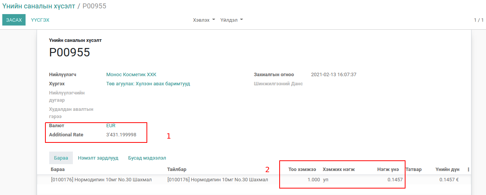
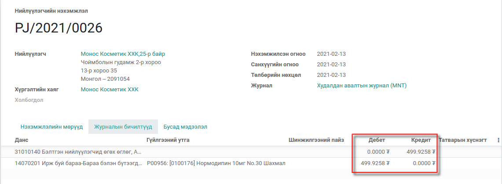

Худалдан авалтын тусгай ханш
****************************

Худалдан авалтын үед тусгай ханш оруулна. Тухайн худалдан авалтаас үүссэн агуулахын баримт
болон нэхэмжлэх тусгай ханшийг авна.

Техникийн нэр
=============

:guilabel:`bumanit_purchase_currency_rate`

Уялдаа холбоо
=============

:guilabel:`purchase`
:guilabel:`bumanit_stock`

bumanit_purchase_currency_rate модулийг суулгавал дээрх 2 модуль дагаж суух болно

Хөгжүүлэлт
==========

Худалдан авалтын тусгай ханш
----------------------------

1. Худалдан авалт дээрх талбар нь :guilabel:`Олон валютууд` групп сонгосон хэрэглэгчидэд харагдана.
   Additional Rate талбар нь худалдан авалтын захиалга дээр сонгосон валют болон компани дээр тохируулсан валютаас ялгаатай тохиолдолд дэлгэцэнд харагдана.
   
   Тухайн талбар нь сонгосон валютын нэгж үнэ нь МНТ гээр хэдтэй тэнцэж байгааг харуулна.

2. Худалдан авалтын мөр дээрх барааны нэгж үнэ Additional Rate дээрх нэгж үнээр 
сонгосон валютанд хөрвөнө

Худалдан авалтаас үүссэн нэхэмжлэл дээрх журналын бичилт :guilabel:`Additional Rate` талбар дээрх нэгж ханшаар журналын бичилт үүснэ.

