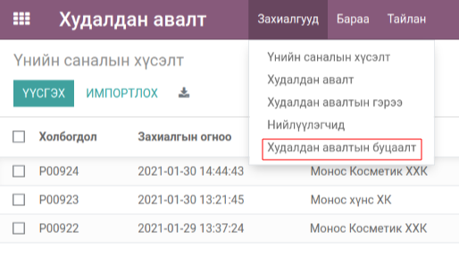
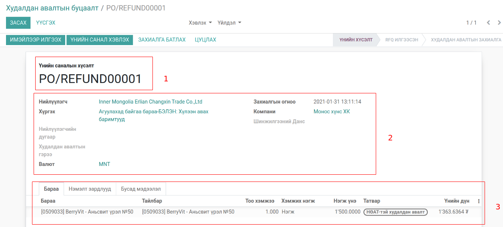
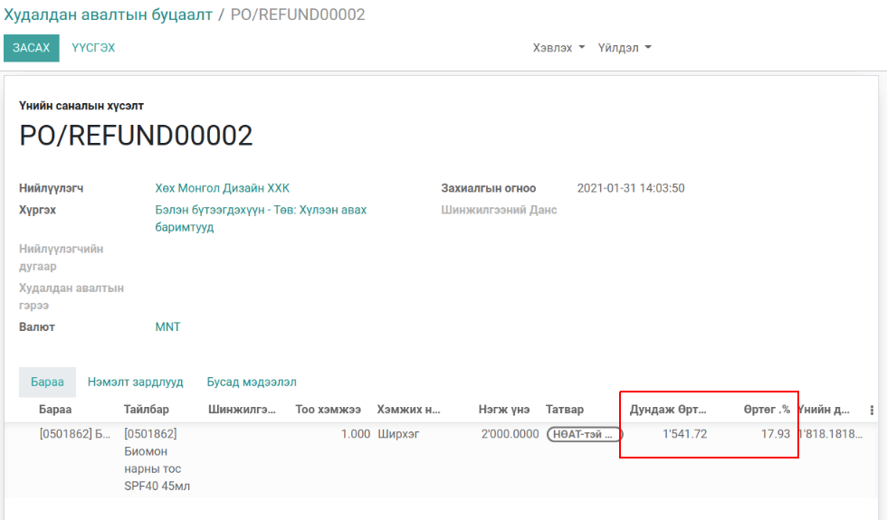
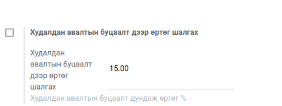

Худалдан авалтын буцаалт
************************

Odoo v13 худалдан авалтын эх баримттай болон баримтгүй буцаалт хийх

Техникийн нэр
=============

:guilabel:`bumanit_purchase_refund`

Уялдаа холбоо
=============

:guilabel:`purchase`
:guilabel:`bumanit_stock`

bumanit_purchase_refund модулийг суулгавал дээрх 2 модуль дагаж суух болно

Ерөнхий тохиргоо
=========================

Системд нэмэгдэх групп, цэс хэрхэн ажиллах ойлголт

1. Олон компани :guilabel:`Худалдан авалтын буцаалт дээр өртөг шалгах`

Групп
----------------------------------
:guilabel:`Худалдан авалтын мөр дээр өртөг харах`

Хөгжүүлэлт
==========

Худалдан авалтын эх баримтгүй буцаалт
-------------------------------------

Худалдан авалтын эх баримтгүй буцаалтын цэс:

    Худалдан авалт -> Захиалгууд -> Худалдан авалтын буцаалт

Эх баримтгүй Худалдан авалтын буцаалтын захиалга нь үндсэн худалдан авалтын захиалгатай адилхан бөгөөд
үүсэж байгаа хүргэлтийн төрөл болон нэхэмжлэхээр ялгаатай

    1. Эх баримтгүй худалдан авалтын нэршил
    2. Нийлүүлэгчийн мэдэээлэл (Худалдан авалтын захиалгатай адил)
    3. Эх баримтгүй худалдан авалтын захиалгын мөр

.. figure::
    ../../../img/modules/bumanit_purchase_refund/frame.gif

Худалдан авалтын буцаалтын захиалгаас үүссэн хүргэлтийн баримт (out) төрөлтэй үүснэ.

Худалдан авалтын эх баримтгүй буцаалтаас үүссэн нэхэмжлэлийн журнал ( өртөгийн журналийн бичэлт)
------------------------------------------------------------------------------------------------

Худалдан авалтын эх баримтгүй буцаалтын мөр дээр өртөг болон өртөгийн хувь харах
--------------------------------------------------------------------------------
групп :guilabel:`Худалдан авалтын мөр дээр өртөг харах`

:guilabel:`Худалдан авалтын мөр дээр өртөг харах` группыг идэвхжүүлсэнээр эх баримтгүй худалдан авалтын мөр дээр
:guilabel:`Дундаж өртөг` болон :guilabel:`Өртөг .%` гэсэн 2 талбар харагдана.

:guilabel:`Дундаж өртөг` нь бараан дээрх өртөгийг харуулна.
:guilabel:`Өртөг .%` тооцоолол:

        (((:guilabel:`Үнийн дүн` /:guilabel:`Тоо ширхэг`) -:guilabel:`Дундаж өртөг`)/:guilabel:`Дундаж өртөг`)*100

Худалдан авалт -> Тохиргоо -> :guilabel:`Худалдан авалтын буцаалт дээр өртөг шалгах`

5. Худалдан авалтын эх баримтгүй буцаайт дээр стандарт өртөгийн хувь оноож хувь хэтэрсэн тохиолдол менежер батлах

