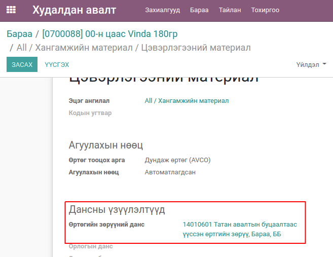
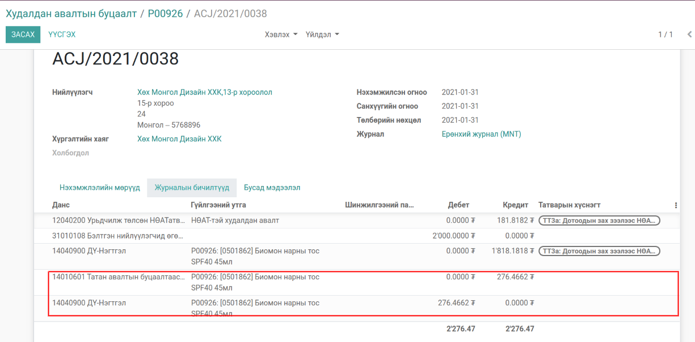
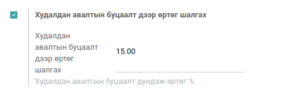
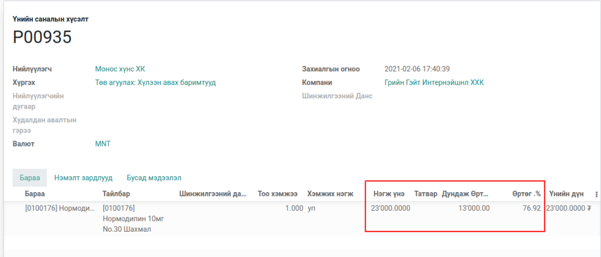
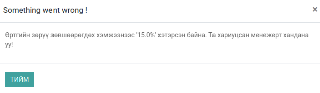

Худалдан авалтын буцаалт
************************

Odoo v13 худалдан авалтын эх баримттай болон баримтгүй буцаалт хийх

Техникийн нэр
=============

:guilabel:`bumanit_purchase_refund`

Уялдаа холбоо
=============

:guilabel:`purchase`
:guilabel:`bumanit_stock`

bumanit_purchase_refund модулийг суулгавал дээрх 2 модуль дагаж суух болно

Ерөнхий тохиргоо
=========================

Системд нэмэгдэх групп, цэс хэрхэн ажиллах ойлголт

1. Олон компани :guilabel:`Худалдан авалтын буцаалт дээр өртөг шалгах`

Групп
----------------------------------
:guilabel:`Худалдан авалтын мөр дээр өртөг харах`

Хөгжүүлэлт
==========

Худалдан авалтын эх баримтгүй буцаалт
-------------------------------------

.. figure::
    ../../../img/modules/bumanit_purchase_refund/frame1.png

Худалдан авалтын эх баримтгүй буцаалтын цэс:

    Худалдан авалт -> Захиалгууд -> Худалдан авалтын буцаалт

.. figure::
    ../../../img/modules/bumanit_purchase_refund/refundform.png

Эх баримтгүй Худалдан авалтын буцаалтын захиалга нь үндсэн худалдан авалтын захиалгатай адилхан бөгөөд
үүсэж байгаа хүргэлтийн төрөл болон нэхэмжлэхээр ялгаатай

    1. Эх баримтгүй худалдан авалтын нэршил
    2. Нийлүүлэгчийн мэдэээлэл (Худалдан авалтын захиалгатай адил)
    3. Эх баримтгүй худалдан авалтын захиалгын мөр

    Худалдан авалтын буцаалтын захиалгаас үүссэн хүргэлтийн баримт (out) төрөлтэй үүснэ.

Худалдан авалтын эх баримтгүй буцаалтаас үүссэн нэхэмжлэлийн журнал ( өртөгийн журналийн бичэлт)
------------------------------------------------------------------------------------------------

Өртөгийн зөрүүний данс тохируулах:
    Худалдан авалт -> Бараа -> Барааны ангилал -> Өртөгийн зөрүүний данс

.. note::
    Өртгийн зөрүүний данс зөвхөн худалдан авалтын эх баримттай болон баримтгүй буцаалтын нэхэмжлэл дээр ашиглагдана.
    

Эх баримтгүй худалдан авалтын буцаалтаас үүссэн нэхэмжлэлийн журналийн бичилт

Худалдан авалтын эх баримтгүй буцаалтын мөр дээр өртөг болон өртөгийн хувь харах
--------------------------------------------------------------------------------
групп :guilabel:`Худалдан авалтын мөр дээр өртөг харах`

.. figure::
    ../../../img/modules/bumanit_purchase_refund/frame3.png

:guilabel:`Худалдан авалтын мөр дээр өртөг харах` группыг идэвхжүүлсэнээр худалдан авалтын мөр дээр
:guilabel:`Дундаж өртөг` болон :guilabel:`Өртөг .%` гэсэн 2 талбар харагдана.

:guilabel:`Дундаж өртөг` нь бараан дээрх өртөгийг харуулна.

.. note::
    Өртөгийн % тооцоолохдоо:
       (((Үнийн дүн/Тоо ширхэг)-Дундаж өртөг)/Дундаж өртөг)*100

Эх баримтгүй худалдан авалтын буцаалт дээр өртөг шалгах
-------------------------------------------------------

Худалдан авалт -> Тохиргоо -> :guilabel:`Худалдан авалтын буцаалт дээр өртөг шалгах`

Дээрх тохиргоог идэвхжүүлсэнээр худалдан авалтын мөр дээрх барааны өртөг тохиргоонд заагдсан стандарт өртөгийн хувиас 
их эсвэл сөрөг их тохиолдолд зөвхөн :guilabel:`Худалдан авалтын менежер` батлана.

   

Дээрх жишээн дээр эх баримтгүй худалдан авалтын мөр дээрх 0100176 кодтой барааны дундаж өртөгийн хувь 76% бөгөөд худалдан авалтын буцаалтын өртөг шалгах өртөг нь 15% байхаар тохируулсан

Худалдан авалт батлахад

Зөвхөн худалдан авалтын менежер батлана.

