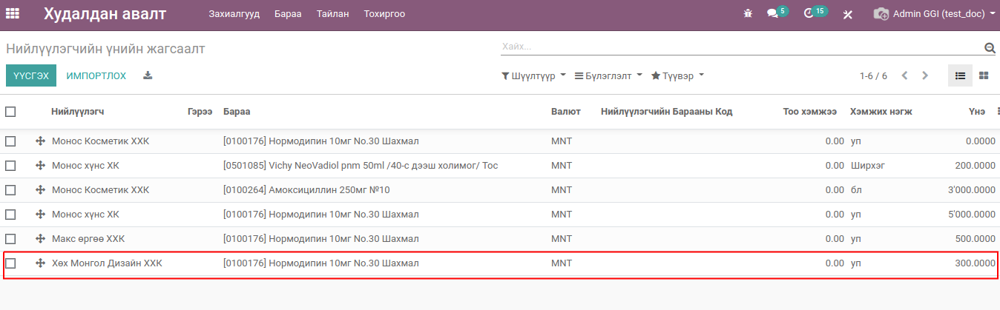
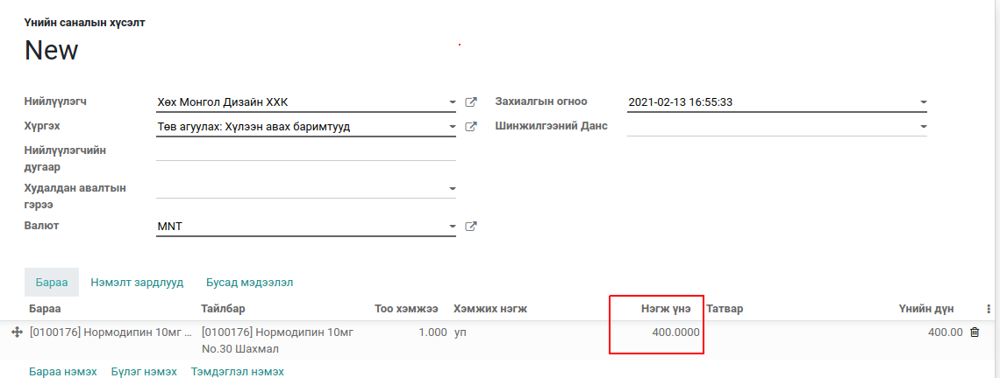
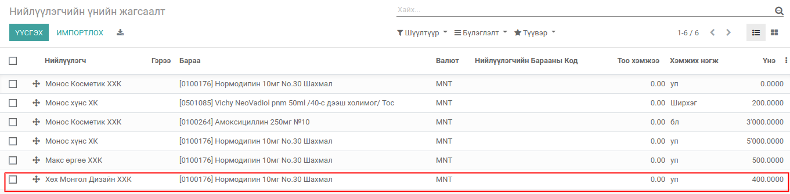

Нийлүүлэгчийн үнийн жагсаалт шинэчлэх
*************************************

Худалдан авалтын захиалгаас нийлүүлэгчийн үнийн жагсаалт шинэчлэх

Техникийн нэр
=============

:guilabel:`bumanit_purchase_update_vendor_price`

Уялдаа холбоо
=============

:guilabel:`purchase`
:guilabel:`bumanit_stock`

bumanit_purchase_update_vendor_price модулийг суулгавал дээрх 2 модуль дагаж суух болно

Ерөнхий тохиргоо
=========================

Системд нэмэгдэх групп, цэс хэрхэн ажиллах ойлголт

1. Олон компани :guilabel:`сүүлд худалдан авсан үнийг санал болгох`

Хөгжүүлэлт
==========

Барааны мэдээлэл дээрх нийлүүлэгчийн үнийн мэдээлэл нь сүүлд батлагдсан захиалгын дагуу автоматаар шинэчлэгдэнэ.

Нийлүүлэгч дээр тохируулсан барааны үнийн жагсаалт

Шинэ худалдан авалт хийхдээ нийлүүлэгчийн Үнийн жагсаалт дээр тохируулсан 
үнэ 300 байсныг 400 болгон худалдан авалтын захиалга шивлээ

Сүүлд бартлагдсан худалдан авалтын захиалгын мөр дээрх бараа болон барааны дүнгээр нийлүүлэгчийн үнийн жагсаалтыг шинэчлэнэ.

.. note::
    Хэрвээ нийлүүлэгчийн үнийн жагсаалтанд байхгүй бараа худалдан авсан тохиолдолд шинээр нийлүүлэгчийн үнийн жагсаалт үүсгэнэ
    

