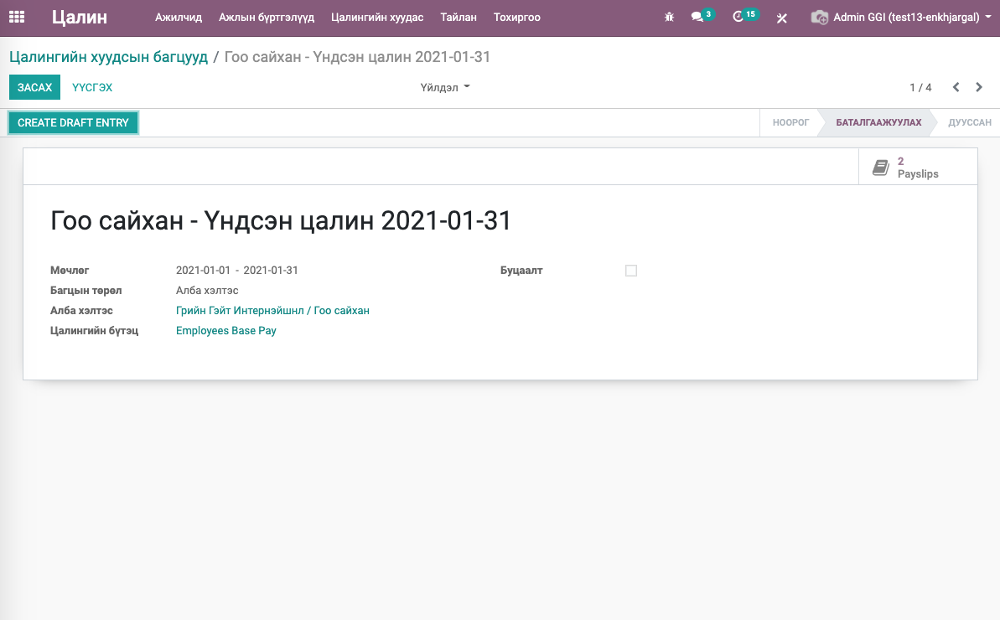
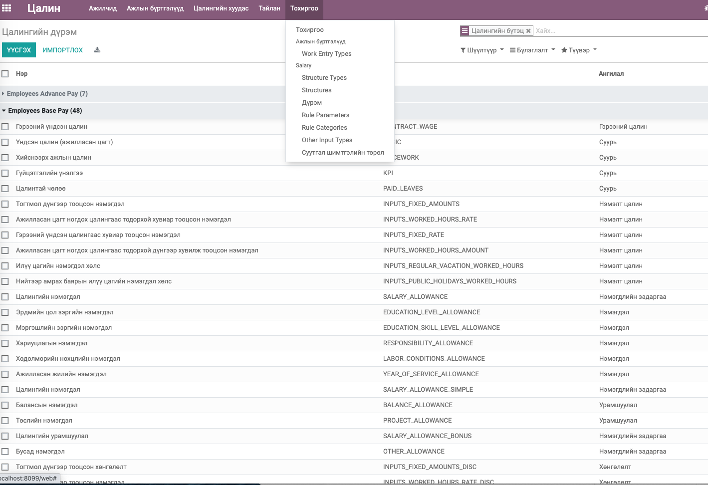
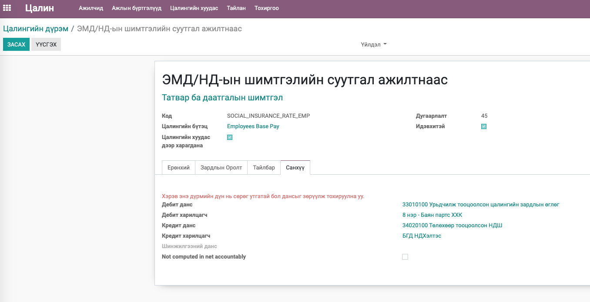
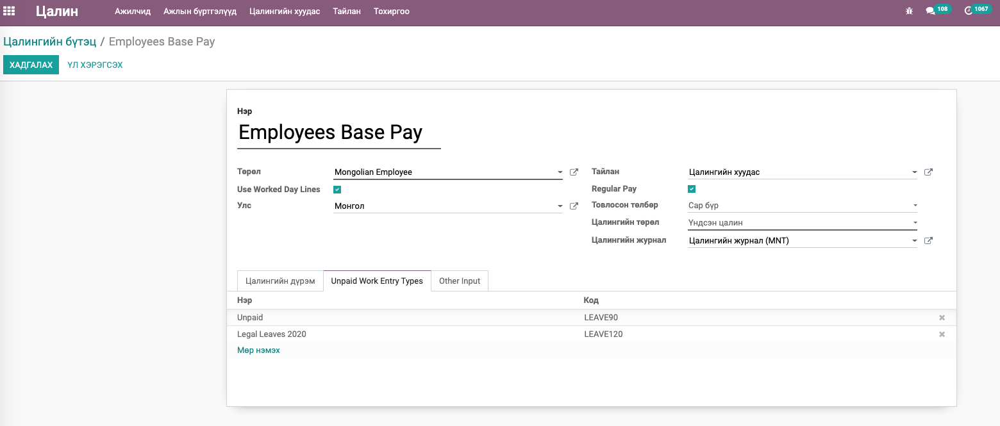
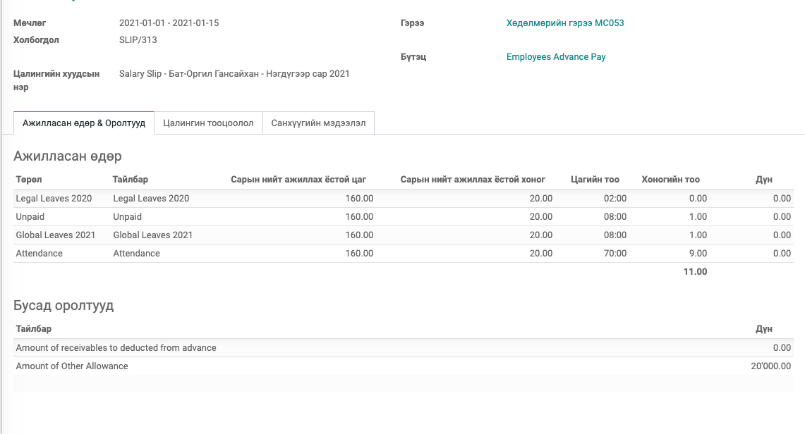
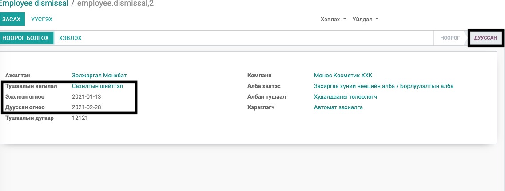
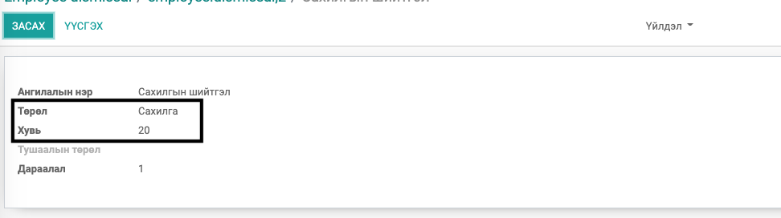
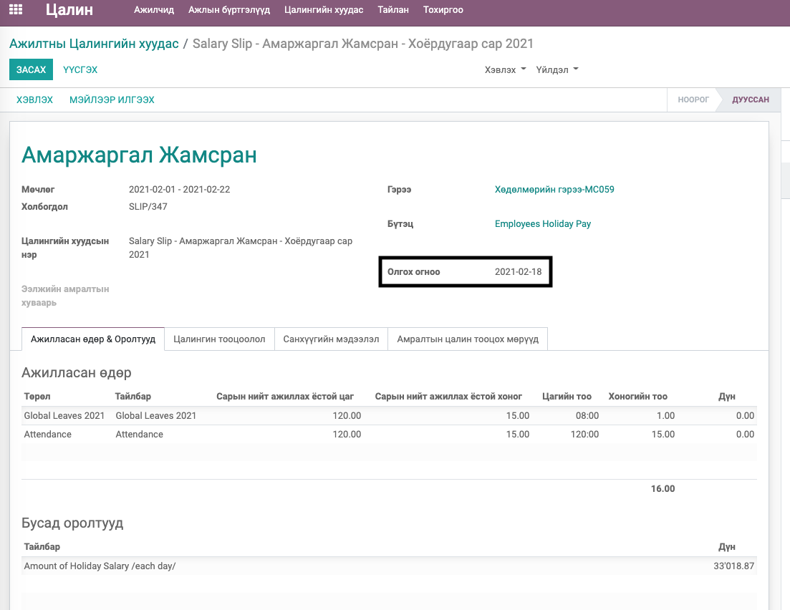
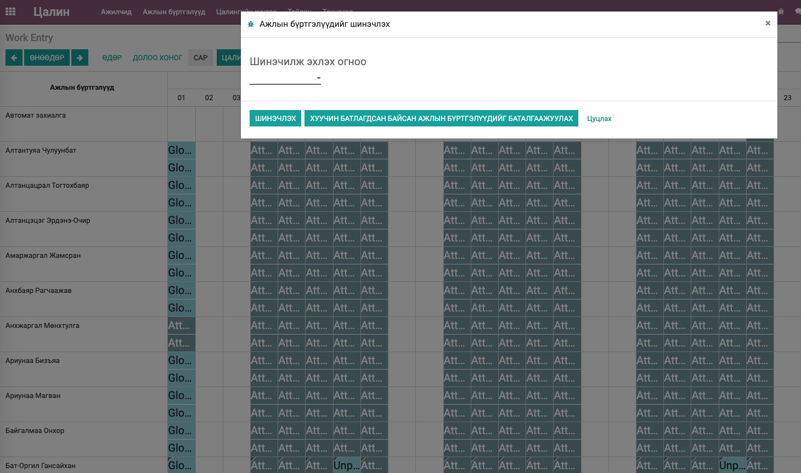
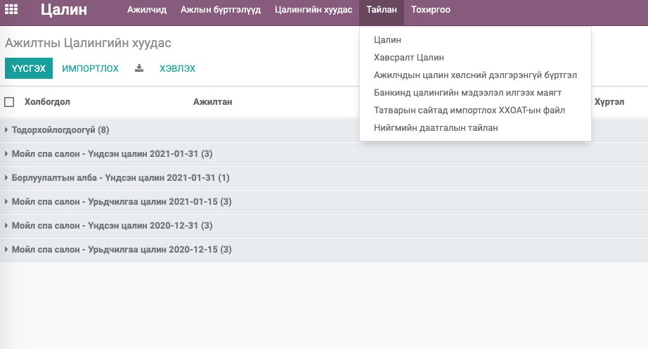

Mongolian - Payroll
****************************

Цалингийн модуль

Техникийн нэр
===========================
:guilabel:`bumanit_l10n_mn_payroll`

Уялдаа холбоо
===============

:guilabel:`hr_payroll`
:guilabel:`bumanit_account`
:guilabel:`bumanit_partner`
:guilabel:`bumanit_hr`
:guilabel:`report_xlsx`

Модуль суулгахад нэмэгдэх цэсүүд
----------------------------------

| Апп ==> Цалин

.. figure::
    ../../../img/modules/bumanit_l10n_mn_payroll/menu_main.png

Цалинтай холбоотойгоор Ажилтнууд модуль дах нэмэлтүүд
=====================================================

Цалин бодохтой холбоотойгоор Ажилтнууд модуль дараах нэмэлт хөгжүүлэлт орсон болно. Эдгээр мэдээлэлд Хүний нөөцийн менежер, Цалингийн менежер эрхтэй хүмүүс хандах боломжтой.

1. Ажилтны ерөнхий мэдээлэлд - HR Тохиргоонууд хэрэгт ЭМД-ийн дэвтрийн дугаар, Цалин авах банк гэсэн талбарууд нэмэгдэв. (Нийгмийн даатгалын тайлан болон Банкинд илгээх цлингийн хүснэгтэнд ашиглагдах)
2. Алба хэлтэс болон Албан тушаалын бүртгэлэд - Шинжилгээний данс сонгох (Заавал биш) талбарууд нэмэгдэв. (Цалингийн шинжилгээний хувиарлалтанд ашиглагдах)
3. Улсын бүртгэлд НДШ-н код, Харилцагчын бүртгэлд байгууллагын НДШ байршлын код,  Албан тушаалын бүртгэлэд НДШ код гэсэн талбарууд нэмэгдэв. (Нийгмийн даатгалын тайланд ашиглагдах)
4. Ажилтнууд модулын Тохиргоо хэсэгт Хариуцлагын нэмэгдэл, Хөдөлмөрийн нөхцлийн нэмэгдэл гэсэн 2 цэс нэмэгдэнэ. /Зураг 1/ Эдгээр бүртгэл нь мөн Олон компани дундаа эсвэл дотооддоо ашиглах боломжтой.

.. figure::
    ../../../img/modules/bumanit_l10n_mn_payroll/frame1.png

Ажилтны гэрээний дэлгэрэнгүй мэдээлэл хэрэгт Зураг - 2 дээрхи талбарууд нэмэгдэнэ.

.. figure::
    ../../../img/modules/bumanit_l10n_mn_payroll/frame2.png

1. Ажилтан туршилтын хугацаандаа яваа бол Туршилтын хугацааны төгсгөл огноог оруулж өгнө. Энэ Огноог оруулвал үндсэн цалингийн хэдэн хувиар цалилжихыг тохируулах Туршилтын цалингийн хувь гэсэн талбар мөн нэмэгдэж харагдана. 
2. Ажилласан өдрийн тооцоолол нь Цалин бодоход ажилласан цагийг хаанаас тооцоолохыг тодорхойлно.

    1. Ажлын бүртгэл (work entry) - Суурь шийдэл буюу гэрээний хугацаагаар автоматаар үүссэн ажиллах хоногийн тооцооллоос бодно.
    2. Ирц (attendance) - Ирцийн төхөөрөмжид орж ирсэн ажилласан ирцийн мэдээллээс ажилласан хоногийг тооцно. (Ирцийн модуль суусан байх шаардлагатай.)
    3. Цагийн хуудас (timesheet) - Төсөл дээр ажилласан цагаа бүртгэж батлуулсан цагийн хуудсаас ажиллах хоногийн тооцооллоос бодох (Төслийн модуль суусан байх шаардлагатай.)
    
3. Ажилласан жилийн нэмэгдэл (Үндсэн цалингийн хувь) - Цалинд нэмэгдэх ажилласан жилийн нэмэгдлийг тооцоолоход ашиглагдан. Энэ талбарт % оруулсанаар ажилласан цагт ногдох цалингаас тохируулсан %-аар нэмэгдэл автоматаар тооцоолно.
4. Лоялти картанд олгосон УЖН-ын суутгалын дүн - Монос картанд (ODOO 10 дээрээс автоматаар цэнэглэгдэж байгаа дүн) шилжин орж буй дүнг энд тохируулна. Энэ талбарт тохируулсан дүнгээр суутгалыг автоматаар тооцоолно.
5. Утасны нэмэгдэл - Утасны нэмэгдэлтэй ажилчидад тогтмол дүнгээр тохируулна. Энэ талбарт тохируулсан дүнг ажилласан цагт ногдуулж цалинд нэмэгдэлийг автоматаар тооцоолно.
6. Унааны нэмэгдэл - Унааны (шатхууны) нэмэгдэлтэй ажилчидад тогтмол дүнгээр тохируулна. Энэ талбарт тохируулсан дүнг ажилласан цагт ногдуулж цалинд нэмэгдэлийг автоматаар тооцоолно.
7. Суутгал шимтгэлийн төрөл - Цалингийн тохиргоо хэсэгт Суутгал шимтгэлийн төрлүүдийн бүртгэлийг хийх бөгөөд тухайн ажилтанд тохирох Суутгал шимтгэлийн төрлийг энд тохируулна. Энд тохируулсан Суутгал шимтгэлийн төрөл дээрээс НДШ болон ЭМД-ийн суутгалын хувийг авч суутгалыг автоматаар тооцоолох юм. /Зураг 3/

.. figure::
    ../../../img/modules/bumanit_l10n_mn_payroll/frame4.png

8. Хариуцлагын нэмэгдэл - Хариуцлагын нэмэгдэлтэй ажилчидад Ажилтнууд модулын Тохиргоо хэсэгт бүртгэсэн Хариуцлагын нэмэгдэлээс сонгож бүртгэж өгнө. Хариуцлагын нэмэгдлийн цалинд нэмэгдэх тохиргооноос нэмэгдэх дүнг тооцож олоод (тотмол дүнгээр нэмэгдэх бол тотмол дүнг ажилласан цагт ногдуулна) цалинд нэмэгдэлийг автоматаар тооцоолно.
9. Хөдөлмөрийн нөхцлийн нэмэгдэл - Хариуцлагын нэмэгдэлтэй ажилчидад Ажилтнууд модулын Тохиргоо хэсэгт бүртгэсэн Хөдөлмөрийн нөхцлийн нэмэгдэлээс сонгож бүртгэж өгнө. Хөдөлмөрийн нөхцлийн нэмэгдлийн цалинд нэмэгдэх тохиргооноос нэмэгдэх дүнг тооцож олоод (тотмол дүнгээр нэмэгдэх бол тотмол дүнг ажилласан цагт ногдуулна) цалинд нэмэгдэлийг автоматаар тооцоолно.

Ажилтны гэрээний цалингийн мэдээлэл хэрэг дэх цалин хэсэгт ажилтны үндсэн цалинг тохируулна. Хэрэв үйлдвэрийн ажилтны цалин бол Энд тохируулсан цалингаас нэмэгдлүүдийг тооцоолох дүн юм. /Зураг - 4/

.. figure::
    ../../../img/modules/bumanit_l10n_mn_payroll/frame3.png

Цалин модуль - Цалингийн багц
==================================

Цалингийн багцад дараах талбаруудыг нэмэв. Ингэсэнээр доорхи сонголтуудаар ажилчдаас шүүж тохирох ажилчдын цалинг багцаар үүсгэн

1. Багцын төрөл - Багц цалин үүсгэх төрөл

    1. Алба хэлтэс - Алба хэлтсээр багц үүсгэх боломжтой болно
    2. Албан тушаал - Албан тушаалаар багц үүсгэх боломжтой болно

2. Алба хэлтэс - Багцын төрөлд алба хэлтэс сонгосон бол энд тухайн компанын Алба хэлтсүүдээс сонгох боломжтой болно. 
3. Албан тушаал - Багцын төрөлд албан тушаал сонгосон бол энд тухайн компанын Албан тушаалуудаас сонгох боломжтой болно. 
4. Цалингийн бүтэц - Цалингийн бүтцийг сонгох

Цалин модуль - Цалин
=========================

Монголын нийтлэг цалингийн бүтэц, дүрэм, оролтуудыг тодорхойлж цалингийн тооцоололыг оруулав. Энэ модуль суухад дараах 5 төрлийн цалингийн бүтэц тэдгээрийн дүрэм шаардлагатай оролтууд автомаар үүснэ.

1. Энгийн урдчилгаа цалин
2. Энгийн үндсэн цалин
3. Амралтын цалин
4. Үйлдвэрийн урдчилгаа цалин - Үйлдвэрийн цалингийн тооцоолол нь ажилтны гэрээнд байгаа үндсэн цалингаас ажилласан цагт ногдох урдчилгаа цалинг тооцоолно.
5. Үйлдвэрийн үндсэн цалин - Үйлдвэрийн цалингийн тооцоолол нь хийснээрх ажлын цалинг гараас тооцоолж оролтоор оруулах ба тухайн ажилтны шаардлагатай нэмэгдлүүдийг гэрээний үндсэн цалингаас тооцсон ажилласан цагт ногдох цалингаас тооцно. Гарт олгох цалин эдгээрийн нийлбэр байна. /Гарт олгох цалинд гэрээний үндсэн цалингаас тооцсон ажилласан цагт ногдох цалин нь нэмэгдэхгүй/.

Цалин бодохоос өмнө Цалингийн нягтлан нь дараах тохиргоонуудыг заавал хийсэн байна. Үүнд:
====================================================================================================

1. Цалингийн дүрмийн Санхүү хэсэгт шаардлагатай дүрмүүдэд Дэбит данс харилцагч, Кредит данс харилцагч -ыг тохируулах. Тохиргоо хийхдээ (-) дүнтай буюу суутгалуудын данс болон харилцагчыг зөрүүлж тохируулна.

2. Цалин олгохгүй амралт чөлөөний төрлүүдийг цалингийн дүрмийн Unpaid Work Entry Type - хэсэгт бүртгэх. Энд бүртгээгүй бол цалинтай чөлөөнд тооцогдон цалин бодогдоно.

3. Ажилтны гэрээнд үндсэн цалин болон нэмэгдэл суутгалтай холбоотой тохиргоонууд шалгах
4. Ажилтнууд модулын тохргоо хэсэг дэх боловсролын зэрэг цол, мэргэжлийн зэрэг мэргэшлүүд, хариуцлагын болон хөдөлмөрийн нөхцлийн нэмэгдлийн бүртгэлүүд дээрхи цалинд нэмэгдэх хувь, тогтмол дүнг шалгах
5. Боловсролын зэрэг цол, мэргэжлийн зэрэг мэргэшлүүлийн нэмэгдэл авдаг ажилчдын бүртгэлийн мэдээллийг шалгах (bumanit_hr гарын авлагыг уншина уу)

Цалин үүсгэхэд дараах сануулгууд болон асуудлууд гарч болох бөгөөд энэ үед шалгах зүйлс:
====================================================================================================

1. Энэ ажилтанд зарим батлагдаагүй ажлын бүртгэл байна. (Багцаар үүсгэх үед: Зарим батлагдаагүй ажлын бүртгэл байна.) - Батлагдаагүй амралт чөлөө байх үед энэ сануулга гарна. Зарим тохиолдолд Ажлын бүртгэл дээр давхардал үүссэн байж болно. Цалин -> Ажлын бүртгэлүүд -> Ажлын бүртгэлүүд цэсээр орж тухайн ажилтын цалингийн хугацаан дах ажлын бүртгэлүүдийг шалгана.
2. Ажилласан цаг илүү эсвэл дутуу орж ирэх

    1. Ажлын бүртгэлээс цалин бодох үед цаг илүү дутуу орж ирвэл Цалин -> Ажлын бүртгэлүүд -> Ажлын бүртгэлүүд цэсээр орж тухайн ажилтын цалингийн хугацаан дах ажлын бүртгэлүүдийг шалгана. Энэ ажлын бүртгэл нь гэрээний эхлэх дуусах хугацаатай хамааралтай үүсдэг тул ажилтны гэрээний эхлэх дуусах хугацааг шалгах шаардлагатай.
    2. Ирцээс бодож байгаа үед Ажилтны ирцийн мэдээллийг шалгаж ирц орж ирсэн эсэх болон хоцролтын цагийг тулгаж шалгана.
    3. Цагийн хуудсаас бодож байгаа үед батгалдсан цагийн хуудсуудыг шалгах шаардлагатай. Мөн амралт чөлөө бүртгэсэн өдөр цаг оруулж баталсан бол давхардаж орж ирэх тул энэ давхардлыг мөн шалгах шаардлагатай.

3. Гүйцтэтгэлийн цалин (bumanit_hr_kpi) болон Зардлын суутгал (bumanit_l10n_mn_payroll_expense) нь тухайн модультай холбоотой бөгөөд эдгээрийн гарын авлагыг уншина уу.

Бусад нэмэгдэл болон суутгалууд
===================================

Цалин тооцоолоход ажилтны эсвэл гэрээний мэдээлэлд тохируулахгүйгээр цалин дээр гараас оролтоор оруулж тооцох нэмэгдэл, суутгалуудыг оруулаж тооцоолж болно.

1. Цалинд гараас оруулж тооцох нэмэгдэл

    1. Amount of piecework (Хийснээрх ажлын цалин) - Энд оролт нь тооцсон мөнгөн дүнгээр оруулах ба ажилтны суурь цалинд нэмэгдэж тооцоологдоно. Өөрөөр хэлвэл Энгийн үндсэн цалинд нэмэгдэл тооцохдоо Ажилласан цагт ногдох цалин + kpi цалин + цалинтэй чөлөөнд ногдох цалин + хийснээрх ажлын цалин гэсэн дүнгээс бусад нэмэгдлүүд тооцогдно. Харин үйлдвэрийн үндсэн цалингийн нэмэгдлүүдийг Ажилласан цагт ногдох цалингаас тооцдог болно.
    
    2. Overtime allowance for regular vacations (Энгийн амралтын үеийн илүү цаг) - Энд оролт нь энгийн амралтын үеийн ажилласан илүү цагийг оруулж өгнө. Ингэсэнээр тооцоолол нь нэг цагт ногдох цалин * энгийн амралтын үеийн ажилласан илүү цаг * 1.5. Энэ нэмэгдэл нь Цалингийн нэмэгдэл ангилалд хамаарна.
    
    3. Overtime allowance for public holidays (Бүх нийтийн амралтын үеийн илүү цаг) - Энд оролт нь бүх нийтийн амралтын үеийн ажилласан илүү цагийг оруулж өгнө. Ингэсэнээр тооцоолол нь нэг цагт ногдох цалин * бүх нийтийн амралтын үеийн ажилласан илүү цаг * 2. Энэ нэмэгдэл нь Цалингийн нэмэгдэл ангилалд хамаарна.
    
    4. Amount of Project Allowance (Төслийн нэмэгдэл) - Энд оролт нь тооцсон мөнгөн дүн байна. Ингэсэнээр тооцоолол нийт Цалингийн урамшуулалд хамаарах нэмэгдэл цалин гараас оруулсан дүнгээр орж ирнэ.
    
    5. Percent of Balance Allowance (Балансын нэмэгдэл %) - Энд оролт нь балансын нэмэгдэл олгох хувь байна. Ингэсэнээр тооцоолол нь Үндсэн цалин * дүрмэнд оруудсан хувь (0.5) * балансын нэмэгдэл олгох хувь. Энэ нэмэгдэл нь Цалингийн урамшуулал ангилалд хамаарна.
    
    6. Allowance amount from Food discount (Хоолны нэмэгдэл) - Энд оролт нь тооцсон мөнгөн дүн байна. Ингэсэнээр тооцоолол нийт Цалингийн хөнгөлөлтөнд хамаарах нэмэгдэл цалин гараас оруулсан дүнгээр орж ирнэ.
    
    7. Amount of Other Allowance (Бусад нэмэгдэл) - Энд оролт нь тооцсон мөнгөн дүн байна. Ингэсэнээр тооцоолол нийт Цалингийн нэмэгдэлд хамаарах нэмэгдэл цалин гараас оруулсан дүнгээр орж ирнэ.

2. Цалинд гараас оруулж тооцох суутгал

    1. Late minutes (Хоцорсон минут) - Энд оролт нь хоцорсон минут байна. Ингэсэнээр тооцоолол Хоцорсон минут * дүрмэнд оруулсан 1минутыг үржих дүн.

    2. 	Deduction of other receivables (Бусад суутгалууд) - Энд оролт нь тооцсон мөнгөн дүн байна. Ингэсэнээр тооцоолол оруулсан бусад суутгалын дүн.

Сахилгын шийтгэлийн суутгал
===================================

Сахилгын шийтгэлийн суутгалыг тооцоолохдоо Ажилтнууд =>  Тушаалууд => Сахилга, Ажлаас чөлөөлөх бүртгэл Сахилгын шийтгэлийн бүртгэл бүртгэж баталсан бол эдгээр тушаалаас цалингийн хугацаанд хамаарах сахилгын шийтгэлүүдийг олж олон шийтгэл байвал нийлбэр хувиар Цалингийн сахилгын шийтгэлийн оролтонд оруулж ирнэ. Энэ хувиар ажилтны гэрээний суурь цалингаас суутгах дүнг тооцоолж суутгана. Суутгалын хувийг тушаалын ангилалаас авна.

Амралтын цалин
===================================

Амралтын цалингийн цагийн тооцоолол нь цалингийн интервалаас шууд авч тооцоолдог онцлогтой. Тооцоолсон амратын цалинг Урдчилгаа, Үндсэн цалинруу нэмэгдлээр автоматаар татах боломжтой бөгөөд автоматаар татахдаа доорхи зурагт харагдаж байгаа ``Олгох огноо`` нь цалингийн интервалд багтаж байвал гэсэн шалгалтаар оруулж ирнэ. Хэрэв Урдчилгаа цалинд оруулах шаардлагатай бол олгох огноог заавал урдчилгааны интервалд багтах огноог сонгож өгөх шаардлагатай.

Цалин модуль - Ажлын бүртгэл
===================================

1. Ажлын бүртгэл ажиллаж буй төлөвтэй ажилчдын гэрээний хугацаагаар сар сараар автоматаар үүсдэг бүртгэл юм. Энэ бүртгэл нь ажилтны гэрээний эхдэх дуусах хугацаа солигдох болон шинэ гэрээ бүртгэхэд шинэчлэгддэг. Ажилтан амралт чөлөө бүртгэж хүсэлтээ илгээхэд Ажлын бүртгэл дээр давхардал үүсч CONFLICT төлөвтэй болдог бөгөөд батлагдах үед энэ давхардал арилдаг. Ажилтын амралт чөлөөтэй байсан цагийн мэдээллийг эндээс авдаг тул энэд CONFLICT болсон ажлын бүртгэл байгаа эсэхийг заавал шалгах шаардлагатай.
2. Ажлын бүртгэлүүд шинэчлэх цэс нь эхлэх огнооноос хойших одоогийн сарын сүүлийн өдөр хүртэлхи бүх ажилчдын ажилын бүртгэлийг шинэчлэн үүсгэдэг. Ажлын бүртгэл шинэчилсэн бол үүнийн дараа шинэчилгэсэн хугацаагаар ХУУЧИН БАТЛАГДСАН БАЙСАН АЖЛЫН БҮРТГЭЛҮҮДИЙГ БАТАЛГААЖУУЛАХ үйлдлийг заавал ажлуулах шаардлагатай.

Цалин модуль - Тайлангууд
===================================

Энэ модуль сууснаар тайлан хэсэгээс дараах 4 excel баримт гаргаж авах боломж бүрднэ. Эдгээр баримтууд нь бүгд батлагдсан цалингуудаас гарна.

1. Ажилчдын цалин хөлсний дэлгэрэнгүй бүртгэл - Сонгосон хугацаа болон цалингийн төрлөөс хамаарч тухайн сарын урдчилгаа эсвэл үндсэн цалингийн дэлгэрэнгүй бүртгэл
2. Банкинд цалингийн мэдээлэл илгээх маягт - Сонгосон хугацаа болон цалингийн төрлөөс хамаарч сонгосон банкинд илгээх тухайн сарын урдчилгаа эсвэл үндсэн цалингийн банкны хүснэгтийг гаргана. Энд ажилтны мэдээлэлд бүртгэсэн Цалин авах банк нь тайлан авах банктай тохирч байгаа ажилчдын гэрийн хаяг дээр тохируулсан харилцагчын тухайн банкны дансны мэдээлэл зэргийг ашиглана.
3. Татварын сайтад импортлох ХХОАТ-ын файл - Сонгосон эхлэх, дуусах хугацааны дууссан үндсэн цалингуудын ХХОАТ-ын суутгалаар тайлан гаргана. /Татварын сайтад импортлох форматын дагуу/
4. Нийгмийн даатгалын тайлан - Сонгосон эхлэх, дуусах хугацааны дууссан үндсэн цалингуудын мэдээллийг ашиглана нийгмийн даатгалын тайланг гаргана. Энд ажилтны мэдээлэлд бүртгэсэн НДШ, ЭМД-ийн дугаар, Улс, Харилцагч(компанын харилцагч), Албан тушаал дээрхи НДШ кодуудыг ашилана. /Татварын сайтад импортлох форматын дагуу/ 

