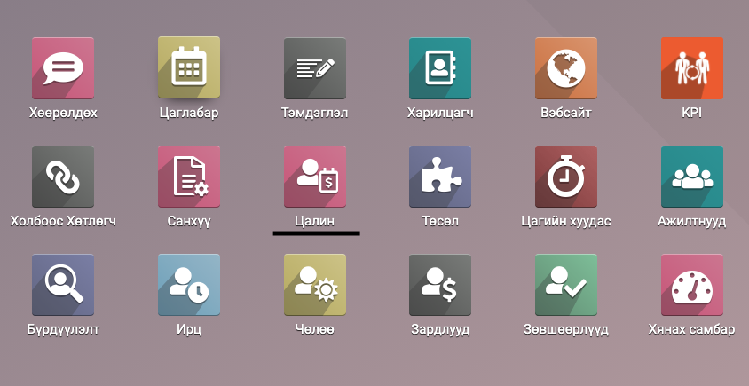
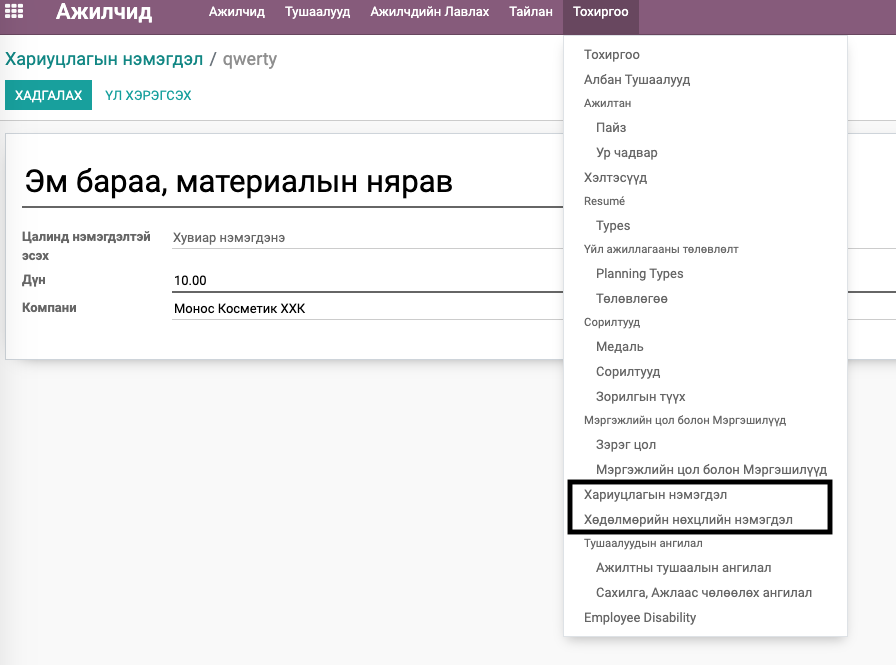
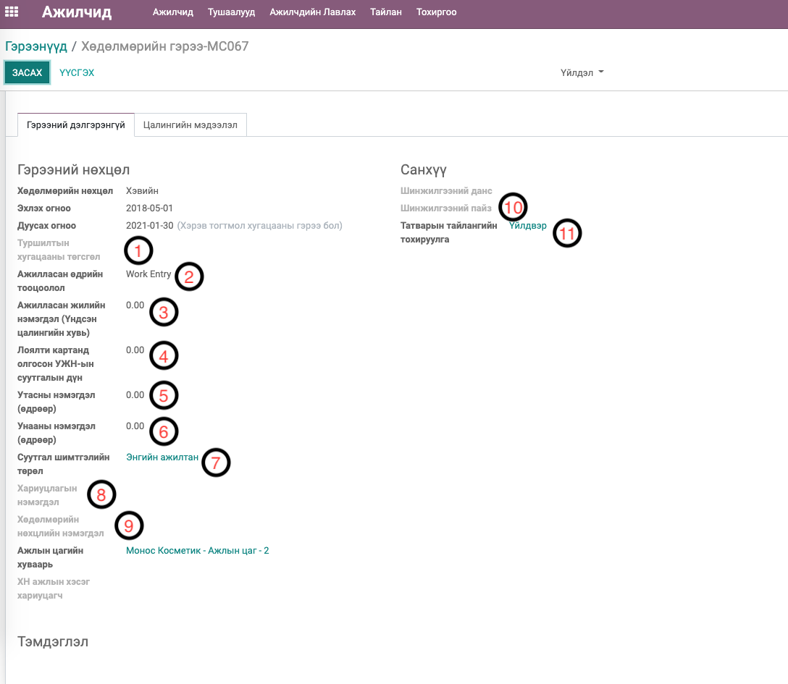
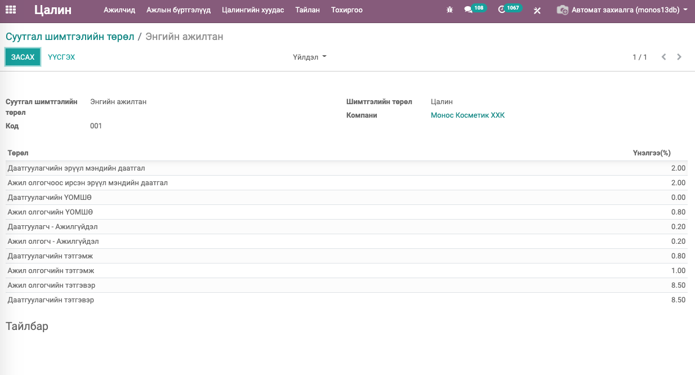
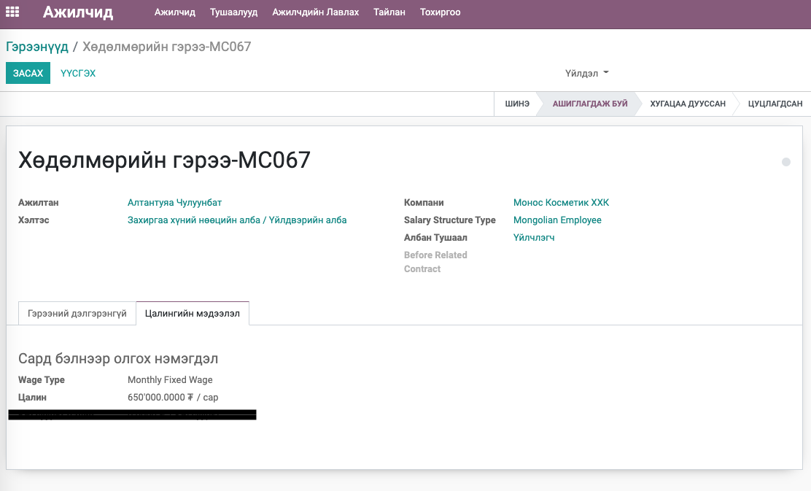

Mongolian - Payroll
****************************

Хүний нөөцийн модуль

Техникийн нэр
===========================
:guilabel:`bumanit_l10n_mn_payroll`

Уялдаа холбоо
===============

:guilabel:`hr_payroll`
:guilabel:`bumanit_account`
:guilabel:`bumanit_partner`
:guilabel:`bumanit_hr`
:guilabel:`report_xlsx`

Модуль суулгахад нэмэгдэх цэсүүд
----------------------------------

| Апп ==> Цалин

Цалинтай холбоотойгоор Ажилтнууд модуль дах нэмэлтүүд
=====================================================

Цалин бодохтой холбоотойгоор Ажилтнууд модуль дараах нэмэлт хөгжүүлэлт орсон болно. Эдгээр мэдээлэлд Хүний нөөцийн менежер, Цалингийн менежер эрхтэй хүмүүс хандах боломжтой.

1. Ажилтны ерөнхий мэдээлэлд - HR Тохиргоонууд хэрэгт ЭМД-ийн дэвтрийн дугаар, Цалин авах банк гэсэн талбарууд нэмэгдэв. (Нийгмийн даатгалын тайлан болон Банкинд илгээх цлингийн хүснэгтэнд ашиглагдах)
2. Алба хэлтэс болон Албан тушаалын бүртгэлэд - Шинжилгээний данс сонгох (Заавал биш) талбарууд нэмэгдэв. (Цалингийн шинжилгээний хувиарлалтанд ашиглагдах)
3. Улсын бүртгэлд НДШ-н код, Харилцагчын бүртгэлд байгууллагын НДШ байршлын код,  Албан тушаалын бүртгэлэд НДШ код гэсэн талбарууд нэмэгдэв. (Нийгмийн даатгалын тайланд ашиглагдах)
4. Ажилтнууд модулын Тохиргоо хэсэгт Хариуцлагын нэмэгдэл, Хөдөлмөрийн нөхцлийн нэмэгдэл гэсэн 2 цэс нэмэгдэнэ. /Зураг 1/ Эдгээр бүртгэл нь мөн Олон компани дундаа эсвэл дотооддоо ашиглах боломжтой.

Ажилтны гэрээний дэлгэрэнгүй мэдээлэл хэрэгт Зураг - 2 дээрхи талбарууд нэмэгдэнэ.

1. Ажилтан туршилтын хугацаандаа яваа бол Туршилтын хугацааны төгсгөл огноог оруулж өгнө. Энэ Огноог оруулвал үндсэн цалингийн хэдэн хувиар цалилжихыг тохируулах Туршилтын цалингийн хувь гэсэн талбар мөн нэмэгдэж харагдана. 
2. Ажилласан өдрийн тооцоолол нь Цалин бодоход ажилласан цагийг хаанаас тооцоолохыг тодорхойлно.

    1. Ажлын бүртгэл (work entry) - Суурь шийдэл буюу гэрээний хугацаагаар автоматаар үүссэн ажиллах хоногийн тооцооллоос бодно.
    2. Ирц (attendance) - Ирцийн төхөөрөмжид орж ирсэн ажилласан ирцийн мэдээллээс ажилласан хоногийг тооцно. (Ирцийн модуль суусан байх шаардлагатай.)
    3. Цагийн хуудас (timesheet) - Төсөл дээр ажилласан цагаа бүртгэж батлуулсан цагийн хуудсаас ажиллах хоногийн тооцооллоос бодох (Төслийн модуль суусан байх шаардлагатай.)
    
3. Ажилласан жилийн нэмэгдэл (Үндсэн цалингийн хувь) - Цалинд нэмэгдэх ажилласан жилийн нэмэгдлийг тооцоолоход ашиглагдан. Энэ талбарт % оруулсанаар ажилласан цагт ногдох цалингаас тохируулсан %-аар нэмэгдэл автоматаар тооцоолно.
4. Лоялти картанд олгосон УЖН-ын суутгалын дүн - Монос картанд (ODOO 10 дээрээс автоматаар цэнэглэгдэж байгаа дүн) шилжин орж буй дүнг энд тохируулна. Энэ талбарт тохируулсан дүнгээр суутгалыг автоматаар тооцоолно.
5. Утасны нэмэгдэл - Утасны нэмэгдэлтэй ажилчидад тогтмол дүнгээр тохируулна. Энэ талбарт тохируулсан дүнг ажилласан цагт ногдуулж цалинд нэмэгдэлийг автоматаар тооцоолно.
6. Унааны нэмэгдэл - Унааны (шатхууны) нэмэгдэлтэй ажилчидад тогтмол дүнгээр тохируулна. Энэ талбарт тохируулсан дүнг ажилласан цагт ногдуулж цалинд нэмэгдэлийг автоматаар тооцоолно.
7. Суутгал шимтгэлийн төрөл - Цалингийн тохиргоо хэсэгт Суутгал шимтгэлийн төрлүүдийн бүртгэлийг хийх бөгөөд тухайн ажилтанд тохирох Суутгал шимтгэлийн төрлийг энд тохируулна. Энд тохируулсан Суутгал шимтгэлийн төрөл дээрээс НДШ болон ЭМД-ийн суутгалын хувийг авч суутгалыг автоматаар тооцоолох юм. /Зураг 3/

8. Хариуцлагын нэмэгдэл - Хариуцлагын нэмэгдэлтэй ажилчидад Ажилтнууд модулын Тохиргоо хэсэгт бүртгэсэн Хариуцлагын нэмэгдэлээс сонгож бүртгэж өгнө. Хариуцлагын нэмэгдлийн цалинд нэмэгдэх тохиргооноос нэмэгдэх дүнг тооцож олоод (тотмол дүнгээр нэмэгдэх бол тотмол дүнг ажилласан цагт ногдуулна) цалинд нэмэгдэлийг автоматаар тооцоолно.
9. Хөдөлмөрийн нөхцлийн нэмэгдэл - Хариуцлагын нэмэгдэлтэй ажилчидад Ажилтнууд модулын Тохиргоо хэсэгт бүртгэсэн Хөдөлмөрийн нөхцлийн нэмэгдэлээс сонгож бүртгэж өгнө. Хөдөлмөрийн нөхцлийн нэмэгдлийн цалинд нэмэгдэх тохиргооноос нэмэгдэх дүнг тооцож олоод (тотмол дүнгээр нэмэгдэх бол тотмол дүнг ажилласан цагт ногдуулна) цалинд нэмэгдэлийг автоматаар тооцоолно.
10. Шинжилгээний пайз - Ажитны цалингийн ажил гүйлгээний шинжилгээний хувиарлалтанд ашиглагдана. Шинжилгээний хувиарлалт нь дараах дүрмээр хэрэгжинэ.

    1. Хэрэв ажилтны гэрээнд шинжилгээний пайз сонгосон бол түүгээр хувиарлана.
    2. 1 хэрэгжихгүй үед ажилтны гэрээнд эсвэл цалингийн дүрмэнд шинжилгээний данс тохируулсан эсэхийг хайж олдсон шинжилгээний дансаар хувиарлана.
    3. 2 хэрэгжихгүй үед ажилтны Алба хэлтэс дээр шинжилгээний данс тохируулсан эсэхийг хайж олдсон шинжилгээний дансаар хувиарлана.
    4. 3 хэрэгжихгүй үед ажилтны Албан тушаал дээр шинжилгээний данс тохируулсан эсэхийг хайж олдсон шинжилгээний дансаар хувиарлана.
    5. Дээрхи бүгд хэрэгжихгүй үед шинжилгээний хувиарлалт хийхгүй.

11. Татварын тайлангийн тохируулга - Энд санхүү хэсэгт бүртгэж тохируулсан дансны харгалзааг сонгож өгнө. Дансны харгалзааг сонгосон үед Ажитны цалингийн ажил гүйлгээнд дансны харгалзаа хэрэгжих юм. Дансны харгалзаа тохируулаагүй үед шууд цалингийн дүрмэнд тохируулсан дансанд гүйлгээ бүртгэгднэ.
12. Ажилтны гэрээний цалингийн мэдээлэл хэрэг дэх цалин хэсэгт ажилтны үндсэн цалинг тохируулна. Хэрэв үйлдвэрийн ажилтны цалин бол Энд тохируулсан цалингаас нэмэгдлүүдийг тооцоолох дүн юм. /Зураг - 4/

Цалин модуль
=========================

