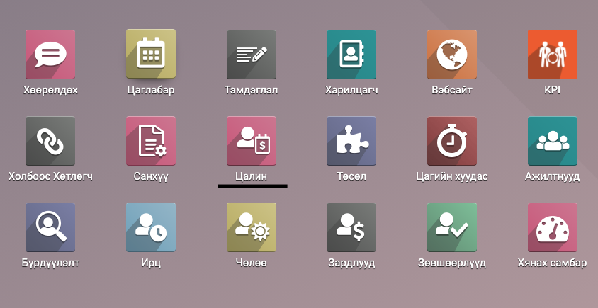
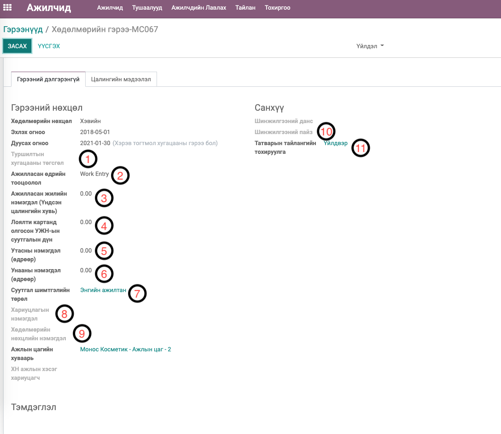
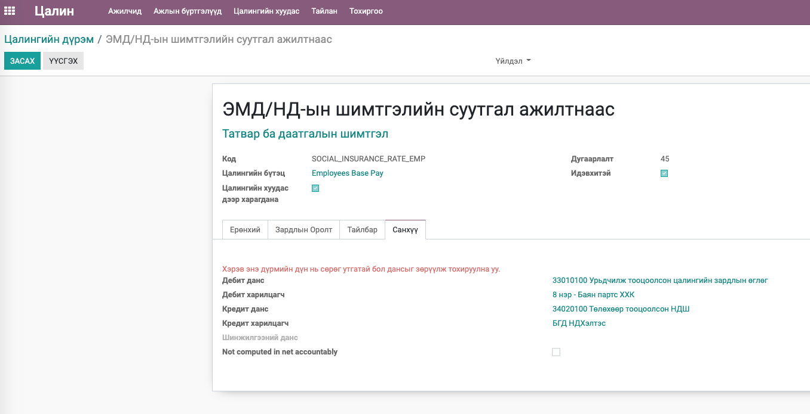
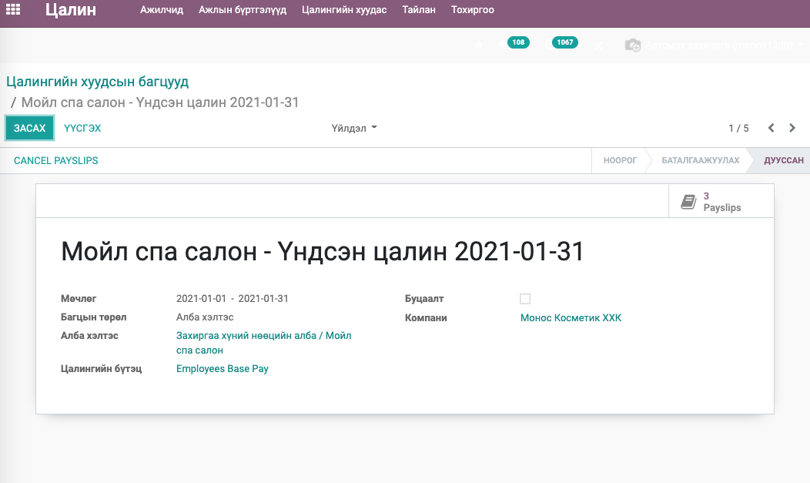

Mongolian - Payroll with Accounting
********************************************

Цалингийн модуль

Техникийн нэр
===========================
:guilabel:`bumanit_l10n_mn_payroll_account`

Уялдаа холбоо
===============

:guilabel:`bumanit_l10n_mn_payroll`
:guilabel:`hr_payroll_account`
:guilabel:`l10n_mn`

Модуль суулгахад нэмэгдэх цэсүүд
----------------------------------

| Апп ==> Цалин

Цалингаас үүсэх санхүүгийн бичилттай холбоотой нэмэлт хөгжүүлэлтүүд
=================================================================================

1. Шинжилгээний пайз - Ажитны цалингийн ажил гүйлгээний шинжилгээний хувиарлалтанд ашиглагдана. Шинжилгээний хувиарлалт нь дараах дүрмээр хэрэгжинэ. /Зураг 1 - 10/

    1. Хэрэв ажилтны гэрээнд шинжилгээний пайз сонгосон бол түүгээр хувиарлана.
    2. 1 хэрэгжихгүй үед ажилтны гэрээнд эсвэл цалингийн дүрмэнд шинжилгээний данс тохируулсан эсэхийг хайж олдсон шинжилгээний дансаар хувиарлана.
    3. 2 хэрэгжихгүй үед ажилтны Алба хэлтэс дээр шинжилгээний данс тохируулсан эсэхийг хайж олдсон шинжилгээний дансаар хувиарлана.
    4. 3 хэрэгжихгүй үед ажилтны Албан тушаал дээр шинжилгээний данс тохируулсан эсэхийг хайж олдсон шинжилгээний дансаар хувиарлана.
    5. Дээрхи бүгд хэрэгжихгүй үед шинжилгээний хувиарлалт хийхгүй.

2. Татварын тайлангийн тохируулга - Энд санхүү хэсэгт бүртгэж тохируулсан дансны харгалзааг сонгож өгнө. Дансны харгалзааг сонгосон үед Ажитны цалингийн ажил гүйлгээнд дансны харгалзаа хэрэгжих юм. Дансны харгалзаа тохируулаагүй үед шууд цалингийн дүрмэнд тохируулсан дансанд гүйлгээ бүртгэгднэ. /Зураг 1 - 11/

3. Нэмэлтээр цалингийн дүрмэнд Дэбит, Кредит харилцагчыг тусад нь тохируулалж санхүүгийн бичилтэнд авах

4. Ажилтны цалинг батлахад Ажил гүйлгээг автоматаар батлах
5. Батлагдсан цалинг Санхүү/Удирддага эрхтэй ажилтан цуцлахад ажил гүйлгээ дагаж цуцлагдах, буцааж батлахад ажил гүйлгээ засварлагдаж дахин батлагдах
6. Цалингийн багцаас багцаар нь цалингуудыг батлах, цуцлах

7. Багц цалингийн санхүүгийн бичилтэнд Бусад суутгал, Утасны суутгал, Хоолны суутгал гэсэн 3 төрлийн суулгалын бичилтийг ажилтнаар нь салгаж бичих