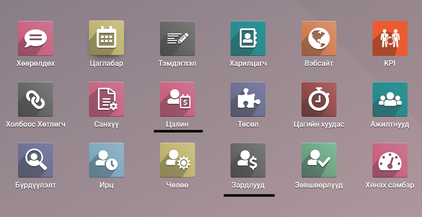
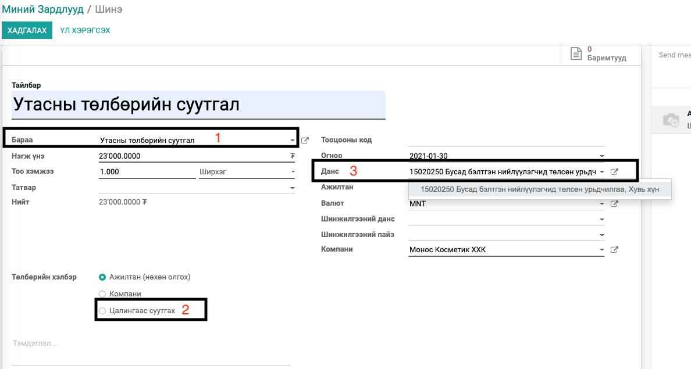

Mongolian Payroll - Expense
****************************************

Цалингийн модуль

Техникийн нэр
===========================
:guilabel:`bumanit_l10n_mn_payroll_expense`

Уялдаа холбоо
===============

:guilabel:`hr_payroll`
:guilabel:`hr_expense`
:guilabel:`hr_payroll_expense`
:guilabel:`bumanit_l10n_mn_payroll`

Модуль суулгахад нэмэгдэх цэсүүд
----------------------------------

| Апп ==> Цалин

Ажилтны цалингийн хуудас Зардал хамт тооцоолох
=====================================================

Энэхүү нэмэлтийг суулгаснаар ажилчдын цалинг тооцолдохдоо тухайн сарын цалинт үеийн хугацаа хооронд зардал үүссэн бол зардал тооцох 
боломжтой болно. Нэмэлтийг даган Зардал модуль, Санхүүгийн нэмэлт модуль дагаж сууна гэдгийг анхаарна уу.

1. Зардал үүсгэхэд цалингаас суутгах сонголт сонгогдсон зардал, тухайн сарын цалингийн хуудас оролт болон орж ирнэ.

    1. Үйлчилгээ төрөлтэй бараа байх
    2. Зардлын данс
    3. Цалингаас суутгах сонголтыг сонгоогүй бол Цалин тооцоолоход энэ энэ зардал автоматаар суутгагдахгүй болно.

2. Зардлын тооцоог зөвшөөрөөд Зөвшөөрсөн төлавтэй орхих ёстой бөгөөд энэ үед цалингийн хуудаст зардлын тооцооны нийт дүнгээр оролт болж орж ирнэ.

3. Цалингийн дүрмийн тохиргоо хэсэг дэх Оролтуудыг зардлын хүсэлтээс татахыг чагтлан тухайн дүрэмд хамаарах үйлчилгээ төрөлтэй бараа болон зардлын оролтыг сонгож тохируулсан байх.

Зардалтай холбоотой загвар файл импорт хийх бол импортлох товчин дээр даран дэлгэцийн голд байрлах Import Template for Expenses -г татан авч загвар файлтай танилцан харгалзах утгуудыг өөрчлөн буцаан бүртгэл үүсгэх хэлбэрээр импорт хийх боломжтой.
