Mongolian - Payroll with MRP
****************************************

Цалингийн модуль

Техникийн нэр
===========================
:guilabel:`bumanit_l10n_mn_payroll_mrp`

Уялдаа холбоо
===============

:guilabel:`hr_payroll`
:guilabel:`bumanit_l10n_mn_payroll`
:guilabel:`bumanit_mrp`
:guilabel:`report_xlsx`

Модуль суулгахад нэмэгдэх цэсүүд
----------------------------------

| Апп ==> Цалин

.. figure::
    ../../../img/modules/bumanit_l10n_mn_payroll_mrp/menu_main.png

Үйлдвэрийн ажилтны хийснээрх ажлыг тооцоолж батлах
=====================================================

Энэхүү нэмэлтийг суулгаснаар үйлдвэрийн ажилтны хийснээрх ажлыг тооцоолж батлах юм. Ингэсэнээр үйлдэр дээр тухайн ажилтны хийсэн ажилтын үнэлгээг автоматаар тооцоолох боломжтой болно.
Үйлдвэрийн ажилтны хийснээрх ажлыг тооцоолоходдоо цалингийн нягтлан эрхтэй ажилтанууд тооцоолох боломжтой. Харин тооцлогдоод илгээгдсэн тооцооллыг БАТЛАХ, ЦУЦЛАХ эрх нь доорх эрхтэй ажилтануудад боломжтой.

1. Цалин / Цалингийн хуудас / Үйлдвэрийн хийсэн ажил цэсээр орж хийснээрх ажлтын тооцоолол үүсгэх болон засварлаж батлана. 

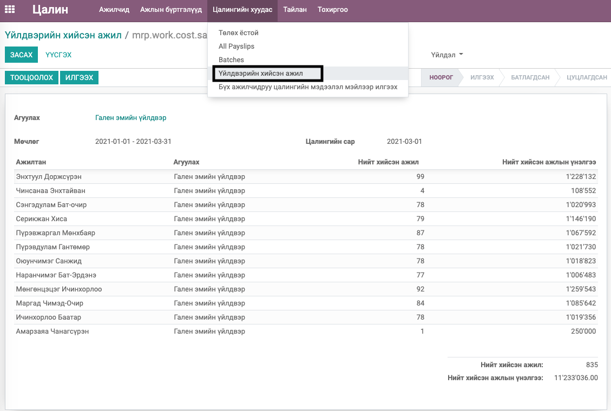

2. Үйлдвэрийн хийсэн ажил тооцоолол үүсгэх болон агуулах солих үед тооцоологдсон мөрүүд устах бөгөөд ТООЦООЛОХ товч дарж шинээр тооцоолно.

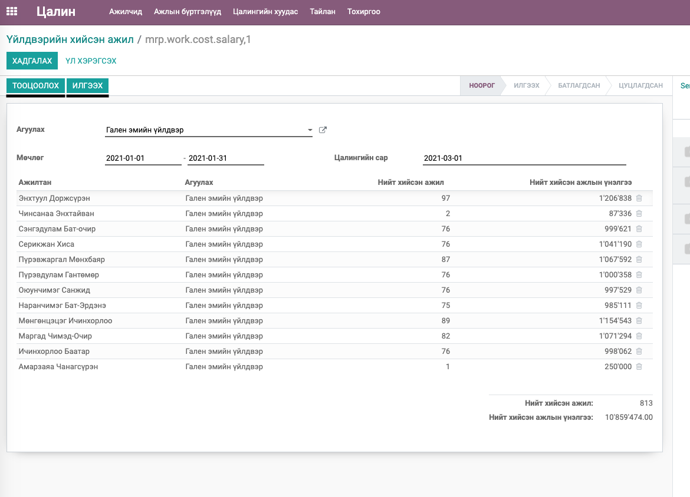

3. Үйлдвэрийн хийсэн ажил тооцооллоос ажилтан хасах эсвэл зарим ажилчдын зарим ажлыг хасах бол засах үйлдлээр хийнэ.

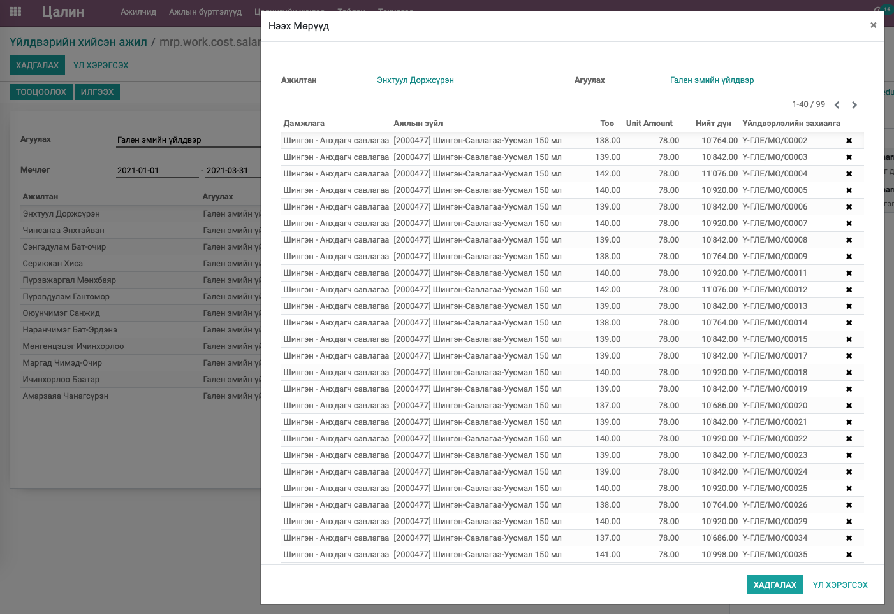

4. Үйлдвэрийн хийсэн ажил тооцоолол нь АГУУЛАХ (Үйлдвэрийн журнад) болон Цалингийн сараар давхардахгүй байх ёстой. Харин хугацааны мөчлөг дурын байх бөгөөд энэ АГУУЛАХАД өөр ЦАЛИНГИЙН САР-аар тооцоолсон бол тухайн тооцоололд орсон хийсэн ажлууд хасагдаж орж ирнэ. Өөрөөр хэлбэл 2021-01-01 - 2021-01-31 гэсэн мөчлөгөөр Гален эмийн үйлвэрийн 2021-01-сарын цалинд тооцогдох хийснээрх ажлын тооцооноос сүүлийн 2 өдрийн ажлыг хасаж тооцосон байгаад дахин 2021-01-01 - 2021-01-31 гэсэн мөчлөгөөр Гален эмийн үйлвэрийн 2021-02-сарын цалинд тооцогдох хийснээрх ажлын тооцоог үүсгэхэд өмнөх тооцооноос хасагдсан хийсэн ажлууд л орж ирэх юм. Энэ тооцоолол нь Үйлдвэрийн хийсэн ажлын тооцоог тооцоолсон дарааллаар хэрэгжих тул цалингийн хугацааны дарааллаар тооцоолох нь зүйтэй юм.

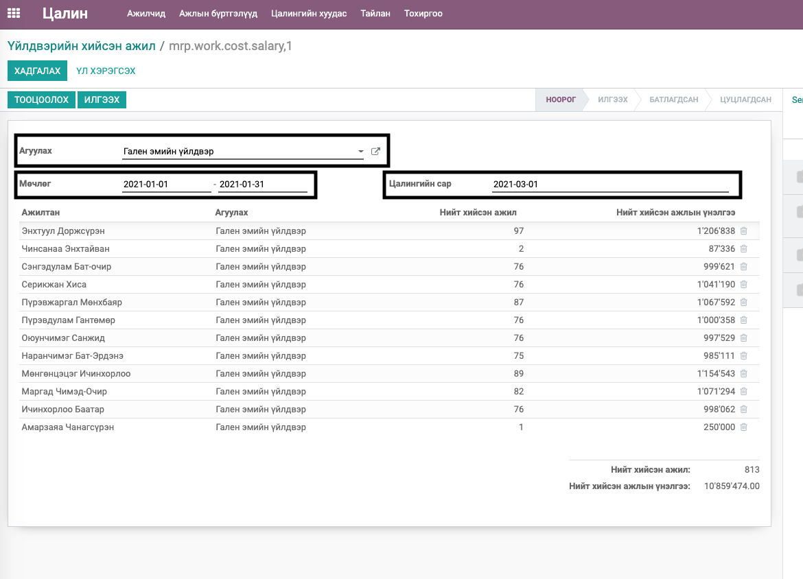

``Энэ үйлдлээр тооцоолсны дараа ТООЦООЛОХ товчыг дарж дахин тооцоолвол өмнөх засвар хэрэгсэхгүй болохыг анхаарна уу.``

5. Үйлдвэрийн хийсэн ажилыг тооцоолж дуусаад ИЛГЭЭХ товч дарснаар ``Үйлдвэрийн хийснээрх ажлын тооцоог батлах`` эрхтай ажилчидад БАТЛАХ, ЦУЦЛАХ гэсэн товч харагдана. БАТЛАХ дарснаар энэ тооцоолол дуусах бөгөөд тооцооллын цалингийн сарын ҮЙЛДВЭРИЙН ҮНДСЭН ЦАЛИНД орж ирэх боломжтой болно. ЦУЦЛАХ дарсан үед дахин нооролоод дахин тооцоолж батлуулах боломжтой болно.

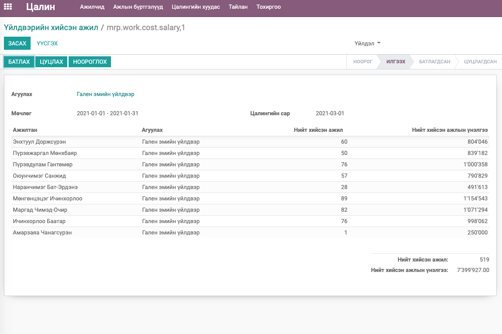

Үйлдвэрийн ажилтны хийснээрх ажлыг тооцоолол цалинд тооцогдох
===================================================================

Батлагдсан төлөвтэй Үйлдвэрийн ажилтны хийснээрх ажлын тооцооллууд цалинд тооцогдоно. Хэрэв нэг ажилтан олон үйлдвэрт ажилласан бөгөөд тухай бүрээр тооцоологдож батлагдсан бол нэгтгэгдсэн дүнгээр цалинд орж ирнэ. 

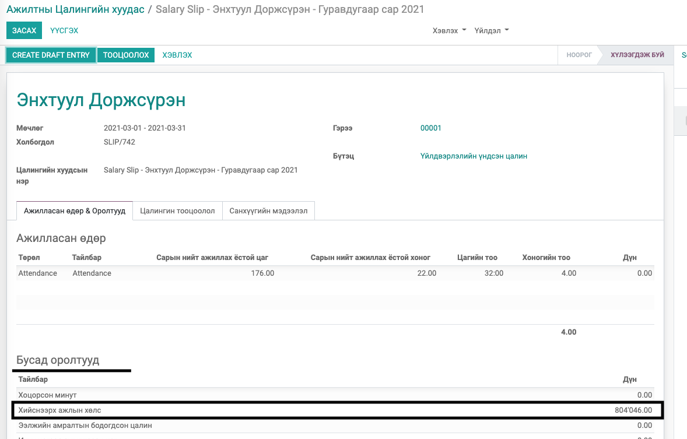

Үйлдвэрийн хийснээрх ажлын тооцооллыг Цалин баталсны дараа тооцоолсон эсвэл хүлээгдэж буй цалинд орж ирсний дараа цуцалж өөрчилсөн бол цалинг цуцлаад ноороглож дахин тооцоолхгүй бол ``тооцоолол буруу болох эрсдэлтэйг`` анхаарах хэрэгтэй.

Цалинд батлагдсан үйлдвэрийн хийснээрх ажилын тайлан
===================================================================

Батлагдсан төлөвтэй Үйлдвэрийн ажилтны хийснээрх ажлын тооцоолоос 2 төрлөөр тайлан авна. Энэ 2 төрөл нь зөвхөн бүлэглэж харж байгаагаар л ялгаатай юм.

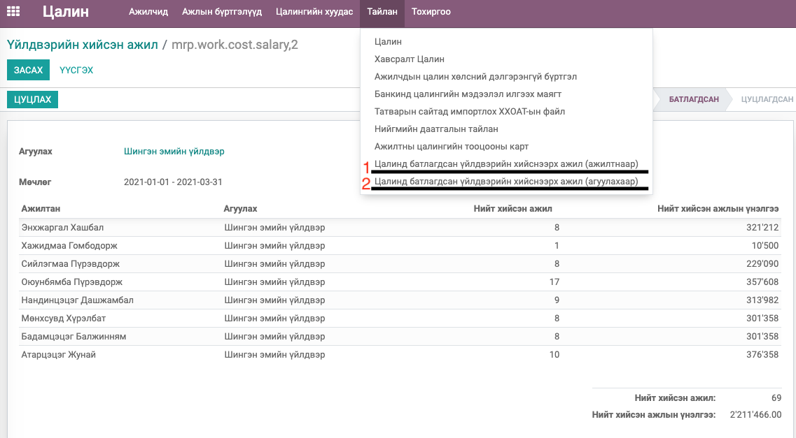

1. Цалинд батлагдсан үйлдвэрийн хийснээрх ажил (ажилтнаар)

Бүх агуулахын тухайн цалингийн сараар батлагдсан үйлдвэрийн хийснээрх ажлын тооцооллуудыг нэгтгэж ажилтнаар бүлгэлж харуулна. Тайлан татахдаа ажилтан сонговол зөвхөн тухайн ажилтны тайланг харуулна.

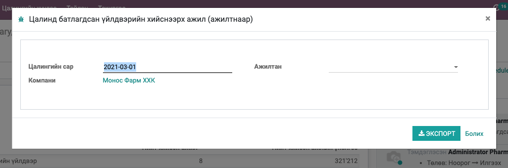

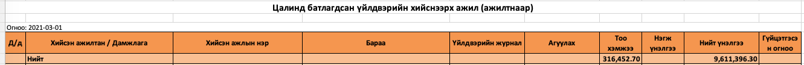

2. Цалинд батлагдсан үйлдвэрийн хийснээрх ажил (агуулахаар)

Бүх агуулахын тухайн цалингийн сараар батлагдсан үйлдвэрийн хийснээрх ажлын тооцооллуудыг нэгтгэж агуулах, үйлвэрийн захиалгаар бүлгэлж харуулна. Тайлан татахдаа агуулах сонговол зөвхөн тухайн агуулахын тайланг харуулна.

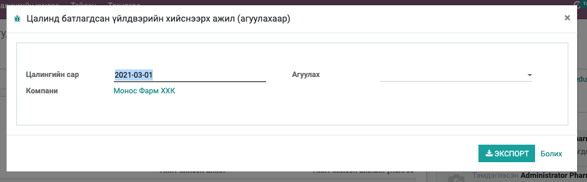

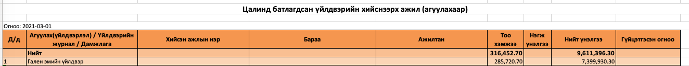