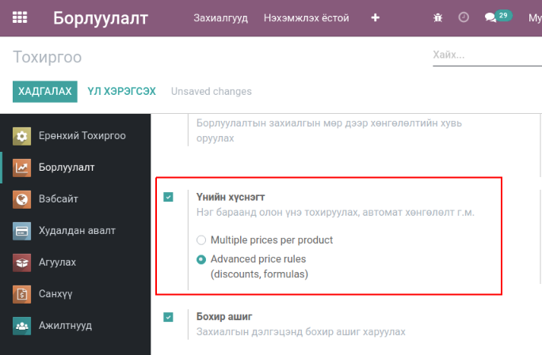
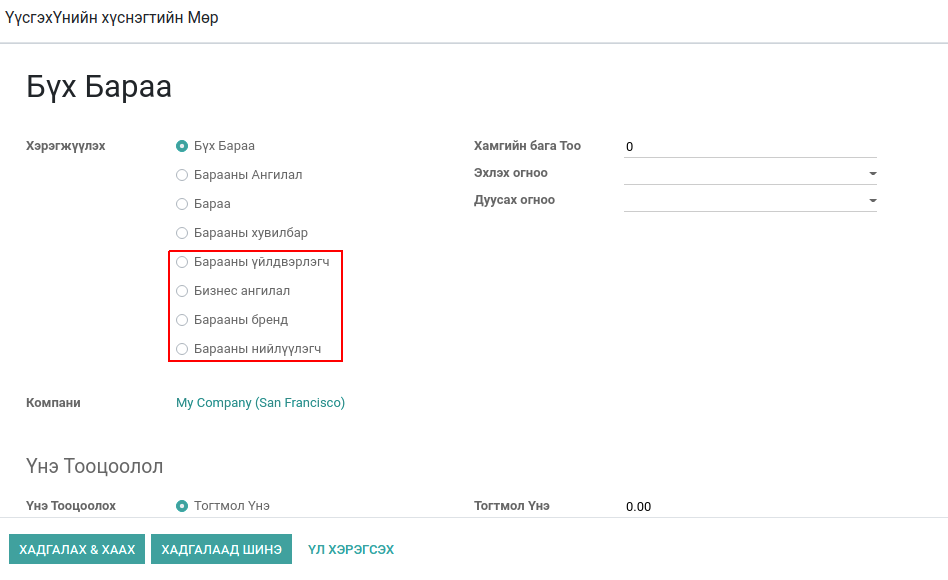

**********************
Product Pricelist Rule
**********************

Техникийн нэр
=============

:guilabel:`bumanit_pricelist`

Уялдаа холбоо
=============

:guilabel:`sale` :guilabel:`bumanit_stock` :guilabel:`bumanit_monos_product`

Тайлбар
=======

Odoo v13 Борлуулалт үнийн саналын дүрэмийн нэмэлт хөгжүүлэлт

Групп
----------------------------------

:guilabel:`Advanced Pricelists`
 - Нарийвчилсан үнийн жагсаалтууд
:guilabel:`Basic Pricelists`
 - Үндсэн үнийн жагсаалтууд

Тохиргоо
--------

:guilabel:`Үнийн хүснэгт`
 - Үнийн хүснэгт ашиглах үндсэн тохиргоо.

   Нэг бараанд олон үнэ тохируулах, автомат хөнгөлөлт г.м.

Хөгжүүлэлт
==========
Цэс: Борлуулалт -> Бараа -> Үнийн хүснэгт

1. Барааны үнийн дүрэм дээр үйлдвэрлэгч, нийлүүлэгч, бренд нэр, бизнес ангилалаар хэрэгжүүлэх

    Үнийн саналын мөр
..  note::
    Эдгээр талбарууд нь бүгд бараанд тохируулагдсан байна.

.. centered:: Гарын авлага боловсруулсан: Амарсанаа. А