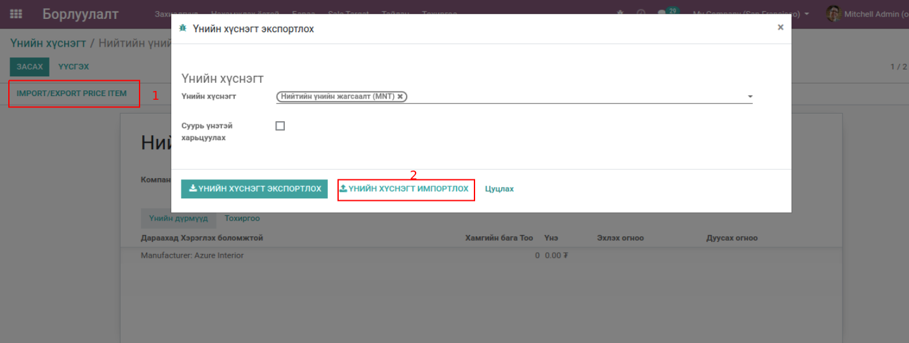
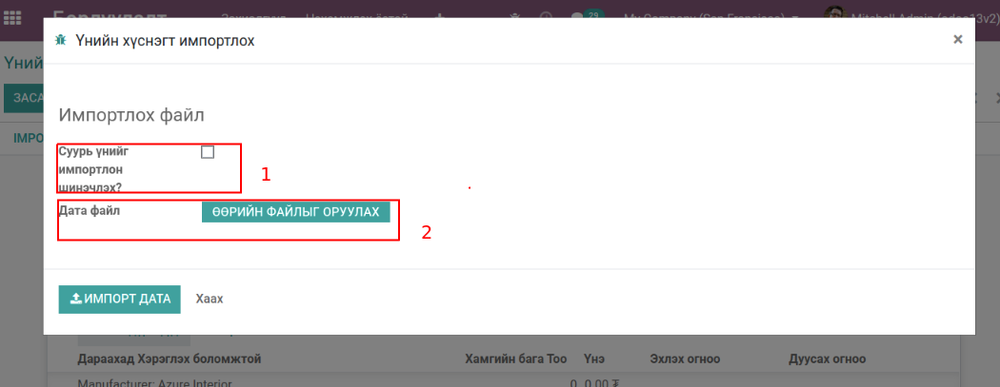

*************************************************
BumanIT Product Pricelist Import/Export Extention
*************************************************

Техникийн нэр
=============

:guilabel:`bumanit_pricelist_import`

Уялдаа холбоо
=============

:guilabel:`base` :guilabel:`sale` :guilabel:`report_xlsx`

Тайлбар
=======

Odoo v13 Борлуулалт үнийн саналын дүрэмийн нарийвчилсан импорт

Групп
----------------------------------

:guilabel:`Advanced Pricelists`
 - Нарийвчилсан үнийн жагсаалтууд
:guilabel:`Basic Pricelists`
 - Үндсэн үнийн жагсаалтууд

Тохиргоо
--------

:guilabel:`Үнийн хүснэгт`
 - Үнийн хүснэгт ашиглах үндсэн тохиргоо.

   Нэг бараанд олон үнэ тохируулах, автомат хөнгөлөлт г.м.

.. figure:: ../../../img/modules/bumanit_pricelist/frame.png
    :align: center

Хөгжүүлэлт
==========
Цэс: Борлуулалт -> Бараа -> Үнийн хүснэгт

1. Үнийн хүснэгт мөр Импорт & Экспорт

    Энэхүү модулыг суулгаснаар үнийн хүснэгтэнд импортоор үнийн хүснэгтийн мөр болох үнийн хүснэгтийн нарийвчилсэн дүрэм оруулах боломжтой болно.

    Үнийн хүснэгт экспортлох

1. Import/Export Price Item ( Импорт болон Экспорт хийх товч: Борлуулалт > Бараа > Үнийн хүснэгт)
2. Дээрх үйлдийг хийхэд үнийн хүснэгт экспортлох визард дэлгэц гарна.Импорт хийх бол үнийн хүснэгт импортлох товч дарна

    Үнийн хүснэгтийн дүрэм импортлох

1. Суурь үнийг импортлон шинэчлэх? - Энэ талбарыг идэвхжүүлсэнээр өмнө үүссэн үнийн дүрмийг дарж бичнэ.
2. Импортлох үнийн дүрэмийн excel файл оруулна.

..  note::
    - Export: SKU,Үнийн жагсаалт,Суурь үнэ
    - Import: SKU,Үнийн жагсаалт
    Үнийн хүснэгтийн дүрэм импортлох, экспортлох ажиллагаа нь зөвхөн тогтмол үнэ тооцоолох үед хэрэгжинэ.

.. centered:: Гарын авлага боловсруулсан: Амарсанаа. А