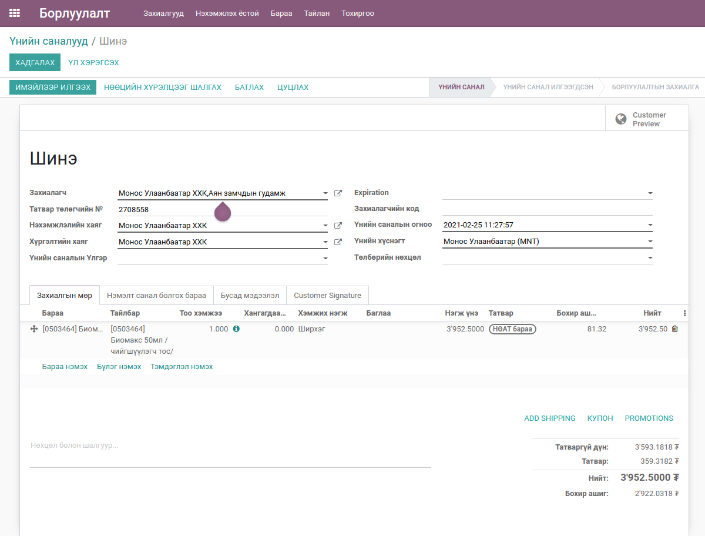
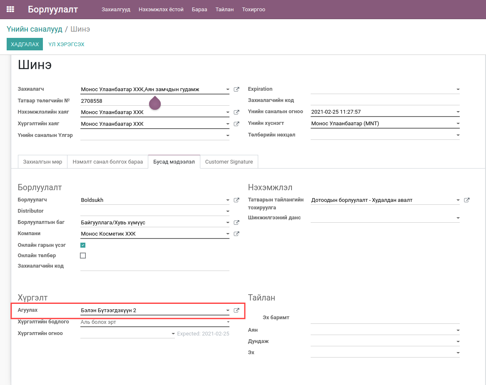
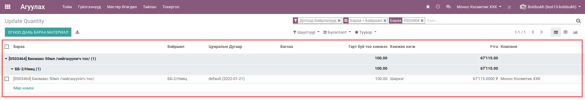
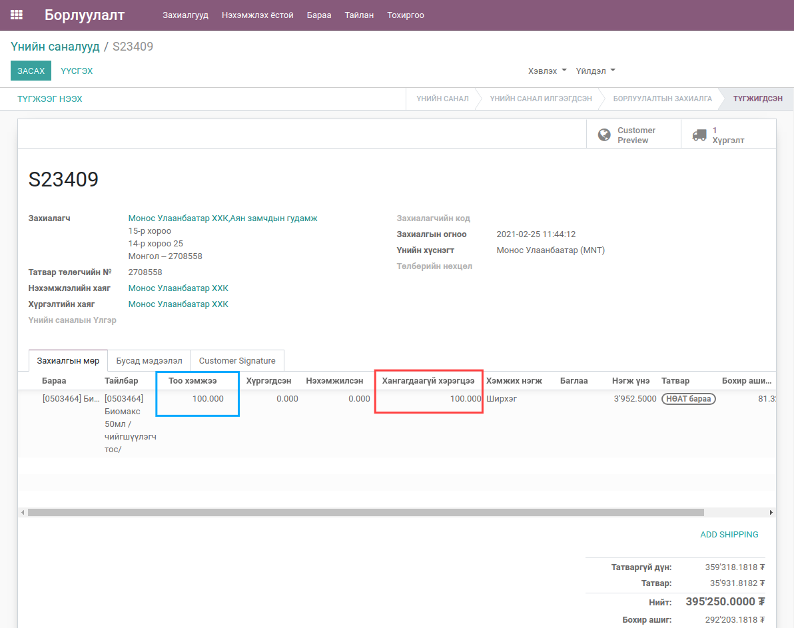
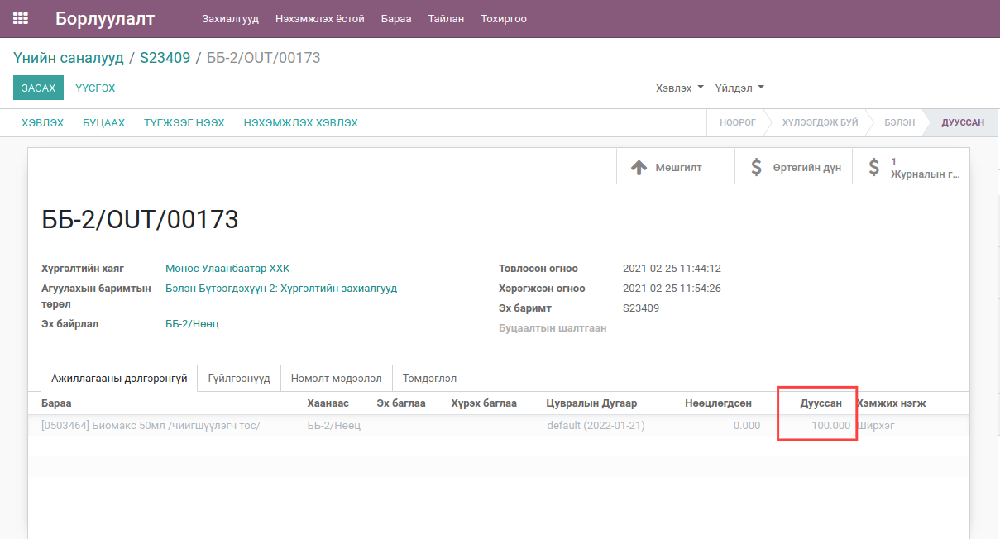

************************
Check Order Availability
************************

Техникийн нэр
=============

:guilabel:`bumanit_sale_availability`

Уялдаа холбоо
=============

:guilabel:`bumanit_stock` :guilabel:`bumanit_sale_refund`

Тайлбар
=======

Борлуулалтын захиалгын нөөцийн бэлэн байдлыг шалгаж, үлдэгдэл хүрэлцэхгүй байвал хангагдаагүй хэрэгцээ гэсэн талбарт нэмнэ. Ингэснээр алдагдсан боломжийн өртөгөө харах боломжтой болно.

Хөгжүүлэлт
==========

Борлуулалт
---------------------------------------------

Цэс:
    - Борлуулалт => Захиалга

1. Борлуулалтын захиалга үүсгэх.

2. Агуулах сонгохдоо тухайн борлуулах гэж буй бараа үлдэгдэлтэй байгаа агуулах сонгох.

3. Зураг дээр байгаа бараа нь 100ш үлдэгдэлтэй байгаа.

4. Энэ үед тухайн барааг 200ш-р борлуулах үед 100ш хүргэлтийн захиалга үүсэх ба үлдсэн 100ш нь хангагдаагүй хэрэгцээ талбарт хадгалагдан.

5. Хүргэлтийн захиалгын харагдац

