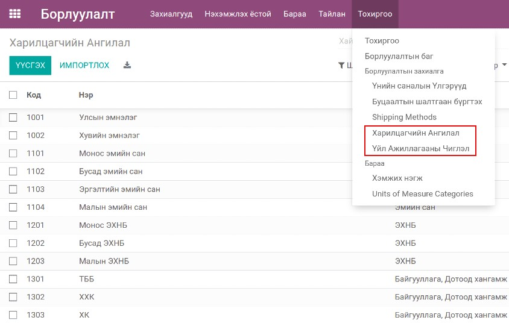
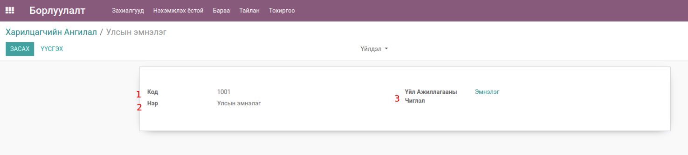
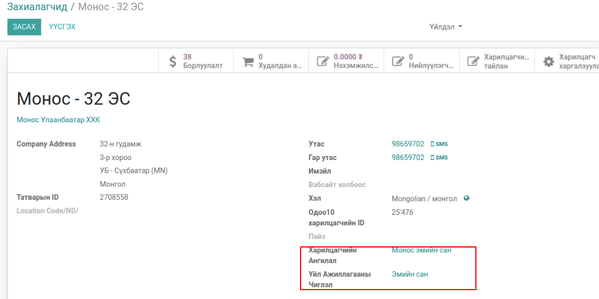
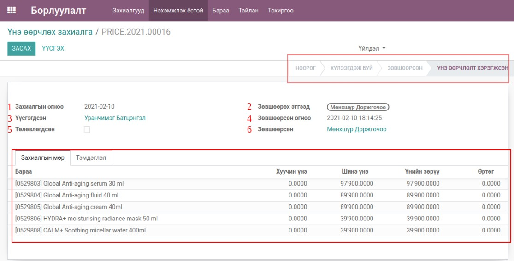
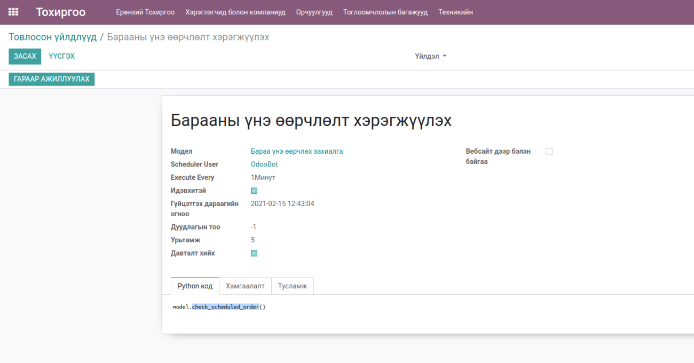

*************
Bumanit Sales
*************

Техникийн нэр
=============

:guilabel:`bumanit_sale`

Уялдаа холбоо
=============

:guilabel:`sale` :guilabel:`bumanit_sale_refund` :guilabel:`sale_coupon` :guilabel:`sale_margin`

Тайлбар
=======

Odoo v13 Борлуулалт модулийн өргөтгөл

Групп
----------------------------------

:guilabel:`Борлуулалтын тайлан дээр Өртөг харах`
:guilabel:`Бараан дээр Өртөг харах`
:guilabel:`Барааны үнэ өөрчлөлтийг удирдах`

Хөгжүүлэлт
==========

Харилцагчийн Ангилал & Үйл Ажиллагааны Чиглэл
---------------------------------------------

Цэс:
    - Борлуулалт => Тохиргоо => Харилцагчийн Ангилал
    - Борлуулалт => Тохиргоо => Үйл Ажиллагааны Чиглэл

    Харилцагчийн Ангилал & Үйл Ажиллагааны Чиглэл цэс

Харилцагчийн ангилал

    Харилцагчийн Ангилалын Харагдац

1. Харилцагчийн ангилалын код
2. Харилцагчийн ангилалын нэр
3. Харилцагчийн үйл ажиллагааны чиглэл
    - үйл ажиллагааны код
    - үйл ажиллагааны нэр

    Харилцагч дээр ангилал болон үйл ажиллагааны чиглэл сонгох

..  note::
    Харилцагчийн ангилал болон үйл ажиллагааны чиглэлийг системийн удирдлагын эрхтэй хүн тохируулна.

Барааны үнэ өөрчлөх захиалга
----------------------------

Цэс:
    - Борлуулалт => Бараа => Үнэ өөрчлөх захиалга

    Барааны үнэ өөрчлөх захиалга

Үнэ өөрчлөлтийн захиалга :guilabel:`борлуулалтын менежер` эрхтэй хэрэглэгч үүсгэх бөгөөд :guilabel:`Барааны үнэ өөрчлөлтийг удирдах` эрхтэй
хэрэглэгч тухайн захиалгийг батална.

1. Захиалгын огноо - захиалга үүсгэсэн огноо
2. Зөвшөөрөх этгээд - Тухайн үнэ өөрчлөлтийн захиалга батлах хэрэглэгч. Энэ хэрэглэгч нь :guilabel:`Барааны үнэ өөрчлөлтийг удирдах` эрхтэй хүн байна.
3. Захиалга үүсгэсэн хэрэглэгч
4. Зөвшөөрсөн огноо
5. Төлөвлөгдсөн -
6. Зөвшөөрсөн хэрэглэгчийн нэр

Барааны Захиалгын мөр дээр бараа сонгох үед тухайн бараан дээрх тохируулагдсан үнэ болон өртөг :guilabel:`хуучин үнэ`, :guilabel:`өртөг` талбрууарт цэнэглэгдэнэ.

:guilabel:`Шинэ үнэ` талбарт өөрчлөх гэж буй үнэ оруулна.

:guilabel:`Шинэ үнэ` оруулсан үед :guilabel:`үнийн зөрүү` талбар - :guilabel:`хуучин үнэ` , :guilabel:`шинэ үнийн` зөрүүгээр цэнэглэгдэнэ.

    Барааны үнэ өөрчлөлт хэрэгжүүлэх крон

Bumanit_sale модул суулгахад автоматаар үнэ өөрчлөлт хэрэгжүүлэх товлосон үйлдэл үүсэх бөгөөд минут тутамд хэрэгжинэ.

Өртөгийн хязгаарлалт
--------------------

Борлуулалтын пивот тайлан
-------------------------

Бусад хөгжүүлэлт
======================

- Борлуулалтын захиалга харилцагчаас хамааран Борлуулалтын баг автоматаар сонгогдох
- Борлуулалтын бодит зардлыг тодорхойлж дараа нь purchase_price талбарт хадгалах

.. centered:: Гарын авлага боловсруулсан: Амарсанаа. А