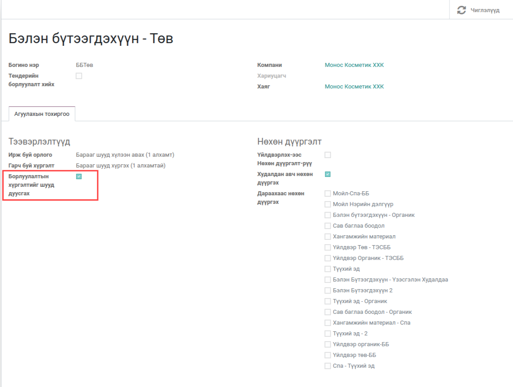
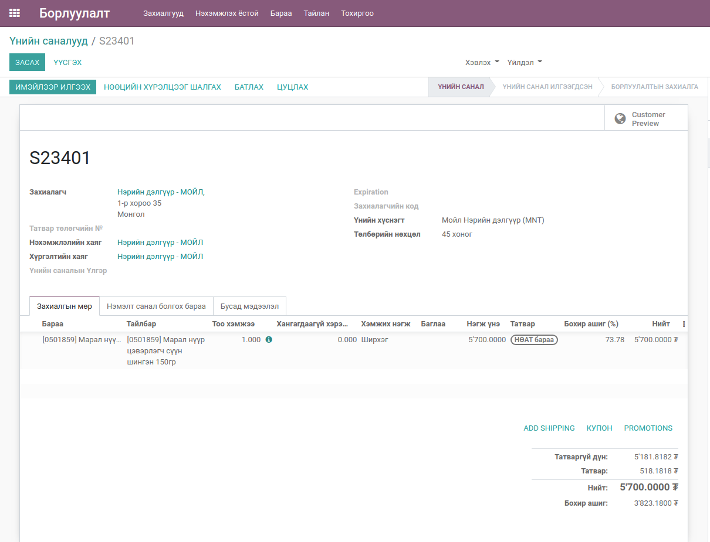
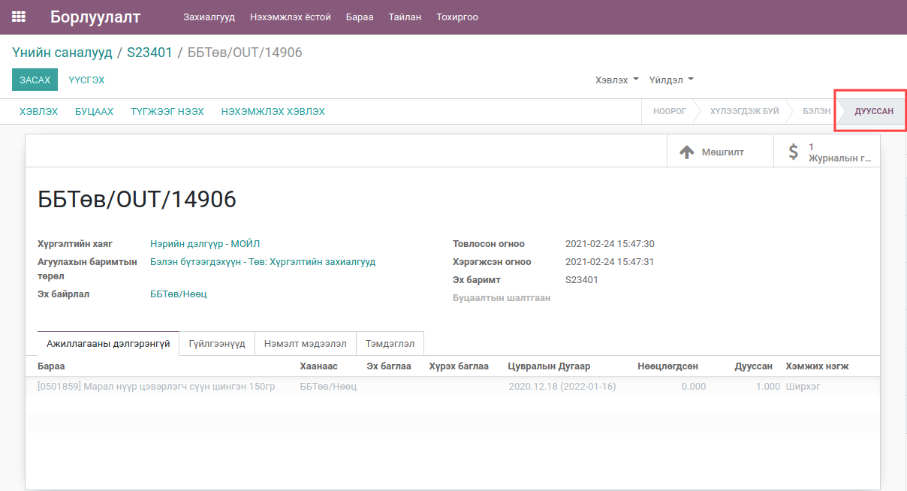
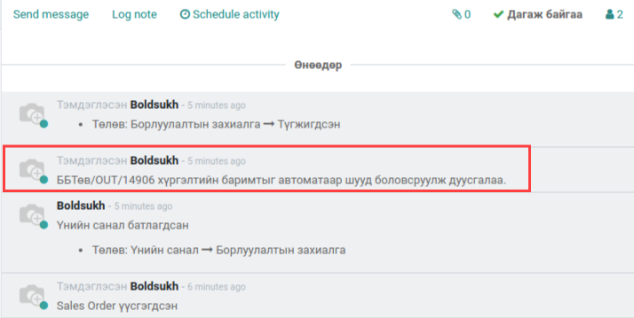

************************
Борлуулалтын захиалгаас хүргэлт батлах
************************

Техникийн нэр
=============

:guilabel:`bumanit_sale_picking_auto_done`

Уялдаа холбоо
=============

:guilabel:`bumanit_stock`

Тайлбар
=======

Борлуулалтын захиалгыг батлах үед хүргэлтийн захиалгыг агуулахын тохиргооноос хамаарч шууд батлана.

Тохиргоо
=============

:guilabel:`Борлуулалтын хүргэлтийг шууд дуусгах`

Цэс:
    - Агуулах => Тохиргоо => Харилцагчийн Ангилал

Хөгжүүлэлт
==========

Борлуулалтын захиалгаас хүргэлт батлах
---------------------------------------------

Цэс:
    - Борлуулалт => Тохиргоо => Агуулах 

1. Борлуулалтын захиалга үүсгэх

2. Үүсгэсэн захиалга батлах үед тухайн агуулах дээр байгаа "Борлуулалтын хүргэлтийг шууд дуусгах" гэсэн тохиргооноос хамаарч хүргэлтийн захиалга батлагдана.
3. Батлагдсан борлуулалтын хүргэлтийн захиалгын харагдац

4. Батлагдсан борлуулалтын захиалгын харагдац

..  note::
    Энэхүү хөгжүүлэлт нь зөвхөн 1 алхамт дээр хэрэгжинэ.