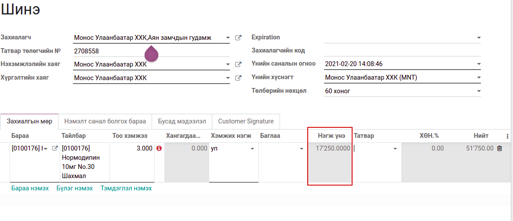
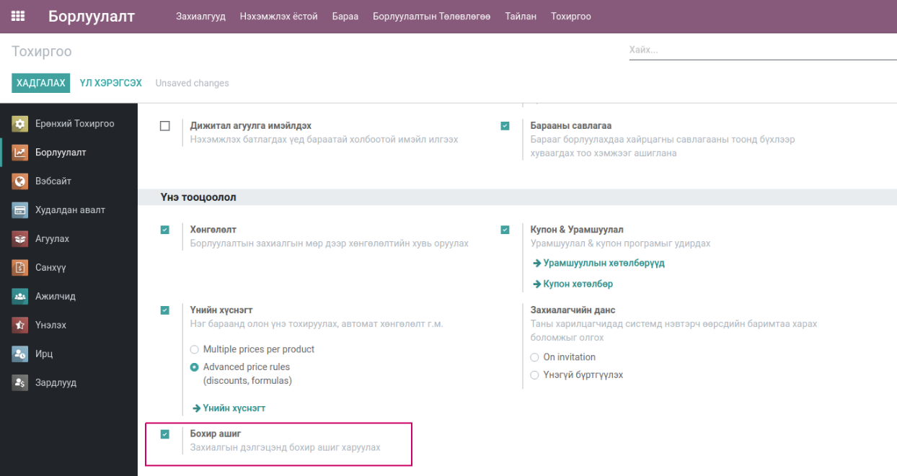
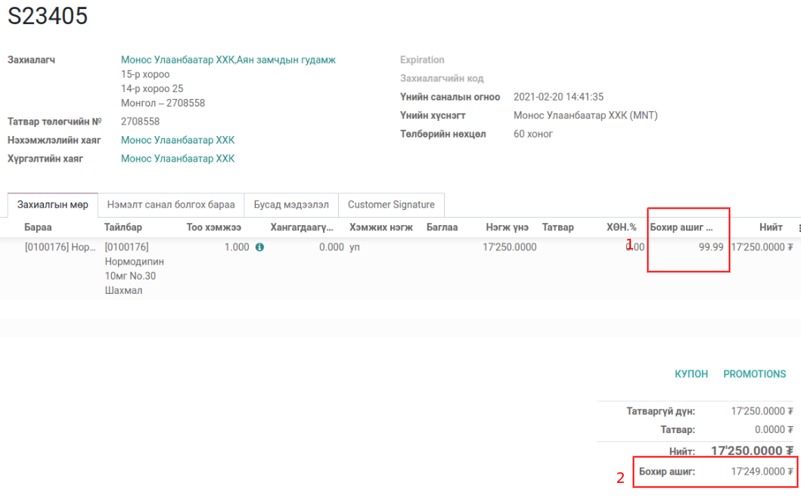

******************************
Sales Price can not be Changed
******************************

Техникийн нэр
=============

:guilabel:`bumanit_sale_readonly_price`

Уялдаа холбоо
=============

:guilabel:`sale_margin` :guilabel:`bumanit_stock`

Тайлбар
=======

Борлуулалтын захиалга дээр үнийг өөрчлөх боломжгүй болгох
.. |

Групп
----------------------------------

:guilabel:`Борлуулалтын захиалгын үнэ засах`
:guilabel:`Бохир ашиг харах`

Хөгжүүлэлт
==========

Борлуулалтын мөр дээрх үнийг өөрчлөх боломжгүй болгох
-----------------------------------------------------

Энэхүү модул сууснаар Борлуулалтын мөр дээрх үнэ засварлах эрхгүй болно.
:guilabel:`Борлуулалтын захиалгын үнэ засах` эрх өгснөөр Борлуулалтын мөр дээрх үнэ засварлаж чадна.

    Борлуулалтын мөр дээрх үнэ :guilabel:`Борлуулалтын захиалгын үнэ засах` эрхгүй

Борлуулалтын мөр дээр бохир ашгийн хувийг харах
-----------------------------------------------
 
    Борлуулалт => Тохиргоо => Тохиргоо

    Системийн тохиргооны бохир ашиг тооцоолох тохиргоо

..  note::
    Дээрх тохиргоог идэвхижүүлснээр дэд модулиуд суух ба анхаарах зүйл нь идэвхигүй болгох үед дэд модулиуд
    системээс устгагдах болно. Иймээс тус тохиргоотой маш болгоомжтой харьцах хэрэгтэй

Системийн хэрэглэгчдэд :guilabel:`Бохир ашиг харах` эрх өгснөөр Борлуулалтын мөр дээр бохир ашгийн хувийг харж чадна.

    Борлуулалтын мөр дээрх бохир ашгийн хувь

1. Борлуулалт мөр дээрх бохир ашгийн хувь
2. Борлуулалтын бохир ашиг 

   Борлуулалт => Тохиргоо => Тохиргоо => Бохир ашиг идэвхжүүлснээр бохир ашиг тооцоолно.
   

Бусад хөгжүүлэлт
======================

- Борлуулалтын мөр дээрх хөнгөлөлт засварлах эрхгүй болгох
- Борлуулалтын бодит зардлыг тодорхойлж дараа нь purchase_price талбарт хадгалах

.. centered:: Гарын авлага боловсруулсан: Амарсанаа. А