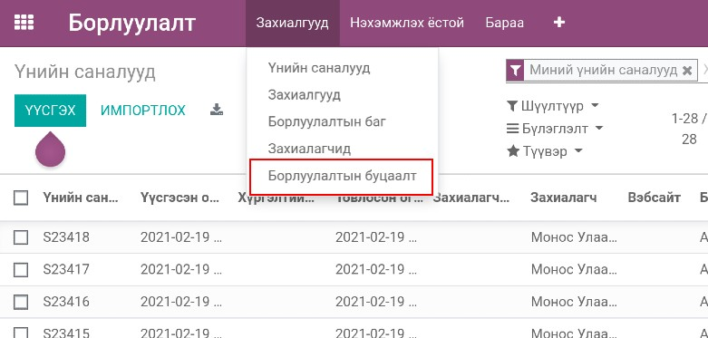
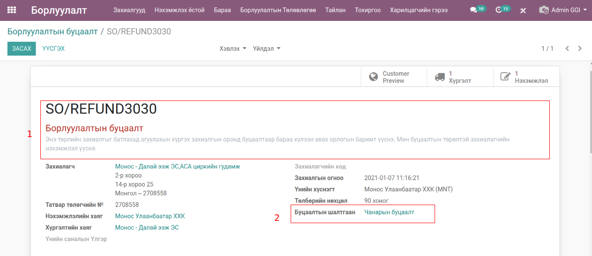

Sales Refund Order
*******************

Odoo v13 Борлуулалтын эх баримттай болон баримтгүй буцаалтын нэмэлт өргөтгөл

Техникийн нэр
=============

:guilabel:`bumanit_sale_refund`

Уялдаа холбоо
=============

:guilabel:`sale`
:guilabel:`stock_account`
:guilabel:`bumanit_stock`

bumanit_sale_refund модулийг суулгавал дээрх 3 модуль дагаж суух болно

Хөгжүүлэлт
==========

Борлуулалтын эх баримтгүй буцаалт
----------------------------------

Энэхүү модуль нь борлуулалтыг буцааж бүртгүүлэх, бүртгэлийн буцаан олголтын функцийг агуулдаг.
Та эх баримтгүй борлуулалтын буцаалтын захиалга үүсгэн борлуулалтыг буцаан олгох боломжтой.

Борлуулалт -> Захиалгууд -> Борлуулалтын буцаалт

    Эх баримтгүй борлуулалтын буцаалтын цэс

Эх баримтгүй борлуулалтын буцаалтын үндсэн харагдац энгийн борлуулалтын захиалгын харагдацтай адил бөгөөд
дугаарлалт болон үүсэж байгаа хүргэлт,нэхэмжлэлийн төрлөөрөө ялгаатай.

    Эх баримтгүй борлуулалтын буцаалтын дэлгэц

1. Эх баримтгүй худалдан авалтын нэршил
2. Буцаалтын шалтгаан (заавал бөглөх талбар биш)

..  note::
    - Борлуулалтын буцаалт бүртгэж буй үед тоо хэмжээний үлдэгдлийг шалгахгүй.
    - Борлуулалтын буцаалтын захиалгаас нэхэмжлэл үүсгэж байвал борлуулалтын буцаалтын данс ашиглана. (Бараа -> Барааны Ангилал -> Орлогын буцаалтын данс)

.. centered:: Гарын авлага боловсруулсан: Амарсанаа. А
