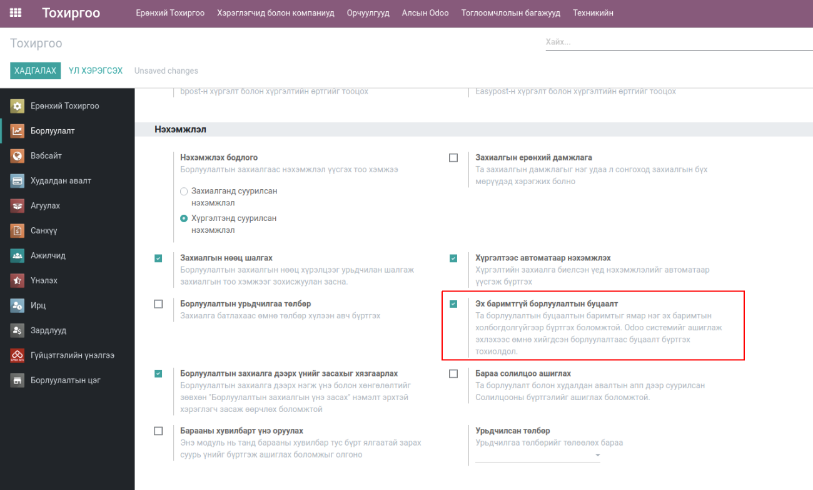

Sales Refund Order
*******************

Odoo v13 Борлуулалтын эх баримттай болон баримтгүй буцаалтын нэмэлт өргөтгөл

Техникийн нэр
=============

:guilabel:`bumanit_sale_refund`

Уялдаа холбоо
=============

:guilabel:`sale`
:guilabel:`stock_account`
:guilabel:`bumanit_stock`

bumanit_sale_refund модулийг суулгавал дээрх 3 модуль дагаж суух болно

Tохиргоо
========
Борлуулалт => Тохиргоо => Тохиргоо => Эх баримтгүй борлуулалтын буцаалт

    Системийн тохиргооны дэд модуль суулгах тохиргоонууд

..  note::
    Дээрх тохиргоонуудыг идэвхижүүлснээр дэд модулиуд суух ба анхаарах зүйл нь идэвхигүй болгох үед дэд модулиуд
    системээс устгагдах болно. Иймээс тус тохиргоотой маш болгоомжтой харьцах хэрэгтэй

Хөгжүүлэлт
==========

Борлуулалтын эх баримтгүй буцаалт
----------------------------------

Энэхүү модуль нь борлуулалтыг буцааж бүртгүүлэх, бүртгэлийн буцаан олголтын функцийг агуулдаг.
Та борлуулалтын буцаалтын баримтыг ямар нэг эх баримтын холбогдолгүйгээр бүртгэх боломжтой.
(Odoo системийг ашиглаж эхлэхээс өмнө хийгдсэн борлуулалтаас буцаалт бүртгэх тохиолдол)

Борлуулалт -> Захиалгууд -> Борлуулалтын буцаалт

.. figure:: ../../../img/modules/bumanit_sale_refund/frame1.jpg
    :align: center

    Эх баримтгүй борлуулалтын буцаалтын цэс

Эх баримтгүй борлуулалтын буцаалтын үндсэн харагдац энгийн борлуулалтын захиалгын харагдацтай адил бөгөөд
дугаарлалт болон үүсэж байгаа хүргэлт,нэхэмжлэлийн төрлөөрөө ялгаатай.

.. figure:: ../../../img/modules/bumanit_sale_refund/frame3.png
    :align: center

    Эх баримтгүй борлуулалтын буцаалтын дэлгэц

1. Эх баримтгүй худалдан авалтын нэршил
2. Буцаалтын шалтгаан (заавал бөглөх талбар биш)

..  note::
    - Борлуулалтын буцаалт бүртгэж буй үед тоо хэмжээний үлдэгдлийг шалгахгүй.
    - Борлуулалтын буцаалтын захиалгаас нэхэмжлэл үүсгэж байвал борлуулалтын буцаалтын данс ашиглана. (Бараа -> Барааны Ангилал -> Орлогын буцаалтын данс)

Худалдан авалтын эх баримтгүй буцаалтаас үүссэн нэхэмжлэлийн журнал ( өртөгийн журналийн бичэлт)
------------------------------------------------------------------------------------------------

Өртөгийн зөрүүний данс тохируулах:
    Худалдан авалт -> Бараа -> Барааны ангилал -> Өртөгийн зөрүүний данс

.. figure::
    ../../../img/modules/bumanit_purchase_refund/frame8.png

.. note::
    Өртгийн зөрүүний данс зөвхөн худалдан авалтын эх баримттай болон баримтгүй буцаалтын нэхэмжлэл дээр ашиглагдана.

.. figure::
    ../../../img/modules/bumanit_purchase_refund/frame6.png

Эх баримтгүй худалдан авалтын буцаалтаас үүссэн нэхэмжлэлийн журналийн бичилт

Худалдан авалтын эх баримтгүй буцаалтын мөр дээр өртөг болон өртөгийн хувь харах
--------------------------------------------------------------------------------
групп :guilabel:`Худалдан авалтын мөр дээр өртөг харах`

.. figure::
    ../../../img/modules/bumanit_purchase_refund/frame3.png

:guilabel:`Худалдан авалтын мөр дээр өртөг харах` группыг идэвхжүүлсэнээр худалдан авалтын мөр дээр
:guilabel:`Дундаж өртөг` болон :guilabel:`Өртөг .%` гэсэн 2 талбар харагдана.

:guilabel:`Дундаж өртөг` нь бараан дээрх өртөгийг харуулна.

.. note::
    Өртөгийн % тооцоолохдоо:
       (((Үнийн дүн/Тоо ширхэг)-Дундаж өртөг)/Дундаж өртөг)*100

Эх баримтгүй худалдан авалтын буцаалт дээр өртөг шалгах
-------------------------------------------------------

Худалдан авалт -> Тохиргоо -> :guilabel:`Худалдан авалтын буцаалт дээр өртөг шалгах`

.. figure::
    ../../../img/modules/bumanit_purchase_refund/frame4.png

Дээрх тохиргоог идэвхжүүлсэнээр худалдан авалтын мөр дээрх барааны өртөг тохиргоонд заагдсан стандарт өртөгийн хувиас
их эсвэл сөрөг их тохиолдолд зөвхөн :guilabel:`Худалдан авалтын менежер` батлана.

.. figure::
    ../../../img/modules/bumanit_purchase_refund/frame5.png

Дээрх жишээн дээр эх баримтгүй худалдан авалтын мөр дээрх 0100176 кодтой барааны дундаж өртөгийн хувь 76% бөгөөд худалдан авалтын буцаалтын өртөг шалгах өртөг нь 15% байхаар тохируулсан

Худалдан авалт батлахад

.. figure::
    ../../../img/modules/bumanit_purchase_refund/frame7.png

Зөвхөн худалдан авалтын менежер батлана.

.. centered:: Гарын авлага боловсруулсан: Амарсанаа. А
