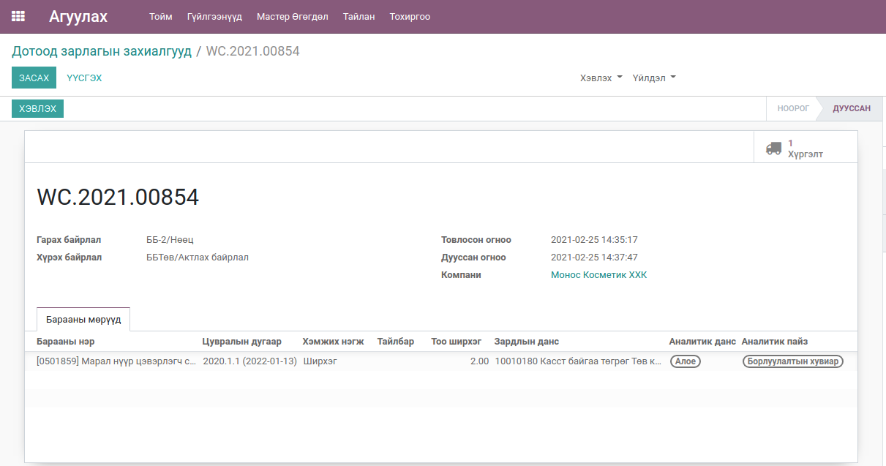
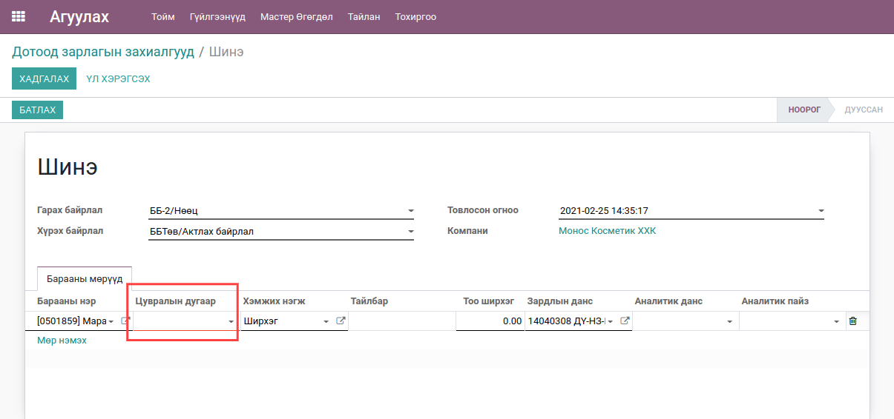
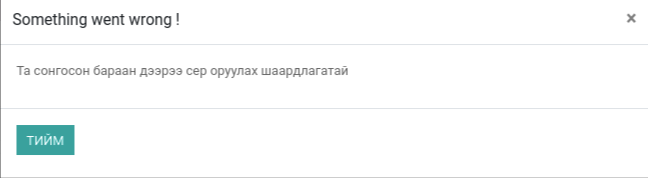
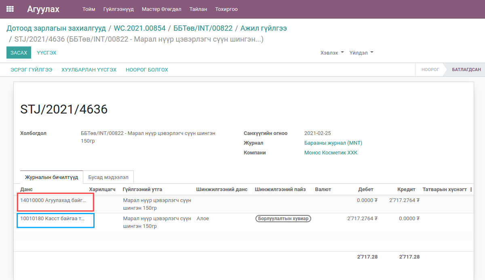
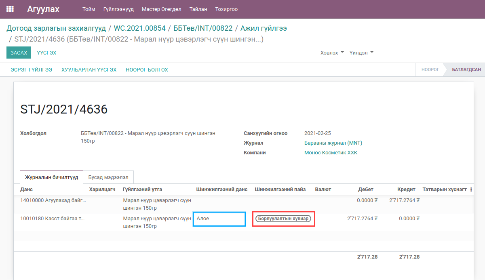
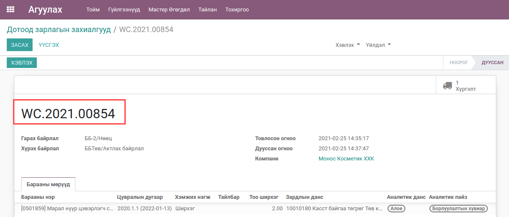
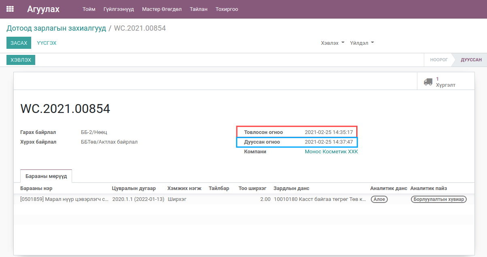
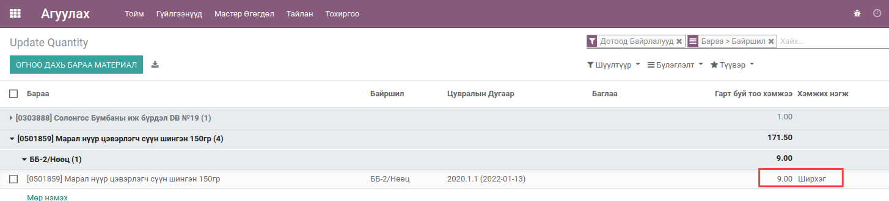
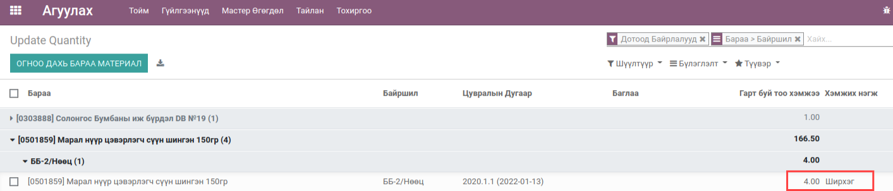

**************************
Дотоод зарлага
**************************

.. |

Техникийн нэр
=============

``bumanit_stock_internal_expense``

.. |

Уялдаа холбоо
=============

| ``bumanit_stock``
| ``report_xlsx``

Тайлбар
=======

Агуулахаас бараа материалыг дотоод зарлагаар гаргах.

.. |

Цэс:
    - Агуулах => Гүйлгээнүүд => Дотоод зарлагын захиалгууд

Хөгжүүлэлт
==========

1. Дотоод зардлын захиалгын ерөнхий дэлгэц

2. Барааны үлдэгдэл шалгах

.. note::
    Сонгогдсон гарах байрлал дээрх барааны үлдэгдэл нь хүрэлцэхгүй байвал зарлагдах гэж оролдсон тоо болон одоо байгаа боломжит нөөцийг харуулж хэрэглэгчид сануулгах мессеж өгнө.

3. Барааны сер дугаар шалгах болон тухайн байрлал дээрх үлдэгдэлтэй серийг харуулах

.. note::
    Хэвэв тухайн бараа сергүй байвал цувралын дугаар талбар нь засах боломжгүй байна. Талбарын доод хэсэг нь улаан байвал заавал бөглөх шаардлагатайг сануулна.

.. note::
    Бараагаа сонгоод сер дугаар сонгохгүй шууд тоо ширхэгээ оруулах үед тухайн бараанд сер дугаар сонгохыг сануулна.

4. Дотоод зардлын захиалга дээр сонгосон зардлын дансанд дебит, барааны ангилал дээр тохируулсан дансанд кредит бичилт бичнэ. 

.. note::
    Улаанаар тодруулсан данс нь барааны материалын ангилалын данс. Цэнхэрээр тодруулсан нь дотоод зардлын захиалга дээр сонгосон зардлын данс

5. Шинжилгээний данс болон пайзыг ажил гүйлгээтэй холбосон

6. Автомат дугаарлалт

7. Товлосон огноо болон дууссан огноо

.. note::
    Улаанаар тодруулсан огноо нь захиалга үүсгэсэн огноо. Цэнхэрээр тодруулсан нь огноо нь захиалгыг баталсан огноо.

8. Сонгосон байрлалаас барааны үлдэгдэл хасагдаж гологдолруу бичих

.. note::
    Дотоод зардлын захиалгаар бараа гаргахын өмнөх нөөц

.. note::
    Дотоод зардлын захиалгаар бараа гаргасны дараах нөөц