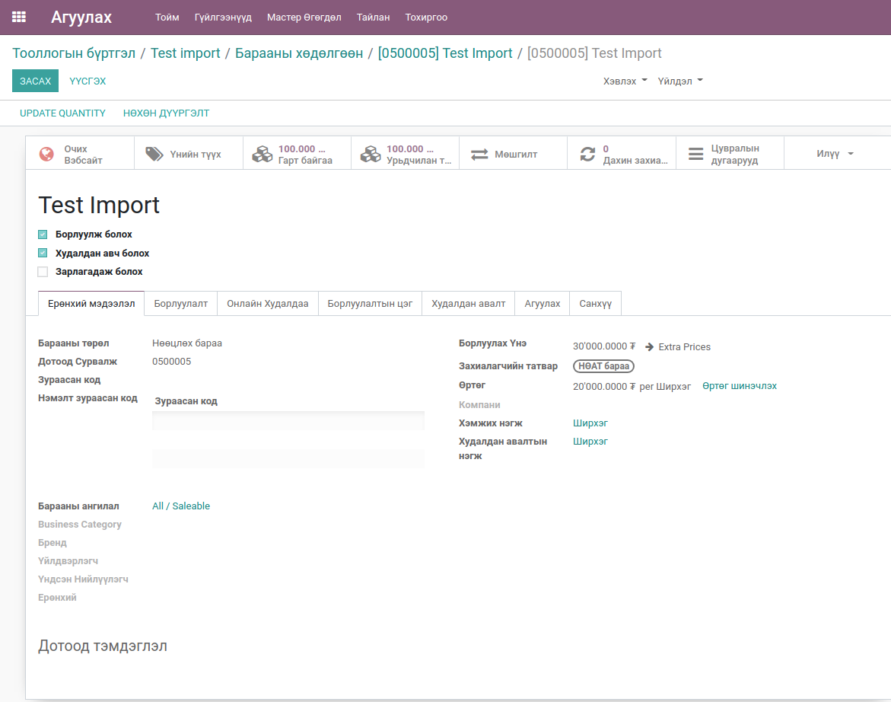
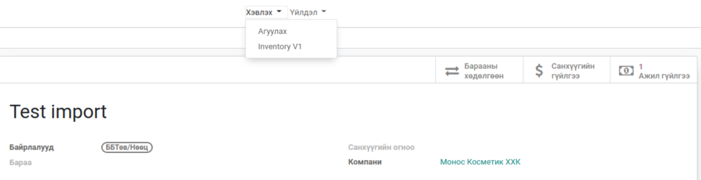

**************************
Агуулахад бараа импорт
**************************

.. |

Техникийн нэр
=============

``bumanit_stock_inventory_import``

.. |

Уялдаа холбоо
=============

| ``bumanit_stock``
| ``product_expiry``

Тайлбар
=======

Энэхүү модулийг ашиглан агуулахад шинээр бараа тооллогоор оруулах болон өмнө нь байсан барааны мэдээллийг засна.

.. |

Цэс:
    - Агуулах => Гүйлгээнүүд => Тооллогын бүртгэл

Хөгжүүлэлт
==========

1. Дотоод зардлын захиалгын ерөнхий дэлгэц

- Тайлбар - Тооллогын код 
- Файл - Excel файл 
- Product Selection Criteria - Зураасан код, Дотоод сурвалж, Барааны нэр, Барааны ID
- Insert missing products? - Шинээр бараа тооллогоор авах
- Product Category for new records - Шинээр үүсгэх барааны ангилал
- Компани
- Агуулах
- Байршил
- Inventory Account 
- Insert by Lots - Сер дугаар оруулах
- Updates Sales Price - Худалдах үнэ оруулах
- Use Past Date 
- Санхүүгийн огноо

2. Excel дата бэлдэц

.. note::
    Хэрэв шинээр бараа оруулах бол Insert by Lots идэвхижүүлэх хэрэгтэй. Ингэснээр тухайн бараанд ангилал тохируулах болон худалдах үнэ оруулах гэсэн сонголтууд гарж ирнэ.

3. Үүссэн барааны хөдөлгөөн

4. Импорт хийсний дараах барааны харагдац 

- Барааны нэр
- Борлуулах үнэ
- Өртөг
- Хэмжих нэгж
- Тоо хэмжээ
- Цувралын дугаар
- Барааны дотоод сурвалж

5. Санхүүгийн гүйлгээ

.. note::
    Цэнхрээр тодруулсан данс нь бараа материалын ангиллын "Тооллогын ашгийн данс". Улаанаар тодруулсан данс нь бараа материалын ангиллын "Бараа материалын данс"

6. Тооллогын PDF баримт

