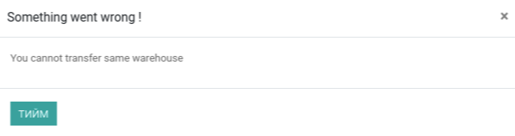

****************************
Нөхөн дүүргэлт
****************************

.. |

Техникийн нэр
=============

``bumanit_transit``

.. |

Уялдаа холбоо
=============

| ``bumanit_stock``   

Тайлбар
=======

Odoo v13 дээр шинээр нөхөн дүүргэлтийн хөгжүүлэлтийг хийсэн. Энэхүү модуль нь агуулах хооронд олон бараа шилжүүлэх боломжийг олгоно. 

.. |

Системийн ерөнхий тохиргоонд хийгдсэн хөгжүүлэлтүүд
==========

Агуулахын тохиргоон дээр байгаа багц нөхөн дүүргэлт гэсэн тохиргоог идэвхижүүлсэнээр нөхөн дүүргэлт хийх боломжтой болно.

Цэс:
    - Агуулах => Гүйлгээнүүд => Нөхөн дүүргэлт

Хөгжүүлэлт
==========

1. Нөхөн дүүргэлтийн ерөнхий дэлгэц

2. Сонгогдсон нийлүүлэх агуулахаас бараа гаргах байрлал 

.. note::
    Зурагт харуулсан үндсэн эх байрлалаас бараа гарна. 

3. Сонгогдсон хүлээн авах агуулахад бараа хүлээн авах байрлал

    
.. note::
    Зурагт харуулсан үндсэн хүргэх байрлалд бараа хүлээн авна.

4. Барааны үлдэгдэл шалгах.

.. note::
    Сонгогдсон агуулахын үндсэн эх байрлал дээрх барааны үлдэгдэл нь хүрэлцэхгүй байвал зарлагдах гэж оролдсон тоо болон одоо байгаа боломжит нөөцийг харуулж хэрэглэгчид сануулгах мессеж өгнө.

5. Нийлүүлэх агуулах болон хүлээн авах агуулах ялгаатай байх

- Хэвэв ажил агуулах байвал сануулга харуулна.

6. Захиалга батлах үед хүргэх захиалга үүсэх

7. Нийлүүлэх агуулахаас гарсан тоо ширхэг 

    
8. Хүргэх захиалга батлагдсны дараа хүлээн авах захиалга үүсэх

9. Хүлээн авах агуулахад хүлээж авсан тоо ширхэг

10. Буцаалт

- Орлогод авсан бараанд буцаалт хийх

- Энэ үед орлогод авсан агуулахаас зарлагын баримт үүснэ

- Зарлагадсан агуулахад орлогын баримт үүснэ

11. Нөхөн дүүргэлтийн захиалга цуцлах 

- Зарлагын баримтаа батласны дараа орлогын баримт цуцлах боломжгүй болох ба анхааруулах мессеж харуулна.

